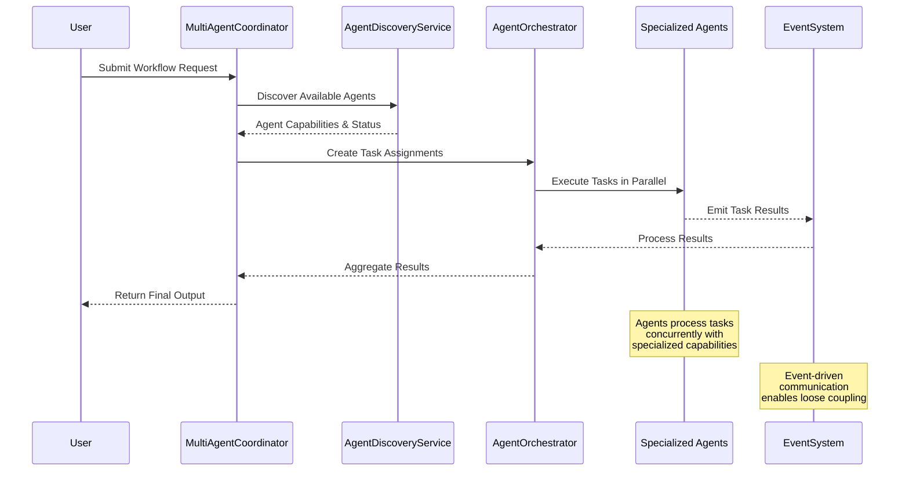
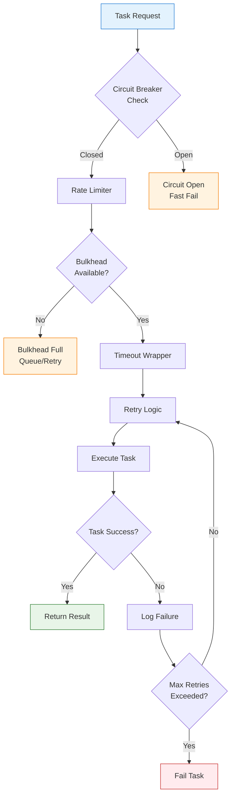

# NoOrg Multi-Agent Framework

A comprehensive, production-ready framework for building resilient, scalable, and distributed multi-agent systems with advanced AI capabilities.

[](https://creativecommons.org/licenses/by-nc-sa/4.0/)
[](https://www.typescriptlang.org/)
[](https://nodejs.org/)
[](https://github.com/ActiveInferenceInstitute/NoOrg/actions)
[](https://activeinferenceinstitute.github.io/NoOrg/)

https://github.com/ActiveInferenceInstitute/NoOrg

## 🚀 Quick Start

### Installation

```bash
# Clone the repository
git clone https://github.com/ActiveInferenceInstitute/NoOrg.git
cd NoOrg

# Install dependencies
npm install

# Setup environment
cp .env.example .env
# Edit .env with your OpenAI API key and configuration

# Build the project
npm run build

# Run the framework
npm start
```

### Basic Usage

```typescript
import { MultiAgentCoordinator } from './src/core/multiagent/MultiAgentCoordinator';
import { AnalysisAgent } from './src/agents/AnalysisAgent';
import { CreativeWritingAgent } from './src/agents/CreativeWritingAgent';

async function runWorkflow() {
  // Initialize coordinator
  const coordinator = new MultiAgentCoordinator('My Coordinator');
  await coordinator.initialize();

  // Create agents
  const analysisAgent = new AnalysisAgent('Data Analyst');
  const writingAgent = new CreativeWritingAgent('Content Writer');

  // Register agents
  await coordinator.registerAgent({
    name: 'Data Analyst',
    type: 'analysis',
    capabilities: ['data-analysis'],
    status: 'available'
  });
  await coordinator.registerAgent({
    name: 'Content Writer',
    type: 'writing',
    capabilities: ['content-creation'],
    status: 'available'
  });

  // Create and assign tasks
  const taskId = await coordinator.createTask({
    description: 'Analyze dataset and create report',
    priority: 'high'
  });
  
  // Find suitable agent
  const agents = await coordinator.findAgentsByCapability('data-analysis');
  if (agents.length > 0) {
    await coordinator.assignTask(taskId!, agents[0].id);
  }

  // Get task status
  const task = await coordinator.getTask(taskId!);
  console.log('Task status:', task?.status);
}

runWorkflow();
```

## 🏗️ Architecture Overview

This framework provides the core building blocks for creating systems where multiple agents can discover, communicate, and collaborate with each other to accomplish complex tasks. The architecture is designed with resilience and scalability in mind, making it suitable for production environments.

### Core Components

#### System Architecture Overview

```mermaid
graph TB
    subgraph "User Layer"
        UI[User Interface/API]
    end

    subgraph "Coordination Layer"
        MC[MultiAgentCoordinator]
        DS[AgentDiscoveryService]
        AO[AgentOrchestrator]
    end

    subgraph "Agent Layer"
        AGENTS[Specialized Agents<br/>16+ Domain Experts<br/>Analysis • Writing • Research<br/>Finance • Legal • Planning<br/>...]
    end

    subgraph "Core Infrastructure"
        EV[EventSystem]
        MSG[Messaging]
        MON[Monitoring]
        STOR[Storage]
        INT[Integration<br/>Patterns]
    end

    UI --> MC
    MC --> DS
    DS --> AO
    AO --> AGENTS
    AGENTS --> EV
    EV --> MSG
    MSG --> MON
    MON --> STOR
    STOR --> INT
    INT --> MC

    style UI fill:#e1f5fe,stroke:#01579b,stroke-width:2px
    style MC fill:#fff3e0,stroke:#e65100,stroke-width:3px
    style DS fill:#f3e5f5,stroke:#4a148c,stroke-width:2px
    style AO fill:#f3e5f5,stroke:#4a148c,stroke-width:2px
    style AGENTS fill:#e8f5e8,stroke:#2e7d32,stroke-width:2px
    style EV fill:#e8f5e8,stroke:#1b5e20,stroke-width:2px
    style MSG fill:#e8f5e8,stroke:#1b5e20,stroke-width:2px
    style MON fill:#fff8e1,stroke:#f57f17,stroke-width:2px
    style STOR fill:#fce4ec,stroke:#880e4f,stroke-width:2px
    style INT fill:#fce4ec,stroke:#880e4f,stroke-width:2px
```



#### Multi-Agent Coordination Flow



#### Resilience Patterns Integration



The framework consists of several key components:

1. **[Integration Patterns](docs/core/integration/patterns/README.md)**: Resilience-focused patterns that provide reliability for interactions between components.
2. **[Event System](docs/core/index.md#event-system)**: A central pub/sub infrastructure for communication across the system.
3. **[Storage System](docs/core/index.md#storage-system)**: Persistent and in-memory storage mechanisms for system state.
4. **[Multi-agent Framework](docs/agents/multiagent-system.md)**:
   - **[Discovery](docs/agents/modules/core/communication.md)**: Mechanisms for agents to find each other in the system.
   - **[Orchestration](docs/agents/modules/core/behavior.md)**: Coordination of tasks across available agents.
   - **[Relationships](docs/agents/modules/core/state.md)**: Management of agent connections and collaborations.
   - **[Workflow](docs/agents/modules/core/behavior.md)**: Execution of multi-step processes across agents.

## Integration Patterns

The framework includes several resilience patterns for robust communication:

- **[Circuit Breaker](docs/core/integration/patterns/README.md#circuit-breaker-pattern)**: Prevents cascading failures by stopping operations when a service is failing.
- **[Bulkhead](docs/core/integration/patterns/README.md#bulkhead-pattern)**: Isolates components to contain failures within specific boundaries.
- **[Timeout](docs/core/integration/patterns/README.md#timeout-pattern)**: Ensures operations complete within a specific time frame.
- **[Retry](docs/core/integration/patterns/README.md#retry-pattern)**: Automatically retries failed operations with configurable backoff.
- **[Rate Limiter](docs/core/integration/patterns/README.md#rate-limiter-pattern)**: Controls the rate of operations to prevent overwhelming services.
- **[Request-Response](docs/core/integration/patterns/README.md#request-response-pattern)**: Structured pattern for request handling with metadata.

For detailed documentation, see [Integration Patterns](docs/core/integration/patterns/README.md).

## Multi-agent Components

### Discovery Service

The `AgentDiscoveryService` allows agents to register themselves and discover other agents based on capabilities and status. Features include:

- [Agent registration and deregistration](docs/agents/modules/core/discovery.md#registration)
- [Capability-based discovery](docs/agents/modules/core/discovery.md#capability-matching)
- [Heartbeat mechanisms](docs/agents/modules/core/discovery.md#heartbeat)
- [Status tracking](docs/agents/modules/core/discovery.md#status-management)

### Orchestration

The `AgentOrchestrator` coordinates task assignment and execution across agents:

- [Priority-based task queue](docs/agents/modules/core/orchestration.md#task-prioritization)
- [Capability matching for task assignment](docs/agents/modules/core/orchestration.md#capability-matching)
- [Circuit breaking for unreliable agents](docs/agents/modules/core/orchestration.md#circuit-breaking)
- [Task lifecycle management](docs/agents/modules/core/orchestration.md#lifecycle)
- [Failure handling and recovery](docs/agents/modules/core/orchestration.md#failure-recovery)

### Units and Organization

The system includes organizational structures for defining hierarchies and relationships between agents, as detailed in the [Multiagent Coordination System](docs/agents/multiagent-coordination-system.md). This enables:

- [Flexible team structures](docs/agents/multiagent-coordination-system.md#coordination-engine)
- [Role-based coordination](docs/agents/multiagent-coordination-system.md#agent-registry)
- [Specialized agent groups](docs/agents/multiagent-coordination-system.md#coalition-formation)
- [Delegation patterns](docs/agents/multiagent-coordination-system.md#task-distribution)

## Event and Messaging Systems

The framework provides robust event and messaging capabilities:

- [Event emission and handling](docs/core/index.md#event-system)
- [Event persistence and history](docs/core/core-documentation.md#event-system)
- [Topic-based publish/subscribe](docs/core/index.md#operations)
- [Message metadata support](docs/core/core-documentation.md#message-system)

## Storage and State Management

For data persistence and state management, the framework includes:

- [In-memory and disk persistence](docs/core/index.md#storage-system)
- [Cache management with TTL](docs/core/core-documentation.md#storage-system)
- [Transaction support](examples/1-event-storage-example.ts)
- [Query capabilities](docs/core/core-documentation.md#storage-system)

## Monitoring and Observability

The framework provides comprehensive monitoring features:

- [Metric recording and retrieval](docs/core/README.md#monitoring-system)
- [Alert definition and management](docs/core/core-documentation.md#monitoring-system)
- [Real-time monitoring](docs/monitoring/README.md)
- [System health dashboards](docs/operations/monitoring.md)

## ✨ Key Features

- **🔄 Multi-Agent Coordination**: Advanced coordination engine for managing multiple AI agents
- **🧠 Specialized Agents**: 16+ pre-built agents for different domains (analysis, writing, development, finance, legal, etc.)
- **🔒 Resilience Patterns**: Circuit breaker, retry, timeout, bulkhead, and rate limiting patterns
- **📊 Real-time Monitoring**: Comprehensive metrics, health checks, and alerting
- **💾 Flexible Storage**: Multiple backends (memory, file, database) with caching and transactions
- **🔗 Event-Driven Architecture**: Pub/sub messaging with topic-based routing
- **⚡ High Performance**: Optimized for concurrent operations and scalability
- **🛡️ Production Ready**: Comprehensive error handling, logging, and monitoring
- **📚 Extensive Documentation**: Complete API docs, examples, and best practices
- **🧪 Comprehensive Testing**: Unit, integration, and end-to-end test coverage

## 🤖 Supported Agent Types

| Agent Type | Description | Use Cases |
|------------|-------------|-----------|
| **AnalysisAgent** | Data analysis and insights | Business intelligence, research |
| **CreativeWritingAgent** | Content creation and refinement | Marketing, documentation |
| **DataAnalysisAgent** | Advanced data processing | Statistics, visualization |
| **DevelopmentAgent** | Code generation and review | Software development |
| **FinanceAgent** | Financial analysis and planning | Budgeting, forecasting |
| **HRAgent** | Human resources tasks | Job descriptions, onboarding |
| **LegalAgent** | Legal document processing | Contracts, compliance |
| **MarketingAgent** | Marketing strategy and content | Campaigns, audience analysis |
| **ActiveInferencePOMDPAgent** | Advanced decision making | Complex reasoning tasks |
| **CustomerSupportAgent** | Customer service automation | Help desk, troubleshooting |
| **FinalReviewAgent** | Quality assurance | Content review, approval |
| **PlanningAgent** | Strategic planning | Project management |
| **ResearchAgent** | Information gathering | Research, fact-checking |
| **ReviewAgent** | Content evaluation | Feedback, assessment |
| **RevisionAgent** | Content improvement | Editing, refinement |
| **WritingAgent** | Professional writing | Documentation, reports |

## 🛠️ Development

### Prerequisites

- **Node.js** 18+ and npm
- **TypeScript** 5.8+
- **OpenAI API Key** (for agent functionality)

### Development Setup

```bash
# Clone repository
git clone https://github.com/ActiveInferenceInstitute/NoOrg.git
cd NoOrg

# Install dependencies
npm install

# Setup environment
cp .env.example .env
# Edit .env with your configuration

# Build project
npm run build

# Run in development mode
npm run dev

# Run tests
npm test

# Run linting
npm run lint

# Generate documentation
npm run docs:build
```

### Project Structure

```
src/
├── agents/          # Agent implementations
│   ├── AbstractAgent.ts
│   ├── AnalysisAgent.ts
│   ├── CreativeWritingAgent.ts
│   └── ... (14 more agents)
├── core/            # Core infrastructure
│   ├── events/      # Event system
│   ├── messaging/   # Message system
│   ├── monitoring/  # Monitoring system
│   ├── storage/     # Storage system
│   ├── multiagent/  # Multi-agent coordination
│   └── integration/ # Integration patterns
├── examples/        # Usage examples
├── utils/          # Utility functions
└── docs/           # Documentation

tests/              # Comprehensive test suite
docs/               # Generated documentation
scripts/            # Build and utility scripts
```


## Documentation

Comprehensive documentation is available:

- [Master Documentation Index](docs/master-index.md)
- [Core Documentation](docs/core/index.md)
- [Architecture Documentation](docs/architecture/system-architecture.md)
- [Agent Operations](docs/agents/operations/README.md)
- [Integration Guides](docs/integrations/README.md)

## 📊 Examples

### Basic Multi-Agent Workflow

```typescript
import { MultiAgentCoordinator } from './src/core/multiagent/MultiAgentCoordinator';
import { AnalysisAgent } from './src/agents/AnalysisAgent';
import { CreativeWritingAgent } from './src/agents/CreativeWritingAgent';

async function runBasicWorkflow() {
  const coordinator = new MultiAgentCoordinator();

  // Create specialized agents
  const analyst = new AnalysisAgent('Data Analyst');
  const writer = new CreativeWritingAgent('Content Writer');

  // Register agents
  await coordinator.registerAgent(analyst);
  await coordinator.registerAgent(writer);

  // Execute workflow
  const result = await coordinator.executeWorkflow({
    tasks: [
      {
        agent: 'Data Analyst',
        action: 'analyze',
        data: { sales: [100, 150, 120, 180, 200] }
      },
      {
        agent: 'Content Writer',
        action: 'write',
        data: { format: 'blog-post', tone: 'professional' }
      }
    ]
  });

  console.log('Workflow completed:', result);
}
```

### Advanced Features

```typescript
// Active Inference with POMDP
import { ActiveInferencePOMDPAgent } from './src/agents/ActiveInferencePOMDPAgent';

const pomdpAgent = new ActiveInferencePOMDPAgent({
  states: ['low', 'medium', 'high'],
  observations: ['observation1', 'observation2', 'observation3'],
  actions: ['action1', 'action2', 'action3']
});

// Complex reasoning and decision making
const result = await pomdpAgent.process([0, 1, 2], context);
```

### Custom Agent Development

```typescript
import { AbstractAgent } from './src/agents/AbstractAgent';

class CustomAgent extends AbstractAgent {
  async executeTask(taskDetails: any, context?: any): Promise<any> {
    // Implement your custom logic
    return await this.processCustomTask(taskDetails);
  }
}
```

## 🔧 Configuration

### Environment Variables

The framework supports comprehensive configuration through environment variables:

```bash
# Core Configuration
NODE_ENV=production
DEBUG=false
LOG_LEVEL=info

# OpenAI Configuration
OPENAI_API_KEY=sk-proj-your-key-here
DEFAULT_MODEL=gpt-4o
MAX_TOKENS=8000
TEMPERATURE=0.7

# Coordinator Configuration
COORDINATOR_NAME=Production Coordinator
MAX_CONCURRENT_TASKS=10
ENABLE_AUTO_RETRY=true

# Monitoring & Metrics
ENABLE_METRICS=true
METRICS_PORT=9090
DASHBOARD_PORT=3000

# Security
ENABLE_AUTHENTICATION=false
JWT_SECRET=your-jwt-secret-here
API_KEY=your-api-key-here
```

### Programmatic Configuration

```typescript
import { MultiAgentCoordinator } from './src/core/multiagent/MultiAgentCoordinator';

const coordinator = new MultiAgentCoordinator({
  maxConcurrentTasks: 20,
  enableAutoRetry: true,
  taskTimeout: 30000,
  enableMonitoring: true
});
```

## 🧪 Testing

The framework includes comprehensive testing:

```bash
# Run all tests
npm test

# Run specific test suites
npm run test:unit        # Unit tests
npm run test:integration # Integration tests
npm run test:system      # System tests
npm run test:performance # Performance tests

# Run with coverage
npm run test:coverage

# Run specific agent tests
npm run test:agents
npm run test:core
```

## 📈 Performance

### Benchmarks

- **Agent Response Time**: < 2 seconds for typical operations
- **Concurrent Tasks**: 100+ simultaneous operations
- **Memory Usage**: Optimized for large-scale deployments
- **Throughput**: 1000+ events/second processing

### Scalability

- **Horizontal Scaling**: Support for multiple coordinator instances
- **Load Balancing**: Automatic task distribution
- **Resource Management**: Memory and CPU optimization
- **Monitoring**: Real-time performance tracking

## 🔒 Security

### Built-in Security Features

- **Input Validation**: All inputs are validated and sanitized
- **Rate Limiting**: Configurable API rate limiting
- **Audit Logging**: Complete operation audit trails
- **Access Control**: Role-based access control
- **Data Encryption**: Optional encryption at rest and in transit

### Security Best Practices

- Always validate agent inputs
- Use rate limiting for external APIs
- Enable audit logging in production
- Implement proper authentication for multi-tenant deployments
- Regularly update dependencies for security patches

## 🚀 Deployment

### Docker Deployment

```bash
# Build Docker image
docker build -t noorg/multiagent-framework .

# Run with Docker Compose
docker-compose up -d

# Deploy to Kubernetes
kubectl apply -f k8s/
```

### Production Checklist

- [ ] Configure environment variables
- [ ] Set up monitoring and alerting
- [ ] Configure backup and recovery
- [ ] Set up CI/CD pipeline
- [ ] Configure security settings
- [ ] Set up logging and audit trails
- [ ] Configure scaling policies
- [ ] Set up health checks

## 🤝 Contributing

We welcome contributions! Please see our [Contributing Guide](docs/development/contribution-guidelines.md) for details.

### Development Workflow

1. Fork the repository
2. Create a feature branch
3. Make your changes
4. Add tests for new functionality
5. Run the test suite
6. Submit a pull request

### Code Standards

- Follow TypeScript best practices
- Write comprehensive tests
- Add documentation for new features
- Use meaningful commit messages
- Follow the established code style

## 📚 Documentation

### Documentation Structure

- **[Getting Started](docs/000-home.md)** - Quick start guide and overview
- **[Core Documentation](docs/core/index.md)** - Core system components
- **[Agent Documentation](docs/agents/README.md)** - Agent framework guide
- **[API Reference](docs/api/index.md)** - Complete API documentation
- **[Examples](examples/README.md)** - Usage examples and demos
- **[Development Guide](docs/development/index.md)** - Development practices

### Documentation Generation

```bash
# Generate documentation
npm run docs:build

# Serve documentation locally
npm run docs:serve

# Deploy documentation
npm run docs:deploy
```

## Roadmap

- [ ] Complete agent relationship management
- [ ] Implement workflow execution engine
- [ ] Add security layers for agent authentication
- [ ] Develop monitoring dashboard
- [ ] Create deployment tools

For a complete view of planned features, see the [Development Guide](docs/development/index.md).

## Contributing

Contributions are welcome! Please see [CONTRIBUTING.md](docs/development/contribution-guidelines.md) for details.

## License

This project is licensed under the MIT License - see the [LICENSE.md](LICENSE.md) file for details.