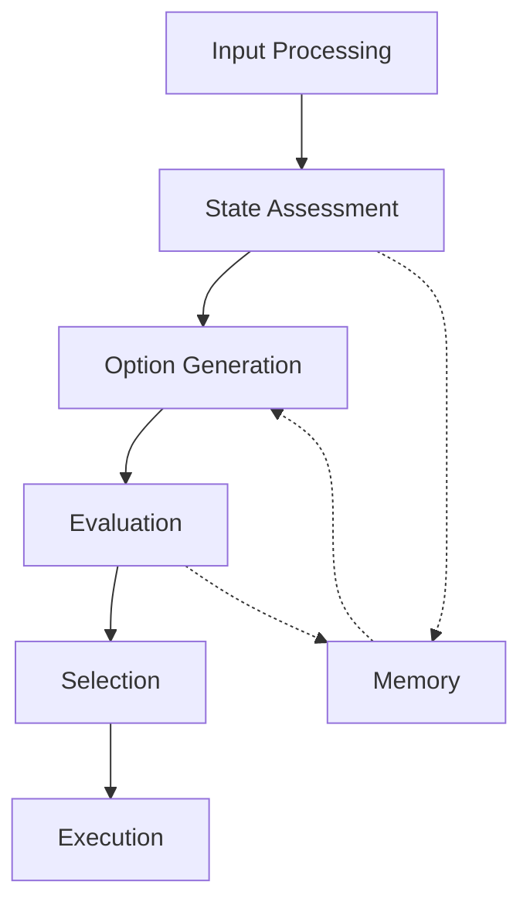

# Decision Frameworks

## Overview

This document details the decision-making frameworks and planning mechanisms used in our agent systems.

## Decision Architecture

### Core Components


## Planning Systems

### Hierarchical Planning
```yaml
planning_hierarchy:
  strategic:
    timeframe: "long-term"
    scope: "global objectives"
    update_frequency: "periodic"
  tactical:
    timeframe: "medium-term"
    scope: "sub-goals"
    update_frequency: "event-driven"
  operational:
    timeframe: "immediate"
    scope: "actions"
    update_frequency: "continuous"
```

### Decision Strategies

#### Utility-Based Decision Making
- Cost-benefit analysis
- Risk assessment
- Resource optimization
- Constraint satisfaction

#### Rule-Based Systems
```python
decision_rules:
    priority: high
    conditions:
        - environment_state
        - resource_availability
        - goal_alignment
    actions:
        - primary_action
        - fallback_action
```

## Implementation

### Decision Patterns
- Reactive Decisions
- Deliberative Planning
- Hybrid Approaches

### Integration Points
- [[cognitive-models|Cognitive Architecture]]
- [[perception-systems|Perception Integration]]
- [[action-patterns|Action Execution]]

## Evaluation

### Performance Metrics
```yaml
metrics:
  decision_quality:
    - accuracy
    - timeliness
    - resource_efficiency
  planning_effectiveness:
    - goal_achievement
    - adaptation_speed
    - resource_utilization
```

### Validation Methods
- Simulation Testing
- Scenario Analysis
- Performance Monitoring

## References
- [[planning-algorithms|Planning Algorithms]]
- [[decision-optimization|Decision Optimization]]
- [[strategy-patterns|Strategic Patterns]] 