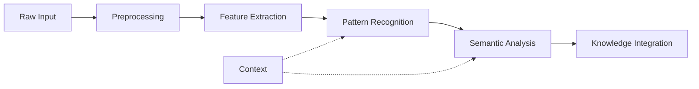
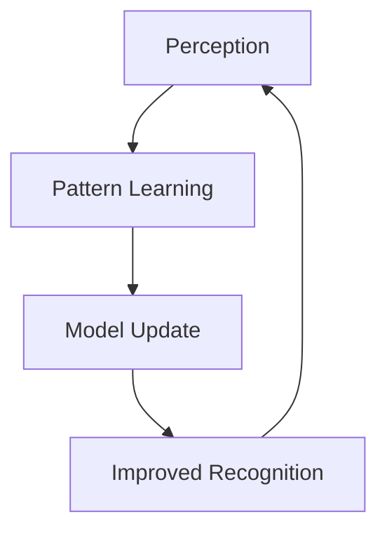

# Perception Systems

## Overview

This document outlines the perception and sensory processing systems used in our agent architectures.

## Sensory Architecture

### Input Processing Pipeline


## Perception Components

### Sensor Types
```yaml
sensor_systems:
  physical:
    - visual
    - auditory
    - tactile
    - proprioceptive
  virtual:
    - data_streams
    - api_endpoints
    - event_listeners
    - state_monitors
```

### Processing Layers

#### Signal Processing
- Filtering
- Normalization
- Feature Detection
- Temporal Integration

#### Pattern Recognition
```python
pattern_recognition:
    methods:
        - template_matching
        - statistical_analysis
        - neural_processing
        - symbolic_reasoning
    outputs:
        - recognized_patterns
        - confidence_scores
        - temporal_context
```

## Integration

### Data Flow
```yaml
data_pipeline:
  input:
    format: "raw_sensor_data"
    frequency: "continuous"
  processing:
    stages:
      - preprocessing
      - feature_extraction
      - pattern_matching
  output:
    format: "semantic_representation"
    consumers:
      - cognitive_system
      - decision_framework
```

### Cross-System Communication
- [[cognitive-models|Cognitive Integration]]
- [[decision-frameworks|Decision Support]]
- [[learning-patterns|Learning Integration]]

## Implementation

### Processing Strategies
- Real-time Processing
- Batch Processing
- Event-driven Processing
- Hierarchical Processing

### Quality Assurance
```yaml
quality_metrics:
  accuracy:
    - detection_rate
    - false_positive_rate
    - precision_recall
  performance:
    - processing_latency
    - resource_usage
    - throughput
```

## Advanced Features

### Attention Mechanisms
- Priority-based Processing
- Resource Allocation
- Focus Control
- Context Awareness

### Learning Integration


## References
- [[sensor-integration|Sensor Integration Guide]]
- [[pattern-recognition|Pattern Recognition Systems]]
- [[perception-optimization|Optimization Techniques]] 