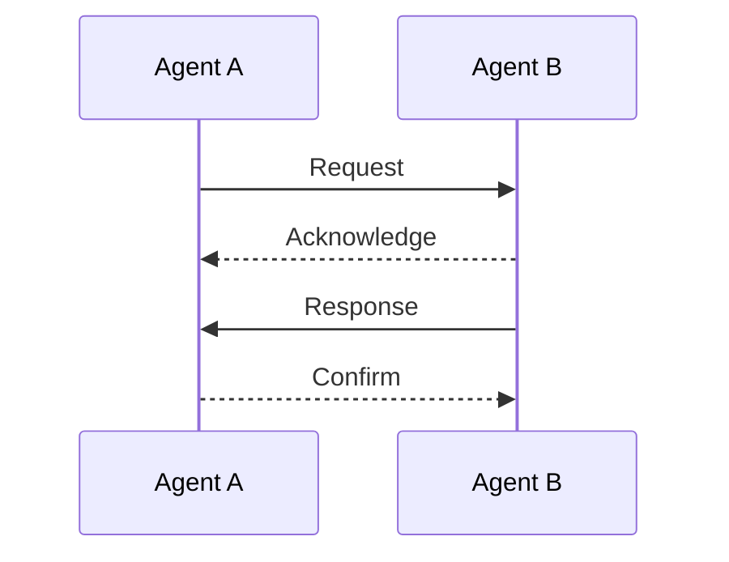
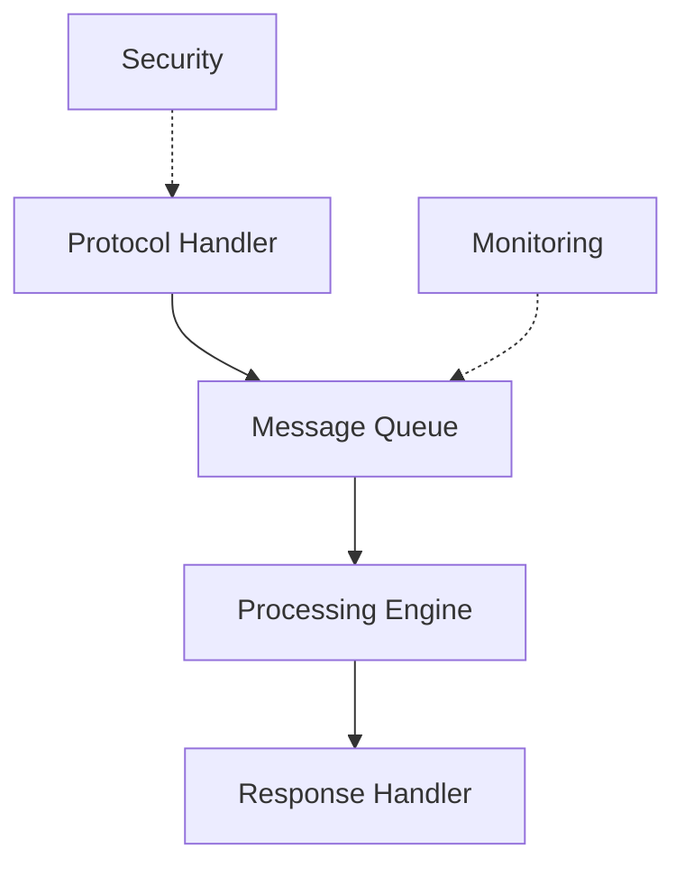

# Communication Protocols

## Overview

This document details the communication protocols and interaction patterns used in our agent systems.

## Protocol Architecture

### Message Flow


## Protocol Types

### Basic Protocols
```yaml
basic_protocols:
  request_response:
    steps:
      - request
      - acknowledge
      - process
      - respond
    properties:
      - synchronous
      - reliable
      - ordered
  publish_subscribe:
    components:
      - publisher
      - broker
      - subscriber
    patterns:
      - topic_based
      - content_based
```

### Advanced Protocols
```yaml
advanced_protocols:
  negotiation:
    types:
      - contract_net
      - auction
      - bargaining
    phases:
      - proposal
      - evaluation
      - acceptance
  coordination:
    mechanisms:
      - synchronization
      - mutual_exclusion
      - leader_election
```

## Implementation

### Message Structure
```yaml
message_format:
  header:
    - message_id
    - timestamp
    - sender
    - receiver
    - protocol_id
  content:
    - type
    - payload
    - encoding
  metadata:
    - priority
    - ttl
    - security
```

### Protocol Patterns
- Request-Response
- Publish-Subscribe
- Query-Answer
- Broadcast

## Integration

### System Components


### Cross-System Links
- [[message-formats|Message Formats]]
- [[interaction-patterns|Interaction Patterns]]
- [[security-protocols|Security]]

## Advanced Features

### Conversation Management
```yaml
conversation:
  states:
    - initiated
    - in_progress
    - completed
    - failed
  tracking:
    - conversation_id
    - state_history
    - timeout_handling
```

### Quality of Service
- Reliability
- Ordering
- Timing
- Priority

### Security Features
```yaml
security_measures:
  authentication:
    - credentials
    - certificates
    - tokens
  encryption:
    - transport_layer
    - message_level
    - end_to_end
```

## Performance

### Monitoring
```yaml
monitoring_metrics:
  performance:
    - latency
    - throughput
    - success_rate
  reliability:
    - message_loss
    - delivery_order
    - error_rate
```

### Optimization
- Load Balancing
- Message Batching
- Protocol Selection
- Resource Management

## Error Handling

### Recovery Mechanisms
```yaml
error_handling:
  detection:
    - timeout
    - validation
    - consistency
  recovery:
    - retry
    - alternate_route
    - fallback
  logging:
    - error_details
    - context
    - resolution
```

### Failure Modes
- Message Loss
- Protocol Violation
- Timeout
- Resource Exhaustion

## References
- [[fipa-protocols|FIPA Standards]]
- [[messaging-patterns|Messaging Patterns]]
- [[protocol-optimization|Optimization Techniques]] 