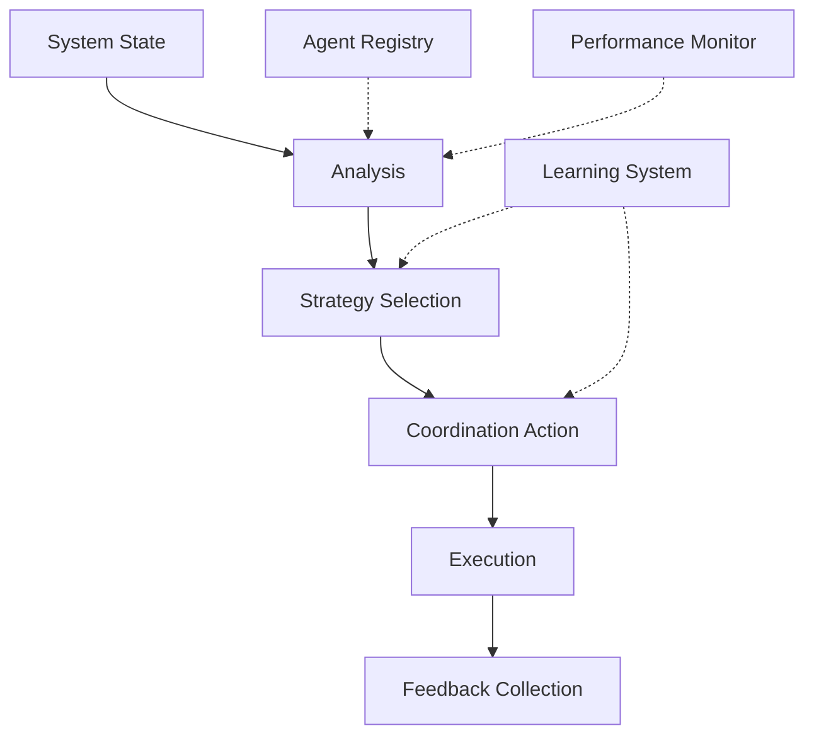

# Coordination Behavior

## Overview

### Purpose & Context
- Behavior Type: System Coordination Pattern
- Application Domain: Multi-Agent Systems
- Trigger Conditions: System State Changes, Task Requests, Agent Status Updates

### Behavioral Model
```yaml
behavior_model:
  type: "adaptive_coordination"
  category: "system_management"
  complexity: "high"
  adaptability: "dynamic"
```

## Implementation

### Core Components


### State Machine
```yaml
states:
  monitoring:
    transitions:
      - to: analyzing
        condition: state_change_detected
  analyzing:
    actions:
      - assess_system_state
      - evaluate_performance
    transitions:
      - to: planning
        condition: action_required
      - to: monitoring
        condition: system_optimal
  planning:
    actions:
      - select_coordination_strategy
      - prepare_directives
    transitions:
      - to: executing
        condition: plan_ready
  executing:
    actions:
      - distribute_tasks
      - form_coalitions
      - adjust_resources
    transitions:
      - to: evaluating
        condition: actions_completed
      - to: error_handling
        condition: execution_failed
  evaluating:
    actions:
      - collect_feedback
      - measure_impact
      - update_models
    transitions:
      - to: monitoring
        condition: evaluation_complete
  error_handling:
    actions:
      - diagnose_failure
      - implement_recovery
    transitions:
      - to: monitoring
        condition: recovery_successful
      - to: planning
        condition: replan_required
```

## Interaction Pattern

### Input Processing
```yaml
inputs:
  system_state:
    - type: agent_status
      data: status_update_format
    - type: performance_metrics
      data: metrics_format
  events:
    - type: task_arrival
      priority: high
    - type: agent_failure
      priority: critical
    - type: load_imbalance
      priority: medium
```

### Output Generation
```yaml
outputs:
  directives:
    - type: task_assignment
      effect: workload_distribution
    - type: coalition_formation
      effect: team_structure
  feedback:
    - type: coordination_metrics
      destination: performance_monitor
    - type: adaptation_data
      destination: learning_system
```

## Learning & Adaptation

### Learning Mechanisms
```yaml
learning:
  method: hierarchical_reinforcement_learning
  parameters:
    - name: coordination_learning_rate
      value: 0.03
    - name: exploration_factor
      value: 0.15
  objectives:
    - optimize_task_distribution
    - minimize_communication_overhead
    - maximize_system_stability
```

### Adaptation Rules
```yaml
adaptation:
  conditions:
    - trigger: performance_degradation
      threshold: 15%
      action: rebalance_workload
    - trigger: communication_congestion
      threshold: 80%
      action: adjust_coalition_structure
  constraints:
    - maintain_service_level
    - preserve_system_stability
```

## Integration

### Dependencies
- [[cognitive-models#coordination|Coordination Model]]
- [[action-patterns#distribution|Distribution Pattern]]
- [[learning-patterns#multi-agent|Multi-Agent Learning]]

### Communication
```yaml
communication:
  internal:
    - target: agent_registry
      protocol: [[protocols#registry-update]]
    - target: performance_monitor
      protocol: [[protocols#metrics-collection]]
  external:
    - target: managed_agents
      protocol: [[protocols#coordination-directive]]
```

## Performance

### Metrics
```yaml
metrics:
  coordination_quality:
    - metric: load_balance_index
      threshold: 0.95
    - metric: response_time
      threshold: 100ms
  efficiency:
    - metric: coordination_overhead
      threshold: 0.15
    - metric: resource_utilization
      threshold: 0.85
```

### Optimization
```yaml
optimization:
  strategies:
    - name: dynamic_load_balancing
      trigger: utilization_imbalance
      action: redistribute_tasks
    - name: coalition_optimization
      trigger: communication_overhead
      action: restructure_teams
```

## Safety & Validation

### Safety Checks
```yaml
safety:
  preconditions:
    - system_state_consistent
    - communication_channels_active
    - resources_available
  invariants:
    - task_conservation
    - agent_capability_matching
    - load_balance_constraints
  postconditions:
    - system_stability_maintained
    - performance_requirements_met
```

### Validation Methods
```yaml
validation:
  runtime_checks:
    - state_consistency_verification
    - action_impact_prediction
    - constraint_satisfaction_check
  recovery_procedures:
    - coordination_rollback
    - gradual_state_correction
    - emergency_stabilization
```

## Maintenance

### Version History
- Current Version: 1.0.0
- Last Modified: 2024-03-21
- Changes: [[changelog#coordination-behavior-1.0.0]]

### Documentation
- Implementation Guide: [[implementation-guides#coordination]]
- Usage Examples: [[examples#coordination]]
- Known Issues: [[issues#coordination]]

## References
- [[behavior-patterns#coordination]]
- [[implementation-guides#multi-agent-coordination]]
- [[best-practices#system-coordination]]

---
*Note: This behavior specification is implemented in the Coordinator Agent.* 