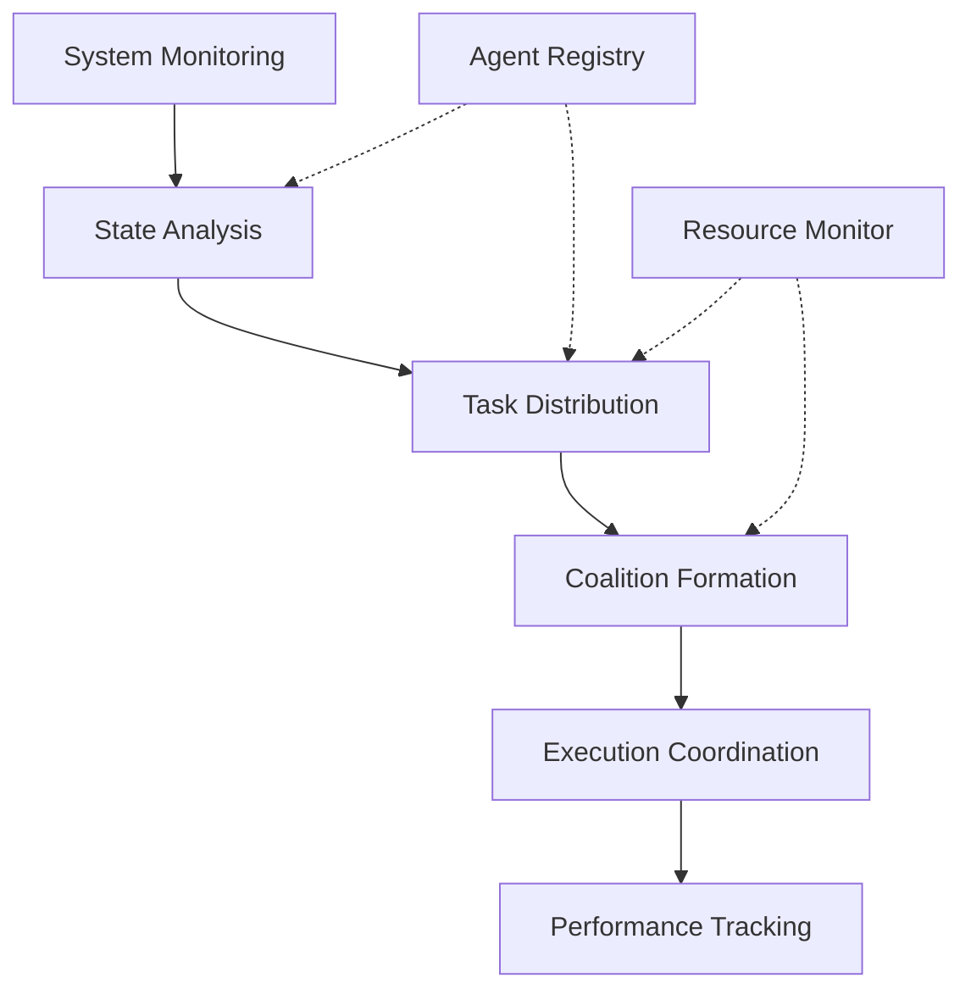

# Coordinator Agent

## Overview

### Purpose & Scope
- Primary Function: Multi-agent coordination and task orchestration
- Domain: Distributed agent systems
- Operating Context: Dynamic multi-agent environment

### Core Capabilities
```yaml
capabilities:
  cognitive:
    - agent_state_tracking
    - workload_balancing
    - coalition_formation
  behavioral:
    - negotiation_management
    - conflict_resolution
    - performance_optimization
  interactive:
    - agent_discovery
    - task_distribution
    - system_monitoring
```

## Architecture

### Cognitive Model
```yaml
cognitive_architecture:
  type: "hierarchical_coordination"
  components:
    - [[cognitive-models#belief-system|Agent Registry]]
    - [[cognitive-models#goal-management|Task Orchestrator]]
    - [[cognitive-models#planning|Coalition Planner]]
  features:
    - dynamic_team_formation
    - adaptive_load_balancing
    - predictive_resource_allocation
```

### Behavioral Framework


## Implementation

### Required Systems
- [[perception-systems|Agent Monitor]]: agent_monitor_v2
- [[reasoning-models|Distribution Planner]]: workload_balancer_v1
- [[learning-patterns|Coordination Learning]]: adaptive_coordinator_v1

### Integration Points
```yaml
integration:
  inputs:
    - type: agent_status
      format: json
      protocol: [[protocols#agent-monitoring]]
    - type: task_request
      format: json
      protocol: [[protocols#task-submission]]
  outputs:
    - type: task_assignment
      format: json
      protocol: [[protocols#task-distribution]]
    - type: coordination_directive
      format: json
      protocol: [[protocols#agent-coordination]]
```

## Coordination Specification

### Coordination Patterns
```yaml
patterns:
  task_distribution:
    - name: workload_balancing
      strategy: round_robin
      constraints: resource_availability
    - name: specialized_assignment
      strategy: capability_matching
      constraints: agent_expertise
  coalition_formation:
    - name: team_assembly
      strategy: optimal_grouping
      constraints: communication_overhead
```

### Learning Configuration
```yaml
learning:
  methods:
    - type: multi_agent_learning
      parameters:
        coordination_rate: 0.05
        adaptation_factor: 0.1
  objectives:
    - system_throughput_optimization
    - communication_overhead_reduction
```

## Communication

### Interaction Protocols
- Primary: [[protocols#coordination-protocol]]
- Secondary: [[protocols#negotiation-protocol]]

### Message Formats
```yaml
message_formats:
  incoming:
    - [[message-formats#agent-status]]
    - [[message-formats#task-request]]
  outgoing:
    - [[message-formats#task-assignment]]
    - [[message-formats#coordination-directive]]
```

## Performance

### Metrics
```yaml
performance_metrics:
  coordination:
    - metric: assignment_latency
      threshold: 50ms
    - metric: load_balance_index
      threshold: 0.9
  system:
    - metric: system_throughput
      threshold: 1000_tasks_per_minute
    - metric: coordination_overhead
      threshold: 0.1
  reliability:
    - metric: task_completion_rate
      threshold: 0.99
    - metric: agent_responsiveness
      threshold: 0.95
```

### Monitoring
- [[monitoring-system#coordination|Coordination Monitoring]]
- [[performance-metrics#system-balance|System Balance Metrics]]

## Security & Safety

### Security Measures
```yaml
security:
  authentication: mutual_tls
  authorization: capability_based
  encryption: ed25519
```

### Safety Protocols
- [[safety-protocols#coordination|Coordination Safety]]
- [[error-handling#distribution|Distribution Error Handler]]

## Maintenance

### Version Control
- Version: 1.0.0
- Last Updated: 2024-03-21
- Change Log: [[changelog#coordinator-1.0.0]]

### Documentation
- Technical Specs: [[technical-docs#coordinator]]
- User Guide: [[user-guides#coordinator]]
- API Reference: [[api-docs#coordinator]]

## Advanced Features

### Dynamic Adaptation
```yaml
adaptation:
  triggers:
    - system_load_change
    - agent_availability_change
    - performance_degradation
  strategies:
    - rebalance_workload
    - restructure_coalitions
    - adjust_communication_patterns
```

### Fault Tolerance
```yaml
fault_tolerance:
  detection:
    - agent_heartbeat_monitoring
    - performance_anomaly_detection
    - communication_pattern_analysis
  recovery:
    - task_reassignment
    - coalition_restructuring
    - communication_rerouting
```

### System Optimization
```yaml
optimization:
  objectives:
    - minimize_coordination_overhead
    - maximize_system_throughput
    - optimize_resource_utilization
  constraints:
    - communication_bandwidth
    - processing_capacity
    - response_time_requirements
```

## References
- [[architecture-patterns#coordination]]
- [[implementation-guides#coordinator]]
- [[best-practices#multi-agent-systems]]

---
*Note: This Coordinator Agent works in conjunction with Task Executor and other specialized agents.* 