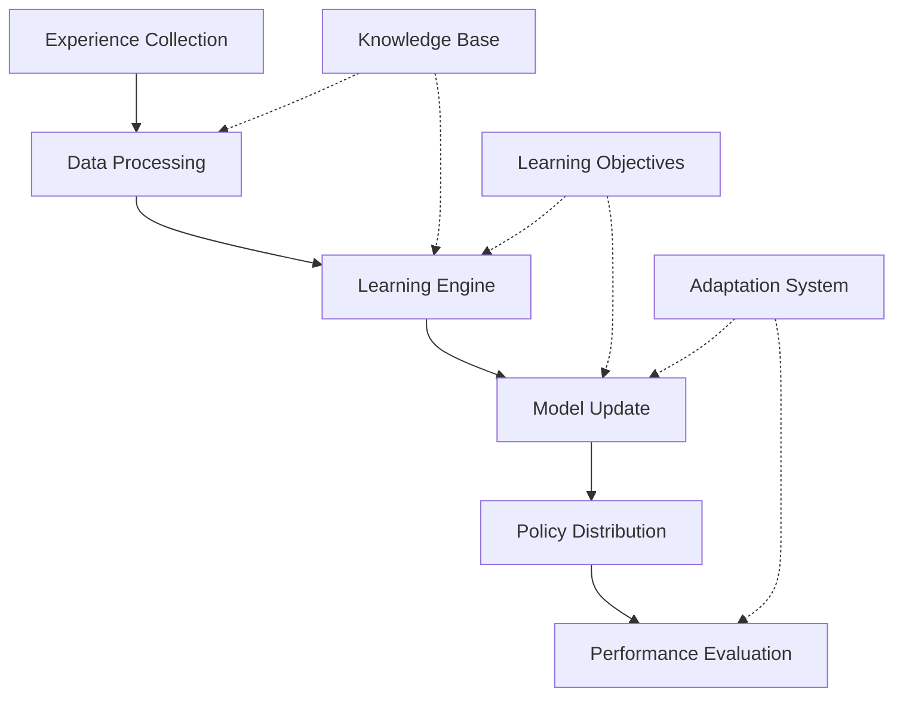

# Learning Behavior

## Overview

### Purpose & Context
- Behavior Type: Distributed Learning Pattern
- Application Domain: Multi-Agent Learning
- Trigger Conditions: Experience Collection, Model Updates, Performance Changes

### Behavioral Model
```yaml
behavior_model:
  type: "adaptive_learning"
  category: "distributed_learning"
  complexity: "high"
  adaptability: "dynamic"
```

## Implementation

### Core Components


### State Machine
```yaml
states:
  collecting:
    transitions:
      - to: processing
        condition: experience_batch_ready
  processing:
    actions:
      - validate_experience
      - preprocess_data
    transitions:
      - to: learning
        condition: data_valid
      - to: error
        condition: validation_failed
  learning:
    actions:
      - update_model
      - optimize_policy
    transitions:
      - to: distributing
        condition: learning_complete
      - to: adapting
        condition: adaptation_needed
  distributing:
    actions:
      - prepare_update
      - distribute_model
    transitions:
      - to: evaluating
        condition: distribution_complete
      - to: error_handling
        condition: distribution_failed
  evaluating:
    actions:
      - measure_performance
      - assess_convergence
    transitions:
      - to: collecting
        condition: continue_learning
      - to: adapting
        condition: adaptation_required
  adapting:
    actions:
      - adjust_parameters
      - modify_strategy
    transitions:
      - to: learning
        condition: adaptation_complete
      - to: error_handling
        condition: adaptation_failed
  error_handling:
    actions:
      - diagnose_error
      - attempt_recovery
    transitions:
      - to: collecting
        condition: recovery_successful
      - to: failed
        condition: recovery_failed
```

## Interaction Pattern

### Input Processing
```yaml
inputs:
  experience:
    - type: trajectory_data
      format: tensor_sequence
    - type: reward_signal
      format: scalar_value
  feedback:
    - type: performance_metrics
      priority: high
    - type: convergence_status
      priority: medium
```

### Output Generation
```yaml
outputs:
  models:
    - type: policy_update
      effect: behavior_modification
    - type: value_function
      effect: value_estimation
  status:
    - type: learning_metrics
      destination: monitoring_system
    - type: adaptation_status
      destination: coordination_system
```

## Learning & Adaptation

### Learning Mechanisms
```yaml
learning:
  methods:
    - name: policy_gradient
      parameters:
        - learning_rate: 0.001
        - discount_factor: 0.99
        - gae_lambda: 0.95
    - name: value_iteration
      parameters:
        - update_rate: 0.01
        - batch_size: 256
  objectives:
    - maximize_expected_return
    - minimize_policy_divergence
    - optimize_sample_efficiency
```

### Adaptation Rules
```yaml
adaptation:
  triggers:
    - condition: performance_degradation
      threshold: 10%
      action: adjust_learning_rate
    - condition: high_variance
      threshold: 0.5
      action: increase_batch_size
    - condition: slow_convergence
      threshold: "1000 steps"
      action: modify_architecture
  constraints:
    - maintain_stability
    - preserve_knowledge
    - respect_resource_limits
```

## Integration

### Dependencies
- [[cognitive-models#learning|Learning Model]]
- [[action-patterns#adaptation|Adaptation Pattern]]
- [[learning-patterns#optimization|Optimization Pattern]]

### Communication
```yaml
communication:
  internal:
    - target: knowledge_base
      protocol: [[protocols#knowledge-update]]
    - target: adaptation_engine
      protocol: [[protocols#adaptation-control]]
  external:
    - target: learning_agents
      protocol: [[protocols#model-sync]]
```

## Performance

### Metrics
```yaml
metrics:
  learning:
    - metric: sample_efficiency
      threshold: 0.8
    - metric: convergence_rate
      threshold: "100 steps"
  adaptation:
    - metric: adaptation_latency
      threshold: 50ms
    - metric: stability_score
      threshold: 0.95
```

### Optimization
```yaml
optimization:
  strategies:
    - name: experience_prioritization
      trigger: learning_slowdown
      action: adjust_sampling
    - name: model_compression
      trigger: high_memory_usage
      action: prune_parameters
```

## Safety & Validation

### Safety Checks
```yaml
safety:
  preconditions:
    - valid_experience_data
    - stable_initial_state
    - sufficient_resources
  invariants:
    - bounded_updates
    - policy_consistency
    - value_bounds
  postconditions:
    - improved_performance
    - maintained_stability
    - resource_efficiency
```

### Validation Methods
```yaml
validation:
  runtime_checks:
    - gradient_magnitude
    - value_bounds
    - policy_entropy
  recovery_procedures:
    - gradient_clipping
    - state_restoration
    - safe_exploration
```

## Maintenance

### Version History
- Current Version: 1.0.0
- Last Modified: 2024-03-21
- Changes: [[changelog#learning-behavior-1.0.0]]

### Documentation
- Implementation Guide: [[implementation-guides#learning]]
- Usage Examples: [[examples#learning]]
- Known Issues: [[issues#learning]]

## References
- [[behavior-patterns#learning]]
- [[implementation-guides#adaptation]]
- [[best-practices#learning]]

---
*Note: This behavior specification is implemented in the Learning Agent.* 