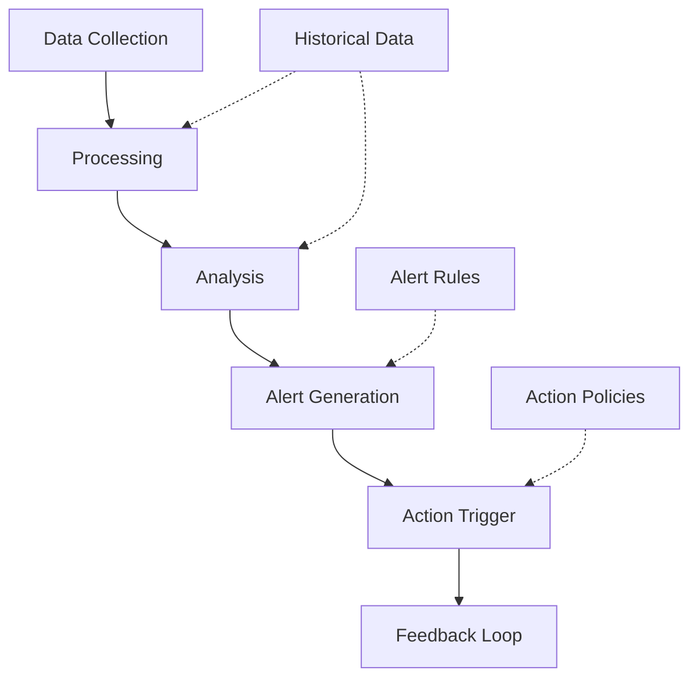

# Monitoring Agent

## Overview

### Purpose & Scope
- Primary Function: System-wide monitoring and observability
- Domain: Performance monitoring and diagnostics
- Operating Context: Distributed agent environment

### Core Capabilities
```yaml
capabilities:
  cognitive:
    - metric_analysis
    - anomaly_detection
    - performance_prediction
  behavioral:
    - adaptive_monitoring
    - alert_management
    - data_aggregation
  interactive:
    - metric_collection
    - alert_distribution
    - health_reporting
```

## Architecture

### Cognitive Model
```yaml
cognitive_architecture:
  type: "analytical_observer"
  components:
    - [[cognitive-models#belief-system|Metrics Registry]]
    - [[cognitive-models#goal-management|Alert Manager]]
    - [[cognitive-models#planning|Analysis Engine]]
  features:
    - real_time_analysis
    - predictive_monitoring
    - pattern_recognition
```

### Behavioral Framework


## Implementation

### Required Systems
- [[perception-systems|Metric Collector]]: metric_collector_v2
- [[reasoning-models|Analysis Engine]]: metric_analyzer_v1
- [[learning-patterns|Pattern Learner]]: adaptive_monitor_v1

### Integration Points
```yaml
integration:
  inputs:
    - type: system_metrics
      format: prometheus
      protocol: [[protocols#metric-collection]]
    - type: agent_status
      format: json
      protocol: [[protocols#health-check]]
  outputs:
    - type: alerts
      format: json
      protocol: [[protocols#alert-notification]]
    - type: performance_reports
      format: json
      protocol: [[protocols#metric-reporting]]
```

## Monitoring Specification

### Metric Types
```yaml
metrics:
  system:
    - name: cpu_usage
      type: gauge
      unit: percentage
    - name: memory_usage
      type: gauge
      unit: bytes
    - name: network_throughput
      type: counter
      unit: bytes_per_second
  agent:
    - name: task_throughput
      type: counter
      unit: tasks_per_minute
    - name: response_time
      type: histogram
      unit: milliseconds
    - name: error_rate
      type: gauge
      unit: errors_per_minute
  application:
    - name: request_rate
      type: counter
      unit: requests_per_second
    - name: latency
      type: histogram
      unit: milliseconds
    - name: success_rate
      type: gauge
      unit: percentage
```

### Alert Rules
```yaml
alerts:
  performance:
    - name: high_cpu_usage
      condition: cpu_usage > 80%
      duration: 5m
      severity: warning
    - name: memory_exhaustion
      condition: memory_usage > 90%
      duration: 2m
      severity: critical
  availability:
    - name: agent_unresponsive
      condition: heartbeat_missing
      duration: 1m
      severity: critical
    - name: high_error_rate
      condition: error_rate > 5%
      duration: 5m
      severity: warning
```

## Communication

### Interaction Protocols
- Primary: [[protocols#monitoring-protocol]]
- Secondary: [[protocols#alert-protocol]]

### Message Formats
```yaml
message_formats:
  incoming:
    - [[message-formats#metric-data]]
    - [[message-formats#health-status]]
  outgoing:
    - [[message-formats#alert-notification]]
    - [[message-formats#metric-report]]
```

## Performance

### Metrics
```yaml
performance_metrics:
  collection:
    - metric: collection_latency
      threshold: 10ms
    - metric: data_throughput
      threshold: 10000_metrics_per_second
  processing:
    - metric: analysis_latency
      threshold: 100ms
    - metric: alert_latency
      threshold: 1s
  storage:
    - metric: write_throughput
      threshold: 5000_writes_per_second
    - metric: query_latency
      threshold: 50ms
```

### Monitoring
- [[monitoring-system#self-monitoring|Self Monitoring]]
- [[performance-metrics#monitoring-system|System Metrics]]

## Security & Safety

### Security Measures
```yaml
security:
  authentication: certificate_based
  authorization: role_based
  encryption: tls_1.3
```

### Safety Protocols
- [[safety-protocols#data-integrity|Data Integrity]]
- [[error-handling#metric-collection|Collection Error Handler]]

## Advanced Features

### Data Management
```yaml
data_management:
  storage:
    - type: time_series_db
      retention: 30d
      resolution: 10s
    - type: alert_history
      retention: 90d
  aggregation:
    - window_functions
    - statistical_analysis
    - trend_detection
```

### Analysis Capabilities
```yaml
analysis:
  methods:
    - statistical_analysis
    - machine_learning
    - anomaly_detection
  features:
    - trend_analysis
    - correlation_detection
    - pattern_recognition
```

### Visualization
```yaml
visualization:
  dashboards:
    - system_overview
    - agent_performance
    - resource_utilization
  graphs:
    - time_series
    - heat_maps
    - dependency_graphs
```

## Maintenance

### Version Control
- Version: 1.0.0
- Last Updated: 2024-03-21
- Change Log: [[changelog#monitoring-agent-1.0.0]]

### Documentation
- Technical Specs: [[technical-docs#monitoring-agent]]
- User Guide: [[user-guides#monitoring-agent]]
- API Reference: [[api-docs#monitoring-agent]]

## References
- [[architecture-patterns#monitoring]]
- [[implementation-guides#monitoring]]
- [[best-practices#observability]]

---
*Note: This Monitoring Agent works in conjunction with Task Executor, Coordinator, and Resource Manager agents.* 