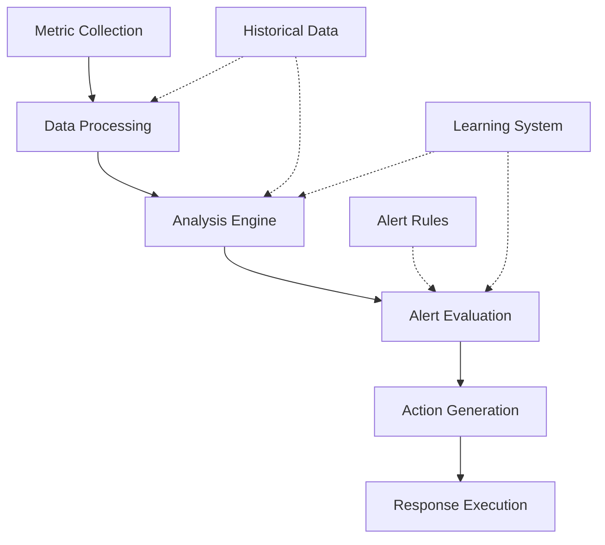

# Monitoring Behavior

## Overview

### Purpose & Context
- Behavior Type: System Monitoring Pattern
- Application Domain: Performance and Health Monitoring
- Trigger Conditions: Metric Collection, Alert Conditions, Analysis Events

### Behavioral Model
```yaml
behavior_model:
  type: "adaptive_monitoring"
  category: "system_observation"
  complexity: "high"
  adaptability: "dynamic"
```

## Implementation

### Core Components


### State Machine
```yaml
states:
  collecting:
    transitions:
      - to: processing
        condition: data_received
  processing:
    actions:
      - validate_data
      - normalize_metrics
    transitions:
      - to: analyzing
        condition: data_valid
      - to: error
        condition: validation_failed
  analyzing:
    actions:
      - analyze_trends
      - detect_anomalies
    transitions:
      - to: alerting
        condition: threshold_exceeded
      - to: collecting
        condition: analysis_complete
  alerting:
    actions:
      - generate_alert
      - determine_severity
    transitions:
      - to: responding
        condition: action_required
      - to: collecting
        condition: notification_sent
  responding:
    actions:
      - execute_response
      - update_status
    transitions:
      - to: collecting
        condition: response_complete
      - to: error_handling
        condition: response_failed
  error_handling:
    actions:
      - log_error
      - attempt_recovery
    transitions:
      - to: collecting
        condition: recovery_successful
      - to: failed
        condition: recovery_failed
```

## Interaction Pattern

### Input Processing
```yaml
inputs:
  metrics:
    - type: system_metric
      data: time_series_format
    - type: agent_status
      data: health_check_format
  events:
    - type: threshold_breach
      priority: high
    - type: anomaly_detected
      priority: medium
```

### Output Generation
```yaml
outputs:
  alerts:
    - type: alert_notification
      effect: notify_operators
    - type: corrective_action
      effect: system_adjustment
  reports:
    - type: performance_report
      destination: monitoring_system
    - type: health_status
      destination: system_dashboard
```

## Learning & Adaptation

### Learning Mechanisms
```yaml
learning:
  method: online_learning
  parameters:
    - name: threshold_adjustment_rate
      value: 0.01
    - name: anomaly_sensitivity
      value: 0.05
  objectives:
    - optimize_alert_accuracy
    - reduce_false_positives
    - improve_prediction_accuracy
```

### Adaptation Rules
```yaml
adaptation:
  conditions:
    - trigger: false_positive_rate
      threshold: 5%
      action: adjust_sensitivity
    - trigger: missed_anomalies
      threshold: 1%
      action: increase_sensitivity
  constraints:
    - maintain_detection_rate
    - limit_alert_frequency
```

## Integration

### Dependencies
- [[cognitive-models#analysis|Analysis Model]]
- [[action-patterns#response|Response Pattern]]
- [[learning-patterns#adaptation|Adaptation Pattern]]

### Communication
```yaml
communication:
  internal:
    - target: metric_store
      protocol: [[protocols#metric-storage]]
    - target: alert_manager
      protocol: [[protocols#alert-handling]]
  external:
    - target: monitored_systems
      protocol: [[protocols#metric-collection]]
```

## Performance

### Metrics
```yaml
metrics:
  collection:
    - metric: collection_rate
      threshold: 10000_metrics_per_second
    - metric: processing_latency
      threshold: 50ms
  analysis:
    - metric: analysis_accuracy
      threshold: 0.99
    - metric: detection_latency
      threshold: 100ms
```

### Optimization
```yaml
optimization:
  strategies:
    - name: adaptive_sampling
      trigger: high_load
      action: adjust_sample_rate
    - name: batch_processing
      trigger: processing_backlog
      action: increase_batch_size
```

## Safety & Validation

### Safety Checks
```yaml
safety:
  preconditions:
    - metric_validation
    - storage_availability
    - processing_capacity
  invariants:
    - data_consistency
    - alert_accuracy
    - response_timeliness
  postconditions:
    - metrics_stored
    - alerts_delivered
    - actions_logged
```

### Validation Methods
```yaml
validation:
  runtime_checks:
    - data_quality_verification
    - threshold_validation
    - action_safety_check
  recovery_procedures:
    - data_reprocessing
    - alert_verification
    - action_rollback
```

## Maintenance

### Version History
- Current Version: 1.0.0
- Last Modified: 2024-03-21
- Changes: [[changelog#monitoring-behavior-1.0.0]]

### Documentation
- Implementation Guide: [[implementation-guides#monitoring]]
- Usage Examples: [[examples#monitoring]]
- Known Issues: [[issues#monitoring]]

## References
- [[behavior-patterns#monitoring]]
- [[implementation-guides#observability]]
- [[best-practices#monitoring]]

---
*Note: This behavior specification is implemented in the Monitoring Agent.* 