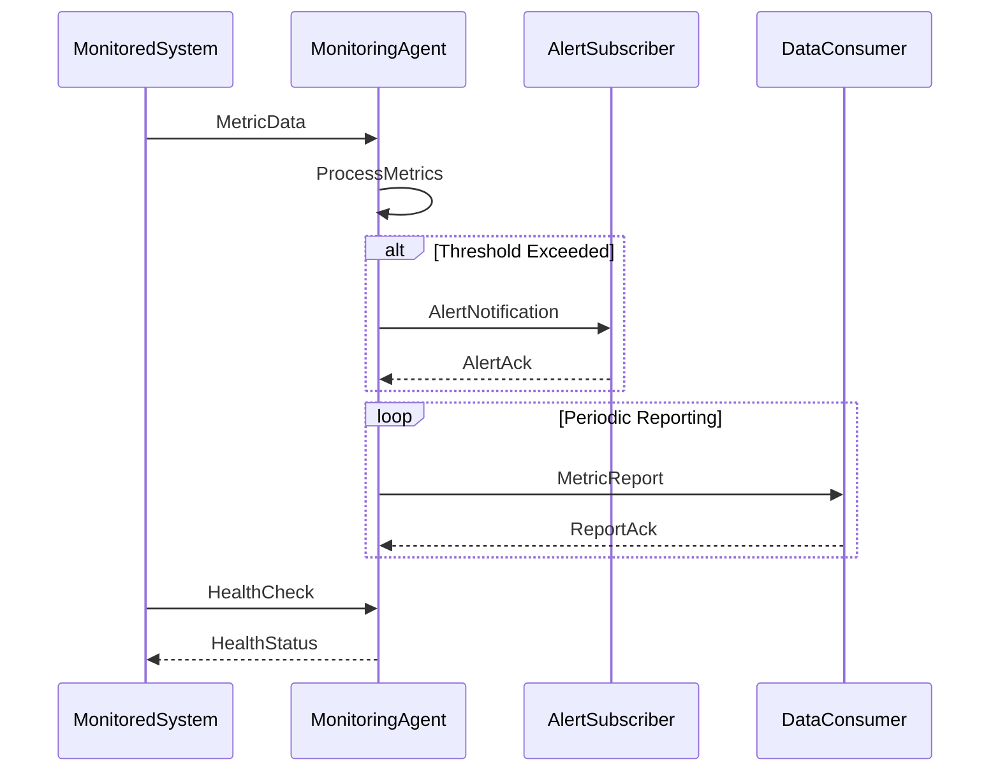

# Monitoring Protocol

## Overview

### Purpose
This protocol defines the communication patterns and message formats for system monitoring and observability in distributed agent systems, enabling efficient metric collection, analysis, and alert distribution.

### Protocol Summary
```yaml
protocol:
  name: monitoring_protocol
  version: 1.0.0
  category: system_monitoring
  style: publish_subscribe_with_alerts
```

### Participants
- Monitoring Agent (MA)
- Monitored Systems (MS)
- Alert Subscribers (AS)
- Data Consumers (DC)

## Message Flow

### Basic Monitoring Flow


## States & Transitions

### Protocol States
```yaml
states:
  idle:
    description: "Awaiting metric data"
    transitions:
      - to: collecting
        trigger: metric_received
  collecting:
    description: "Collecting metrics"
    transitions:
      - to: processing
        trigger: collection_complete
      - to: error
        trigger: collection_failed
  processing:
    description: "Processing metric data"
    transitions:
      - to: analyzing
        trigger: processing_complete
      - to: error
        trigger: processing_failed
  analyzing:
    description: "Analyzing metrics"
    transitions:
      - to: alerting
        trigger: threshold_exceeded
      - to: reporting
        trigger: analysis_complete
  alerting:
    description: "Generating alerts"
    transitions:
      - to: idle
        trigger: alert_sent
      - to: error
        trigger: alert_failed
  reporting:
    description: "Generating reports"
    transitions:
      - to: idle
        trigger: report_sent
      - to: error
        trigger: report_failed
  error:
    description: "Handling errors"
    transitions:
      - to: idle
        trigger: error_resolved
      - to: failed
        trigger: recovery_failed
```

## Message Definitions

### Core Messages
```yaml
messages:
  metric_data:
    type: data
    fields:
      - name: metric_id
        type: uuid
        required: true
      - name: timestamp
        type: datetime
        required: true
      - name: source
        type: string
        required: true
      - name: metric_type
        type: string
        required: true
      - name: value
        type: float
        required: true
      - name: labels
        type: object
        required: false
    example: |
      {
        "metric_id": "550e8400-e29b-41d4-a716-446655440000",
        "timestamp": "2024-03-21T10:00:00Z",
        "source": "task_executor_1",
        "metric_type": "cpu_usage",
        "value": 75.5,
        "labels": {
          "environment": "production",
          "region": "us-west"
        }
      }

  alert_notification:
    type: alert
    fields:
      - name: alert_id
        type: uuid
        required: true
      - name: timestamp
        type: datetime
        required: true
      - name: severity
        type: string
        enum: [critical, warning, info]
        required: true
      - name: source
        type: string
        required: true
      - name: condition
        type: object
        required: true
    example: |
      {
        "alert_id": "550e8400-e29b-41d4-a716-446655440001",
        "timestamp": "2024-03-21T10:00:01Z",
        "severity": "critical",
        "source": "task_executor_1",
        "condition": {
          "metric": "cpu_usage",
          "threshold": 80,
          "current_value": 85.5,
          "duration": "5m"
        }
      }
```

### Event Messages
```yaml
events:
  health_status:
    type: event
    fields:
      - name: event_id
        type: uuid
        required: true
      - name: timestamp
        type: datetime
        required: true
      - name: system_id
        type: string
        required: true
      - name: status
        type: string
        enum: [healthy, degraded, failed]
        required: true
      - name: metrics
        type: object
        required: true
    example: |
      {
        "event_id": "550e8400-e29b-41d4-a716-446655440002",
        "timestamp": "2024-03-21T10:00:02Z",
        "system_id": "task_executor_1",
        "status": "healthy",
        "metrics": {
          "uptime": 86400,
          "error_rate": 0.01,
          "response_time": 45
        }
      }
```

## Implementation

### Required Components
```yaml
components:
  monitoring_agent:
    - metric_collector
    - data_processor
    - alert_manager
  monitored_system:
    - metric_reporter
    - health_checker
    - status_manager
```

### Integration Points
```yaml
integration:
  message_broker:
    type: rabbitmq
    exchanges:
      - name: metrics
        type: topic
      - name: alerts
        type: fanout
  metric_storage:
    type: prometheus
    retention: 30d
```

## Behavior

### Success Scenario
1. Metric data collection
2. Data validation and processing
3. Analysis and threshold checking
4. Alert generation (if needed)
5. Report generation
6. Data storage

### Error Handling
```yaml
error_handling:
  scenarios:
    - error: collection_failure
      action: retry_collection
      retry: true
    - error: processing_error
      action: reprocess_data
      retry: true
    - error: storage_failure
      action: buffer_data
      retry: true
```

## Quality of Service

### Performance Requirements
```yaml
performance:
  latency:
    collection: "< 10ms"
    processing: "< 50ms"
    alerting: "< 1s"
  throughput:
    metrics_per_second: 10000
    alerts_per_second: 100
```

### Reliability Measures
```yaml
reliability:
  data_delivery:
    ack_required: true
    retry_count: 3
    retry_delay: "exponential"
  data_consistency:
    validation: "strict"
    storage: "durable"
```

## Security

### Authentication & Authorization
```yaml
security:
  authentication:
    method: mutual_tls
    certificate_authority: "system_ca"
  authorization:
    method: role_based
    roles:
      - metric_producer
      - metric_consumer
      - alert_receiver
```

### Data Protection
```yaml
data_protection:
  encryption:
    transport: tls_1.3
    storage: aes_256_gcm
  integrity:
    checksums: sha256
    signatures: ed25519
```

## Monitoring

### Metrics Collection
```yaml
monitoring:
  metrics:
    - name: message_throughput
      type: counter
      labels: [message_type, source]
    - name: processing_latency
      type: histogram
      labels: [operation_type]
    - name: error_rate
      type: gauge
      labels: [error_type]
```

### Logging Requirements
```yaml
logging:
  levels:
    - error
    - warn
    - info
  fields:
    - timestamp
    - correlation_id
    - source
    - operation
    - status
```

## Maintenance

### Version Control
- Protocol Version: 1.0.0
- Last Updated: 2024-03-21
- Changelog: [[changelog#monitoring-protocol-1.0.0]]

### Documentation
- Implementation Guide: [[implementation-guides#monitoring-protocol]]
- Message Formats: [[message-formats#monitoring]]
- Integration Examples: [[examples#monitoring-protocol]]

## References
- [[protocols#monitoring]]
- [[security#metric-protection]]
- [[monitoring#metrics]]

---
*Note: This protocol specification is implemented by the Monitoring Agent.* 