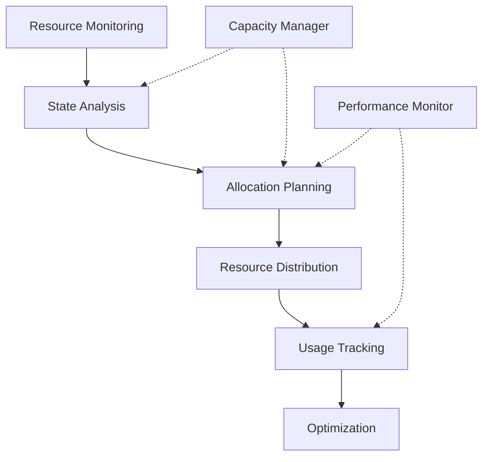

# Resource Manager Agent

## Overview

### Purpose & Scope
- Primary Function: System resource allocation and optimization
- Domain: Resource management and scheduling
- Operating Context: Distributed computing environment

### Core Capabilities
```yaml
capabilities:
  cognitive:
    - resource_tracking
    - allocation_optimization
    - capacity_planning
  behavioral:
    - dynamic_allocation
    - contention_resolution
    - utilization_balancing
  interactive:
    - resource_negotiation
    - status_reporting
    - coordination_interface
```

## Architecture

### Cognitive Model
```yaml
cognitive_architecture:
  type: "predictive_optimization"
  components:
    - [[cognitive-models#belief-system|Resource Registry]]
    - [[cognitive-models#goal-management|Allocation Optimizer]]
    - [[cognitive-models#planning|Resource Planner]]
  features:
    - predictive_allocation
    - dynamic_rebalancing
    - contention_management
```

### Behavioral Framework


## Implementation

### Required Systems
- [[perception-systems|Resource Monitor]]: resource_monitor_v2
- [[reasoning-models|Allocation Planner]]: resource_optimizer_v1
- [[learning-patterns|Usage Learning]]: adaptive_allocator_v1

### Integration Points
```yaml
integration:
  inputs:
    - type: resource_request
      format: json
      protocol: [[protocols#resource-request]]
    - type: usage_metrics
      format: json
      protocol: [[protocols#resource-monitoring]]
  outputs:
    - type: allocation_decision
      format: json
      protocol: [[protocols#resource-allocation]]
    - type: resource_status
      format: json
      protocol: [[protocols#status-reporting]]
```

## Resource Management

### Resource Types
```yaml
resources:
  compute:
    - type: cpu
      units: cores
      allocation: fractional
    - type: memory
      units: bytes
      allocation: block
    - type: gpu
      units: devices
      allocation: whole
  storage:
    - type: disk
      units: bytes
      allocation: block
    - type: ssd
      units: iops
      allocation: rate
  network:
    - type: bandwidth
      units: bits_per_second
      allocation: rate
```

### Allocation Strategies
```yaml
allocation:
  strategies:
    - name: priority_based
      policy: highest_priority_first
      constraints: resource_availability
    - name: fair_share
      policy: proportional_allocation
      constraints: minimum_guarantee
    - name: cost_optimized
      policy: efficiency_maximization
      constraints: budget_limits
```

## Communication

### Interaction Protocols
- Primary: [[protocols#resource-management-protocol]]
- Secondary: [[protocols#allocation-negotiation-protocol]]

### Message Formats
```yaml
message_formats:
  incoming:
    - [[message-formats#resource-request]]
    - [[message-formats#usage-report]]
  outgoing:
    - [[message-formats#allocation-response]]
    - [[message-formats#resource-status]]
```

## Performance

### Metrics
```yaml
performance_metrics:
  allocation:
    - metric: allocation_latency
      threshold: 50ms
    - metric: resource_utilization
      threshold: 0.85
  efficiency:
    - metric: fragmentation_ratio
      threshold: 0.1
    - metric: allocation_success_rate
      threshold: 0.99
  optimization:
    - metric: cost_efficiency
      threshold: 0.9
    - metric: balance_index
      threshold: 0.95
```

### Monitoring
- [[monitoring-system#resource-management|Resource Monitoring]]
- [[performance-metrics#utilization|Utilization Metrics]]

## Security & Safety

### Security Measures
```yaml
security:
  authentication: certificate_based
  authorization: capability_based
  encryption: aes_256_gcm
```

### Safety Protocols
- [[safety-protocols#resource-protection|Resource Protection]]
- [[error-handling#allocation-failure|Allocation Failure Handler]]

## Advanced Features

### Predictive Management
```yaml
prediction:
  models:
    - usage_prediction
    - demand_forecasting
    - capacity_planning
  horizons:
    - short_term: "5m"
    - medium_term: "1h"
    - long_term: "24h"
```

### Dynamic Optimization
```yaml
optimization:
  objectives:
    - maximize_utilization
    - minimize_fragmentation
    - balance_load
  constraints:
    - resource_limits
    - priority_requirements
    - fairness_criteria
```

### Fault Tolerance
```yaml
fault_tolerance:
  detection:
    - resource_failure
    - performance_degradation
    - capacity_exhaustion
  recovery:
    - reallocation
    - failover
    - graceful_degradation
```

## Maintenance

### Version Control
- Version: 1.0.0
- Last Updated: 2024-03-21
- Change Log: [[changelog#resource-manager-1.0.0]]

### Documentation
- Technical Specs: [[technical-docs#resource-manager]]
- User Guide: [[user-guides#resource-manager]]
- API Reference: [[api-docs#resource-manager]]

## References
- [[architecture-patterns#resource-management]]
- [[implementation-guides#resource-manager]]
- [[best-practices#resource-optimization]]

---
*Note: This Resource Manager Agent works in conjunction with the Coordinator Agent and Task Executor agents.* 