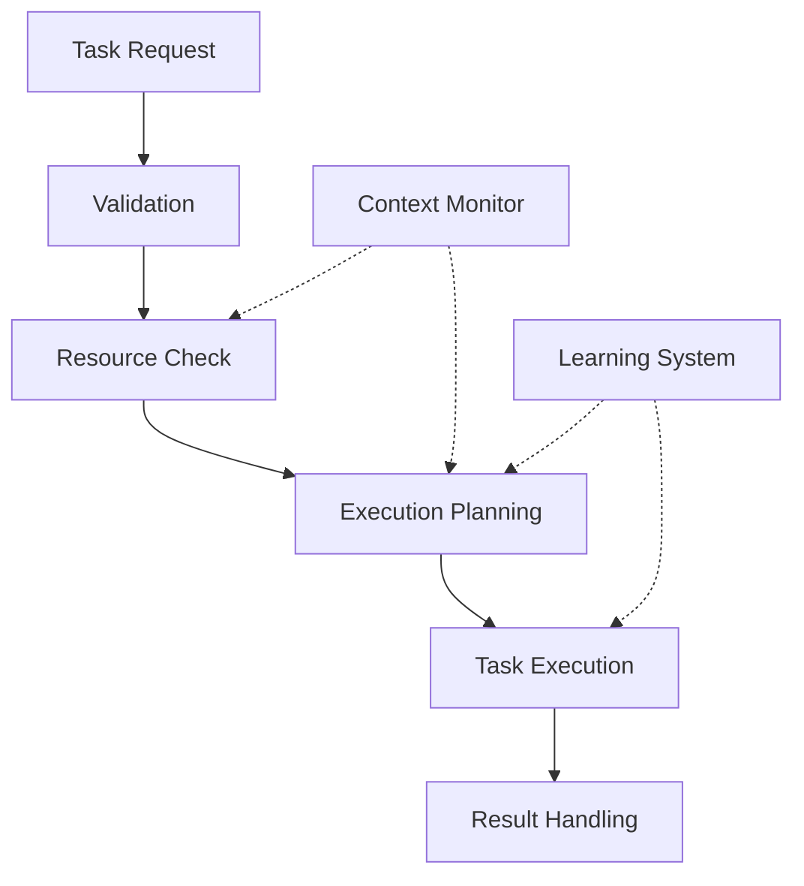

# Task Execution Behavior

## Overview

### Purpose & Context
- Behavior Type: Core Execution Pattern
- Application Domain: Task Automation
- Trigger Conditions: Task Request, Resource Availability

### Behavioral Model
```yaml
behavior_model:
  type: "adaptive_execution"
  category: "task_management"
  complexity: "high"
  adaptability: "dynamic"
```

## Implementation

### Core Components


### State Machine
```yaml
states:
  initial:
    transitions:
      - to: validating
        condition: task_received
  validating:
    actions:
      - validate_task_parameters
      - check_prerequisites
    transitions:
      - to: resource_check
        condition: validation_passed
      - to: error
        condition: validation_failed
  resource_check:
    actions:
      - check_resource_availability
      - reserve_resources
    transitions:
      - to: planning
        condition: resources_available
      - to: waiting
        condition: resources_unavailable
  planning:
    actions:
      - generate_execution_plan
      - optimize_resource_usage
    transitions:
      - to: executing
        condition: plan_ready
  executing:
    actions:
      - execute_task_steps
      - monitor_progress
    transitions:
      - to: completing
        condition: execution_successful
      - to: error_recovery
        condition: execution_failed
  completing:
    actions:
      - release_resources
      - generate_results
    transitions:
      - to: finished
        condition: cleanup_complete
```

## Interaction Pattern

### Input Processing
```yaml
inputs:
  sensors:
    - type: task_queue
      data: task_request_format
    - type: resource_monitor
      data: resource_status_format
  triggers:
    - condition: new_task_available
      priority: normal
    - condition: resource_state_changed
      priority: high
```

### Output Generation
```yaml
outputs:
  actions:
    - type: task_execution
      effect: state_change
    - type: resource_management
      effect: resource_allocation
  feedback:
    - type: execution_status
      destination: task_manager
    - type: performance_metrics
      destination: monitoring_system
```

## Learning & Adaptation

### Learning Mechanisms
```yaml
learning:
  method: reinforcement_learning
  parameters:
    - name: learning_rate
      value: 0.01
    - name: exploration_rate
      value: 0.1
  objectives:
    - minimize_execution_time
    - optimize_resource_usage
    - maximize_success_rate
```

### Adaptation Rules
- Condition: performance_below_threshold
- Strategy: adjust_resource_allocation
- Constraints: maintain_minimum_throughput

## Integration

### Dependencies
- [[cognitive-models#task-planning|Task Planning Model]]
- [[action-patterns#resource-management|Resource Management]]
- [[learning-patterns#execution-optimization|Execution Optimization]]

### Communication
```yaml
communication:
  internal:
    - target: resource_manager
      protocol: [[protocols#resource-request]]
    - target: task_scheduler
      protocol: [[protocols#task-status]]
  external:
    - target: monitoring_system
      protocol: [[protocols#metrics-reporting]]
```

## Performance

### Metrics
```yaml
metrics:
  effectiveness:
    - metric: success_rate
      threshold: 0.99
    - metric: completion_time
      threshold: task_specific_sla
  efficiency:
    - metric: resource_utilization
      threshold: 0.85
    - metric: throughput
      threshold: 100_tasks_per_minute
```

### Optimization
- Strategy: dynamic_resource_allocation
- Parameters: queue_depth, resource_availability
- Constraints: max_concurrent_tasks

## Safety & Validation

### Safety Checks
```yaml
safety:
  preconditions:
    - valid_task_parameters
    - sufficient_resources
    - system_healthy
  invariants:
    - resource_limits_maintained
    - execution_within_bounds
  postconditions:
    - resources_released
    - results_validated
```

### Validation Methods
- Test Scenarios: standard_task_suite
- Success Criteria: completion_with_expected_results
- Failure Handling: graceful_degradation

## Maintenance

### Version History
- Current Version: 1.0.0
- Last Modified: 2024-03-21
- Changes: [[changelog#task-execution-behavior-1.0.0]]

### Documentation
- Implementation Guide: [[implementation-guides#task-execution]]
- Usage Examples: [[examples#task-execution]]
- Known Issues: [[issues#task-execution]]

## References
- [[behavior-patterns#execution]]
- [[implementation-guides#task-automation]]
- [[best-practices#execution-patterns]]

---
*Note: This behavior specification is implemented in the Task Executor Agent.* 