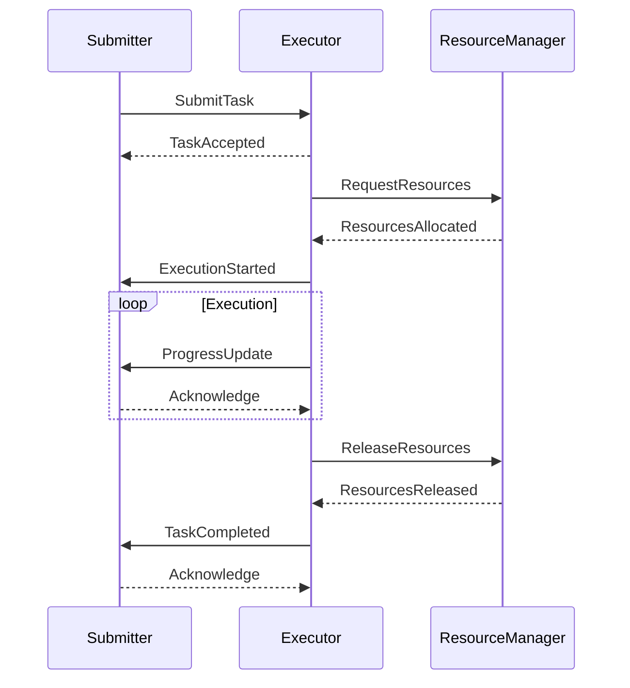
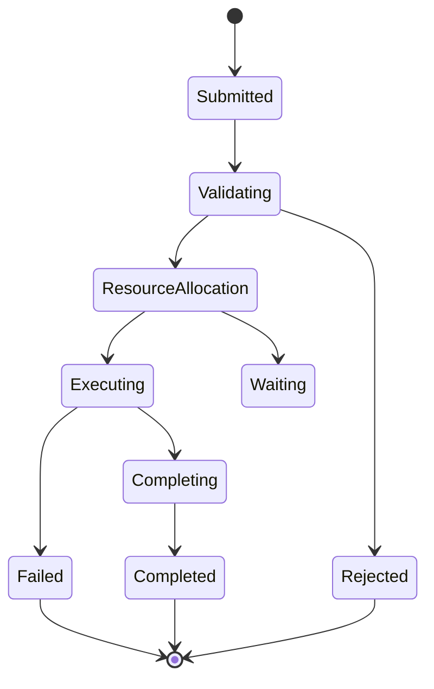

# Task Execution Protocol

## Overview

### Purpose & Scope
- Protocol Type: Task Management
- Use Cases: Distributed Task Execution
- Participants: Task Submitter, Task Executor, Resource Manager

### Protocol Summary
```yaml
protocol:
  name: task_execution_protocol
  version: 1.0.0
  category: task_management
  style: request_response_with_monitoring
```

## Protocol Specification

### Message Flow


### States & Transitions


## Message Definitions

### Message Types
```yaml
messages:
  submit_task:
    header:
      - field: message_id
        type: string
        required: true
      - field: timestamp
        type: datetime
        required: true
    body:
      - field: task_specification
        type: object
        required: true
      - field: priority
        type: integer
        required: true
      - field: deadline
        type: datetime
        required: false
  
  task_status:
    header:
      - field: message_id
        type: string
        required: true
      - field: reference_id
        type: string
        required: true
    body:
      - field: status
        type: string
        required: true
      - field: progress
        type: float
        required: false
      - field: details
        type: object
        required: false
```

### Message Examples
```json
{
  "type": "submit_task",
  "header": {
    "message_id": "task-123",
    "timestamp": "2024-03-21T10:00:00Z"
  },
  "body": {
    "task_specification": {
      "type": "data_processing",
      "parameters": {
        "input_source": "data_stream_1",
        "processing_steps": ["validate", "transform", "aggregate"]
      }
    },
    "priority": 1,
    "deadline": "2024-03-21T10:30:00Z"
  }
}
```

## Implementation

### Required Components
```yaml
components:
  handlers:
    - name: task_submission_handler
      purpose: validate and queue incoming tasks
    - name: execution_handler
      purpose: manage task execution lifecycle
  validators:
    - name: task_validator
      rules: task_validation_schema
    - name: resource_validator
      rules: resource_requirements_schema
```

### Integration Points
- [[message-formats#task-message|Task Message Format]]
- [[interaction-patterns#task-execution|Task Execution Pattern]]
- [[security-protocols#task-auth|Task Authentication]]

## Behavior

### Success Scenario
```yaml
success_flow:
  steps:
    - actor: submitter
      action: submit_task
      message: task_specification
    - actor: executor
      action: validate_task
      message: task_accepted
    - actor: executor
      action: allocate_resources
      message: execution_started
    - actor: executor
      action: execute_task
      message: progress_updates
    - actor: executor
      action: complete_task
      message: task_completed
```

### Error Handling
```yaml
error_handling:
  scenarios:
    - error: validation_failed
      detection: schema_validation
      recovery: reject_task
    - error: resource_unavailable
      detection: allocation_timeout
      recovery: retry_with_backoff
  retries:
    max_attempts: 3
    backoff: exponential
```

## Quality of Service

### Performance Requirements
```yaml
performance:
  latency:
    max: 500ms
    target: 100ms
  throughput:
    min: 100_tasks_per_minute
    target: 500_tasks_per_minute
```

### Reliability Measures
- Delivery Guarantee: at-least-once
- Order Preservation: per-task-ordered
- Durability: persistent-until-completed

## Security

### Security Measures
```yaml
security:
  authentication:
    method: jwt_token
    requirements: valid_signature
  encryption:
    level: message_level
    algorithms: [aes_256_gcm, rsa_2048]
```

### Access Control
- Roles: submitter, executor, admin
- Permissions: submit_task, execute_task, monitor_task
- Restrictions: rate_limits, resource_quotas

## Monitoring

### Metrics Collection
```yaml
metrics:
  performance:
    - name: submission_rate
      type: counter
      threshold: 1000/minute
    - name: execution_time
      type: histogram
      threshold: p99 < 30s
  health:
    - name: error_rate
      type: ratio
      threshold: < 0.1%
```

### Logging Requirements
- Log Levels: info, warn, error
- Event Types: submission, state_change, completion
- Audit Trail: full_message_history

## Maintenance

### Version Control
- Version: 1.0.0
- Last Updated: 2024-03-21
- Changelog: [[changelog#task-protocol-1.0.0]]

### Documentation
- Implementation Guide: [[implementation-guides#task-protocol]]
- Test Suite: [[test-suites#task-protocol]]
- Examples: [[examples#task-protocol]]

## References
- [[protocol-standards#task-execution]]
- [[message-patterns#task-management]]
- [[best-practices#task-protocols]]

---
*Note: This protocol is implemented by the Task Executor Agent.* 