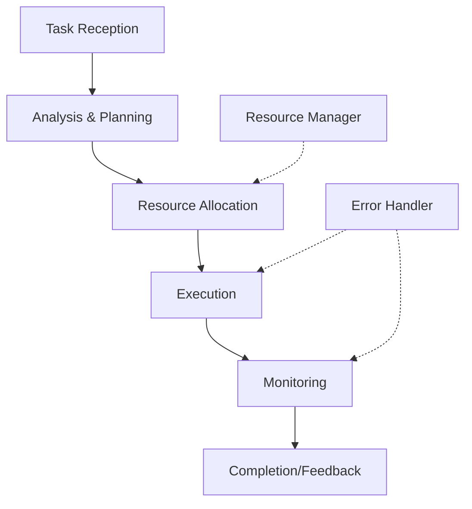

# Task Executor Agent

## Overview

### Purpose & Scope
- Primary Function: Autonomous task execution and management
- Domain: General-purpose task automation
- Operating Context: Distributed system environment

### Core Capabilities
```yaml
capabilities:
  cognitive:
    - task_planning
    - resource_optimization
    - priority_management
  behavioral:
    - adaptive_execution
    - error_recovery
    - performance_monitoring
  interactive:
    - task_negotiation
    - progress_reporting
    - resource_coordination
```

## Architecture

### Cognitive Model
```yaml
cognitive_architecture:
  type: "hybrid_deliberative_reactive"
  components:
    - [[cognitive-models#belief-system|Task Knowledge Base]]
    - [[cognitive-models#goal-management|Task Scheduler]]
    - [[cognitive-models#planning|Execution Planner]]
  features:
    - dynamic_task_reprioritization
    - resource_aware_planning
    - adaptive_execution_strategies
```

### Behavioral Framework


## Implementation

### Required Systems
- [[perception-systems|Task Analysis System]]: task_analyzer_v2
- [[reasoning-models|Task Planning Model]]: hierarchical_planner_v1
- [[learning-patterns|Execution Learning System]]: adaptive_executor_v1

### Integration Points
```yaml
integration:
  inputs:
    - type: task_request
      format: json
      protocol: [[protocols#task-submission]]
    - type: resource_status
      format: json
      protocol: [[protocols#resource-monitoring]]
  outputs:
    - type: task_status
      format: json
      protocol: [[protocols#status-reporting]]
    - type: execution_results
      format: json
      protocol: [[protocols#result-delivery]]
```

## Behavior Specification

### Action Patterns
```yaml
actions:
  primary:
    - name: task_execution
      trigger: new_task_received
      effect: task_completed
    - name: resource_allocation
      trigger: execution_ready
      effect: resources_assigned
  fallback:
    - name: error_recovery
      condition: execution_failed
    - name: task_rescheduling
      condition: resource_unavailable
```

### Learning Configuration
```yaml
learning:
  methods:
    - type: reinforcement_learning
      parameters:
        learning_rate: 0.01
        discount_factor: 0.95
  objectives:
    - execution_efficiency_improvement
    - resource_utilization_optimization
```

## Communication

### Interaction Protocols
- Primary: [[protocols#task-execution-protocol]]
- Secondary: [[protocols#resource-negotiation-protocol]]

### Message Formats
```yaml
message_formats:
  incoming:
    - [[message-formats#task-request]]
    - [[message-formats#resource-status]]
  outgoing:
    - [[message-formats#task-status]]
    - [[message-formats#execution-result]]
```

## Performance

### Metrics
```yaml
performance_metrics:
  cognitive:
    - metric: planning_time
      threshold: 100ms
    - metric: decision_accuracy
      threshold: 0.95
  behavioral:
    - metric: task_success_rate
      threshold: 0.99
    - metric: resource_efficiency
      threshold: 0.85
  operational:
    - metric: throughput
      threshold: 100_tasks_per_minute
    - metric: latency
      threshold: 500ms
```

### Monitoring
- [[monitoring-system#task-execution|Task Execution Monitoring]]
- [[performance-metrics#resource-utilization|Resource Utilization Metrics]]

## Security & Safety

### Security Measures
```yaml
security:
  authentication: jwt_token
  authorization: role_based_access
  encryption: aes_256_gcm
```

### Safety Protocols
- [[safety-protocols#task-validation|Task Validation Protocol]]
- [[error-handling#execution-failure|Execution Failure Handler]]

## Maintenance

### Version Control
- Version: 1.0.0
- Last Updated: 2024-03-21
- Change Log: [[changelog#task-executor-1.0.0]]

### Documentation
- Technical Specs: [[technical-docs#task-executor]]
- User Guide: [[user-guides#task-executor]]
- API Reference: [[api-docs#task-executor]]

## References
- [[architecture-patterns#task-execution]]
- [[implementation-guides#task-executor]]
- [[best-practices#autonomous-agents]] 