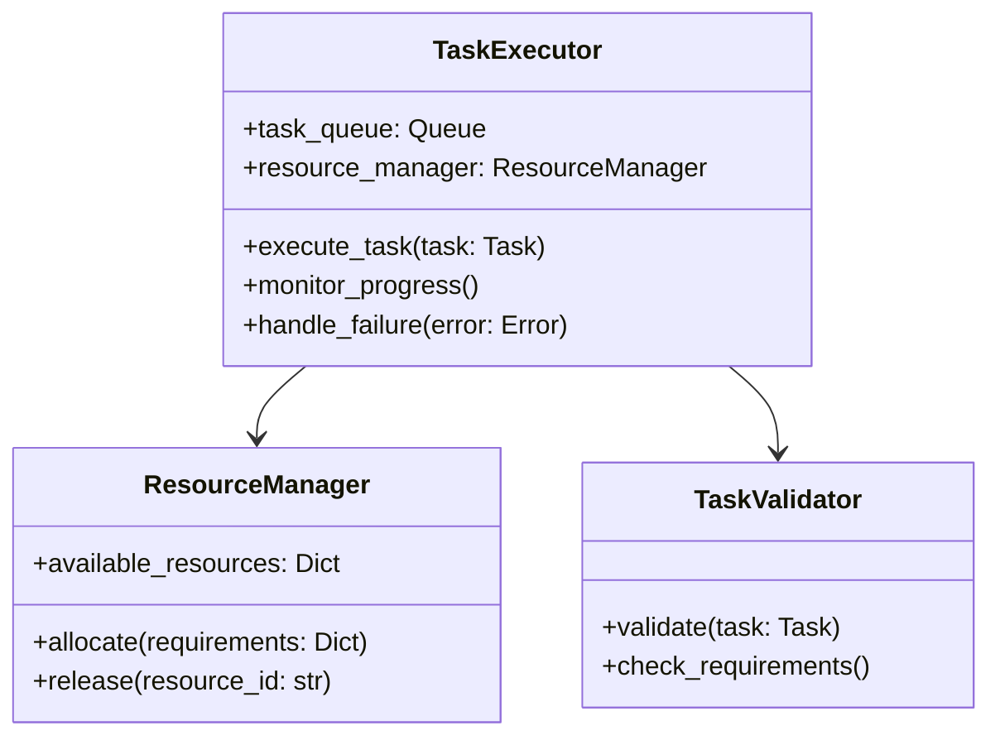

# Task Executor Implementation Guide

## Overview

### Purpose & Scope
- Component Type: Autonomous Agent
- Functionality: Task Execution Management
- Integration Level: System Core Component

### Prerequisites
```yaml
requirements:
  dependencies:
    - name: python
      version: ">=3.8"
    - name: asyncio
      version: latest
    - name: aiohttp
      version: ">=3.8.0"
    - name: pydantic
      version: ">=2.0.0"
  knowledge:
    - async programming
    - distributed systems
    - resource management
  environment:
    - message broker
    - monitoring system
    - resource manager
```

## Architecture

### Component Structure


### Integration Points
```yaml
integration:
  inputs:
    - source: message_broker
      type: task_request
      format: json
    - source: resource_manager
      type: resource_status
      format: protobuf
  outputs:
    - destination: message_broker
      type: task_status
      format: json
    - destination: monitoring_system
      type: metrics
      format: prometheus
```

## Implementation Steps

### 1. Setup & Configuration
```yaml
setup:
  environment:
    - step: "Create virtual environment"
      command: "python -m venv venv"
    - step: "Install dependencies"
      command: "pip install -r requirements.txt"
  configuration:
    - file: config.yaml
      settings:
        - key: message_broker_url
          value: "amqp://localhost:5672"
        - key: max_concurrent_tasks
          value: 100
```

### 2. Core Implementation
```python
from typing import Dict, Optional
from asyncio import Queue
from pydantic import BaseModel

class Task(BaseModel):
    id: str
    type: str
    parameters: Dict
    priority: int
    deadline: Optional[str]

class TaskExecutor:
    def __init__(self, config: Dict):
        self.task_queue = Queue()
        self.resource_manager = ResourceManager(config)
        self.validator = TaskValidator()
        
    async def execute_task(self, task: Task):
        """Execute a single task with resource management"""
        try:
            # Validate task
            self.validator.validate(task)
            
            # Allocate resources
            resources = await self.resource_manager.allocate(
                task.parameters.get('requirements', {})
            )
            
            # Execute task
            result = await self._execute_with_monitoring(task, resources)
            
            # Release resources
            await self.resource_manager.release(resources['id'])
            
            return result
            
        except Exception as e:
            await self.handle_failure(task, e)
            raise
```

### 3. Integration Implementation
```yaml
integration_steps:
  - phase: message_broker_integration
    steps:
      - action: "Implement message consumer"
        code: "consumer.py"
      - action: "Implement status publisher"
        code: "publisher.py"
    validation:
      - check: "Message flow verification"
```

## Testing & Validation

### Unit Tests
```python
def test_task_execution():
    # Test setup
    executor = TaskExecutor(test_config)
    task = Task(
        id="test-1",
        type="processing",
        parameters={"data": "test"},
        priority=1
    )
    
    # Test execution
    result = await executor.execute_task(task)
    
    # Assertions
    assert result.status == "completed"
    assert result.execution_time < 1.0
```

### Integration Tests
```yaml
integration_tests:
  scenarios:
    - name: full_execution_cycle
      setup:
        - start_message_broker
        - start_resource_manager
      execution:
        - submit_test_task
        - wait_for_completion
      validation:
        - check_task_status
        - verify_resource_release
```

## Performance Optimization

### Optimization Guidelines
```yaml
optimization:
  areas:
    - target: task_throughput
      technique: parallel_execution
      metrics:
        - name: tasks_per_second
          threshold: 100
    - target: resource_utilization
      technique: dynamic_allocation
      metrics:
        - name: resource_usage
          threshold: 0.85
```

### Monitoring Setup
```yaml
monitoring:
  metrics:
    - name: task_execution_time
      collection: histogram
      alert:
        threshold: p95 < 1s
        action: notify_admin
    - name: resource_usage
      collection: gauge
      alert:
        threshold: > 90%
        action: scale_resources
```

## Security Considerations

### Security Measures
```yaml
security:
  authentication:
    method: jwt_authentication
    implementation: jwt_handler.py
  authorization:
    model: role_based_access
    roles:
      - task_submitter
      - task_executor
      - admin
```

### Data Protection
- Encryption: AES-256 for sensitive data
- Storage: Encrypted at rest
- Transmission: TLS 1.3

## Deployment

### Deployment Process
```yaml
deployment:
  stages:
    - name: staging
      steps:
        - action: deploy_message_broker
          command: "docker-compose up -d broker"
        - action: deploy_executor
          command: "kubectl apply -f executor.yaml"
      validation:
        - check: health_check
```

### Configuration Management
```yaml
configuration:
  files:
    - path: /etc/executor/config.yaml
      template: config.yaml.j2
      variables:
        - name: BROKER_URL
          value: "{{broker_url}}"
```

## Troubleshooting

### Common Issues
```yaml
issues:
  - problem: task_execution_timeout
    symptoms:
      - task stuck in executing state
    diagnosis:
      - check resource availability
      - verify network connectivity
    resolution:
      - restart task execution
      - scale resources if needed
```

### Logging & Debugging
```yaml
logging:
  levels:
    - level: DEBUG
      usage: development_debugging
    - level: INFO
      usage: production_monitoring
  configuration:
    - file: logging.yaml
      settings: default_logging_config
```

## Maintenance

### Routine Maintenance
```yaml
maintenance:
  tasks:
    - frequency: daily
      action: clear_stale_tasks
      validation: verify_queue_state
    - frequency: weekly
      action: optimize_resource_pools
      validation: check_performance_metrics
```

### Updates & Upgrades
- Version Control: Git with semantic versioning
- Migration Steps: Documented in migrations/
- Rollback Procedures: Automated rollback scripts

## References

### Documentation
- [[architecture-docs#task-executor|Architecture Documentation]]
- [[api-docs#task-executor|API Documentation]]
- [[examples#task-executor|Example Implementations]]

### Resources
- [[best-practices#task-execution|Task Execution Best Practices]]
- [[troubleshooting-guide#executor|Troubleshooting Guide]]
- [[performance-guide#optimization|Performance Optimization Guide]]

---
*Note: This implementation guide should be used in conjunction with the Task Executor Agent Specification.* 