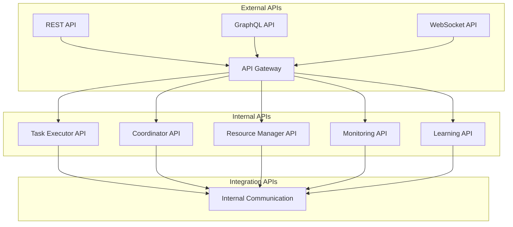

# Multi-Agent System API Documentation

## Overview

### Purpose & Scope
- Documentation Type: API Specification
- Environment: Production Multi-Agent System
- Target Audience: Developers and Integrators

### API Architecture


## REST API Endpoints

### Task Management API
```yaml
task_api:
  base_path: /api/v1/tasks
  endpoints:
    create_task:
      path: /
      method: POST
      request:
        content_type: application/json
        body:
          type: object
          properties:
            task_type:
              type: string
              enum: [processing, analysis, learning]
            parameters:
              type: object
            priority:
              type: integer
              minimum: 1
              maximum: 10
            deadline:
              type: string
              format: date-time
      response:
        200:
          description: Task created successfully
          content:
            application/json:
              schema:
                type: object
                properties:
                  task_id:
                    type: string
                  status:
                    type: string
                    enum: [pending, scheduled, executing]
        400:
          description: Invalid request parameters
        401:
          description: Unauthorized request
    
    get_task_status:
      path: /{task_id}/status
      method: GET
      parameters:
        - name: task_id
          in: path
          required: true
          schema:
            type: string
      response:
        200:
          description: Task status retrieved
          content:
            application/json:
              schema:
                type: object
                properties:
                  task_id:
                    type: string
                  status:
                    type: string
                  progress:
                    type: number
                  details:
                    type: object
```

### Resource Management API
```yaml
resource_api:
  base_path: /api/v1/resources
  endpoints:
    allocate_resources:
      path: /allocate
      method: POST
      request:
        content_type: application/json
        body:
          type: object
          properties:
            resource_type:
              type: string
              enum: [compute, memory, storage, gpu]
            quantity:
              type: number
            duration:
              type: string
            constraints:
              type: object
      response:
        200:
          description: Resources allocated
          content:
            application/json:
              schema:
                type: object
                properties:
                  allocation_id:
                    type: string
                  resources:
                    type: object
                  expiry:
                    type: string
                    format: date-time
    
    get_resource_status:
      path: /status
      method: GET
      parameters:
        - name: resource_type
          in: query
          required: false
          schema:
            type: string
      response:
        200:
          description: Resource status retrieved
          content:
            application/json:
              schema:
                type: object
                properties:
                  resources:
                    type: array
                    items:
                      type: object
                      properties:
                        type:
                          type: string
                        available:
                          type: number
                        allocated:
                          type: number
```

### Monitoring API
```yaml
monitoring_api:
  base_path: /api/v1/monitoring
  endpoints:
    get_metrics:
      path: /metrics
      method: GET
      parameters:
        - name: metric_type
          in: query
          required: false
          schema:
            type: string
        - name: start_time
          in: query
          required: false
          schema:
            type: string
            format: date-time
        - name: end_time
          in: query
          required: false
          schema:
            type: string
            format: date-time
      response:
        200:
          description: Metrics retrieved
          content:
            application/json:
              schema:
                type: object
                properties:
                  metrics:
                    type: array
                    items:
                      type: object
                      properties:
                        name:
                          type: string
                        value:
                          type: number
                        timestamp:
                          type: string
                          format: date-time
                        labels:
                          type: object
    
    get_alerts:
      path: /alerts
      method: GET
      parameters:
        - name: severity
          in: query
          required: false
          schema:
            type: string
            enum: [critical, warning, info]
      response:
        200:
          description: Alerts retrieved
          content:
            application/json:
              schema:
                type: array
                items:
                  type: object
                  properties:
                    alert_id:
                      type: string
                    severity:
                      type: string
                    message:
                      type: string
                    timestamp:
                      type: string
                      format: date-time
```

## GraphQL API

### Schema Definition
```graphql
type Task {
  id: ID!
  type: TaskType!
  status: TaskStatus!
  parameters: JSONObject
  priority: Int!
  deadline: DateTime
  progress: Float
  result: JSONObject
  createdAt: DateTime!
  updatedAt: DateTime!
}

type Resource {
  id: ID!
  type: ResourceType!
  capacity: Float!
  allocated: Float!
  available: Float!
  reservations: [Reservation!]!
}

type Metric {
  name: String!
  value: Float!
  labels: JSONObject
  timestamp: DateTime!
}

type Query {
  task(id: ID!): Task
  tasks(
    status: TaskStatus
    type: TaskType
    limit: Int = 10
    offset: Int = 0
  ): [Task!]!
  
  resource(id: ID!): Resource
  resources(
    type: ResourceType
    available: Boolean
    limit: Int = 10
    offset: Int = 0
  ): [Resource!]!
  
  metrics(
    name: String
    startTime: DateTime
    endTime: DateTime
    limit: Int = 100
  ): [Metric!]!
}

type Mutation {
  createTask(input: CreateTaskInput!): Task!
  updateTask(id: ID!, input: UpdateTaskInput!): Task!
  cancelTask(id: ID!): Task!
  
  allocateResources(input: AllocateResourcesInput!): Resource!
  releaseResources(id: ID!): Resource!
  
  acknowledgeAlert(id: ID!): Alert!
}

type Subscription {
  taskUpdated(id: ID!): Task!
  resourceChanged(type: ResourceType): Resource!
  metricReceived(name: String): Metric!
  alertTriggered(severity: AlertSeverity): Alert!
}
```

## WebSocket API

### Event Streams
```yaml
websocket_api:
  base_path: /ws/v1
  streams:
    task_events:
      path: /tasks/events
      events:
        task_created:
          type: object
          properties:
            event: 
              type: string
              enum: [task_created]
            task_id:
              type: string
            timestamp:
              type: string
              format: date-time
            details:
              type: object
        
        task_updated:
          type: object
          properties:
            event:
              type: string
              enum: [task_updated]
            task_id:
              type: string
            status:
              type: string
            progress:
              type: number
            timestamp:
              type: string
              format: date-time
    
    metric_stream:
      path: /metrics/stream
      events:
        metric_update:
          type: object
          properties:
            event:
              type: string
              enum: [metric_update]
            name:
              type: string
            value:
              type: number
            labels:
              type: object
            timestamp:
              type: string
              format: date-time
```

## Internal APIs

### Agent Communication Protocol
```yaml
agent_protocol:
  message_types:
    task_request:
      type: object
      properties:
        message_id:
          type: string
        message_type:
          type: string
          enum: [task_request]
        payload:
          type: object
          properties:
            task_id:
              type: string
            requirements:
              type: object
            priority:
              type: integer
    
    resource_allocation:
      type: object
      properties:
        message_id:
          type: string
        message_type:
          type: string
          enum: [resource_allocation]
        payload:
          type: object
          properties:
            allocation_id:
              type: string
            resources:
              type: object
            duration:
              type: string
```

### Service Integration Protocol
```yaml
service_protocol:
  registration:
    request:
      type: object
      properties:
        service_id:
          type: string
        service_type:
          type: string
        endpoints:
          type: array
          items:
            type: object
            properties:
              path:
                type: string
              method:
                type: string
              parameters:
                type: object
    
    response:
      type: object
      properties:
        status:
          type: string
          enum: [registered, rejected]
        service_token:
          type: string
        ttl:
          type: integer
```

## Authentication & Authorization

### Authentication Methods
```yaml
authentication:
  methods:
    jwt:
      type: bearer
      token_format: JWT
      headers:
        Authorization: Bearer <token>
      claims:
        required:
          - sub
          - exp
          - iat
        optional:
          - roles
          - permissions
    
    api_key:
      type: header
      headers:
        X-API-Key: <api_key>
      rate_limit:
        requests: 1000
        period: 1h
```

### Authorization Policies
```yaml
authorization:
  roles:
    admin:
      permissions:
        - create_task
        - manage_resources
        - view_metrics
        - manage_system
    
    operator:
      permissions:
        - view_tasks
        - view_resources
        - view_metrics
    
    agent:
      permissions:
        - execute_task
        - request_resources
        - report_metrics
```

## Error Handling

### Error Responses
```yaml
error_responses:
  400:
    bad_request:
      type: object
      properties:
        error:
          type: string
          enum: [bad_request]
        message:
          type: string
        details:
          type: object
  
  401:
    unauthorized:
      type: object
      properties:
        error:
          type: string
          enum: [unauthorized]
        message:
          type: string
  
  403:
    forbidden:
      type: object
      properties:
        error:
          type: string
          enum: [forbidden]
        message:
          type: string
        required_permissions:
          type: array
          items:
            type: string
```

## Rate Limiting

### Rate Limit Configuration
```yaml
rate_limiting:
  default:
    requests: 100
    period: 1m
  
  endpoints:
    /api/v1/tasks:
      post:
        requests: 50
        period: 1m
    
    /api/v1/resources:
      post:
        requests: 30
        period: 1m
    
    /api/v1/metrics:
      get:
        requests: 300
        period: 1m
```

## Documentation

### Version History
- Version: 1.0.0
- Last Updated: 2024-03-21
- Changelog: [[changelog#api-doc-1.0.0]]

### Related Documentation
- Technical Implementation: [[technical-impl#system]]
- Integration Guide: [[integration#system]]
- Security Guide: [[security#system]]

## References
- [[api-patterns#rest]]
- [[api-patterns#graphql]]
- [[best-practices#api-design]]

---
*Note: This API documentation provides comprehensive details about all interfaces available in the multi-agent system.* 