# Autonomous Agent Project Lifecycle Guide

## Overview

### Purpose & Scope
- Guide Type: Project Lifecycle Management
- Environment: Autonomous Multi-Agent System
- Target Audience: Project Managers and System Architects

### Lifecycle Architecture

```mermaid
graph TD
    subgraph Project Lifecycle
        PI[Project Initialization] --> PP[Project Planning]
        PP --> PE[Project Execution]
        PE --> PM[Project Monitoring]
        PM --> PC[Project Completion]
    end
    
    subgraph Task Management
        TI[Task Initialization] --> TA[Task Assignment]
        TA --> TE[Task Execution]
        TE --> TM[Task Monitoring]
        TM --> TC[Task Completion]
    end
    
    subgraph Reporting System
        RP[Real-time Progress] --> PA[Performance Analysis]
        PA --> IR[Insight Generation]
        IR --> RD[Report Distribution]
    end
```


## Project Management

### Project Lifecycle Manager
```python
class ProjectLifecycleManager:
    def __init__(self, config: Dict):
        self.initializer = ProjectInitializer(config['initialization'])
        self.planner = ProjectPlanner(config['planning'])
        self.executor = ProjectExecutor(config['execution'])
        self.monitor = ProjectMonitor(config['monitoring'])
        self.completer = ProjectCompleter(config['completion'])
    
    async def manage_project_lifecycle(
        self,
        project: Project
    ) -> ProjectResult:
        """Manage complete project lifecycle"""
        try:
            # Initialize project
            context = await self.initializer.initialize_project(project)
            
            # Create project plan
            plan = await self.planner.create_project_plan(context)
            
            # Execute project
            execution = await self.executor.execute_project(plan)
            
            # Monitor progress
            while not await self._is_project_complete(execution):
                # Update progress
                status = await self.monitor.check_progress(execution)
                
                # Adjust if needed
                if await self._needs_adjustment(status):
                    await self._adjust_execution(execution, status)
                
                # Generate reports
                await self._generate_progress_report(execution, status)
            
            # Complete project
            result = await self.completer.complete_project(execution)
            
            return result
            
        except Exception as e:
            await self._handle_lifecycle_error(e, project)
            raise
    
    async def _adjust_execution(
        self,
        execution: ProjectExecution,
        status: ProjectStatus
    ):
        """Adjust project execution based on status"""
        # Analyze performance
        analysis = await self._analyze_performance(status)
        
        # Generate adjustments
        adjustments = await self._generate_adjustments(analysis)
        
        # Apply adjustments
        await self._apply_adjustments(execution, adjustments)
```

### Task Workflow Manager
```python
class TaskWorkflowManager:
    def __init__(self, config: Dict):
        self.task_initializer = TaskInitializer(config['initialization'])
        self.task_assigner = TaskAssigner(config['assignment'])
        self.task_executor = TaskExecutor(config['execution'])
        self.task_monitor = TaskMonitor(config['monitoring'])
        self.task_completer = TaskCompleter(config['completion'])
    
    async def manage_task_workflow(
        self,
        task: Task,
        project_context: ProjectContext
    ) -> TaskResult:
        """Manage complete task workflow"""
        try:
            # Initialize task
            task_context = await self.task_initializer.initialize_task(
                task,
                project_context
            )
            
            # Assign task
            assignment = await self.task_assigner.assign_task(task_context)
            
            # Execute task
            execution = await self.task_executor.execute_task(assignment)
            
            # Monitor task
            while not await self._is_task_complete(execution):
                # Check progress
                status = await self.task_monitor.check_progress(execution)
                
                # Optimize if needed
                if await self._needs_optimization(status):
                    await self._optimize_execution(execution, status)
                
                # Update project context
                await self._update_project_context(
                    project_context,
                    execution,
                    status
                )
            
            # Complete task
            result = await self.task_completer.complete_task(execution)
            
            return result
            
        except Exception as e:
            await self._handle_workflow_error(e, task)
            raise
```

## Progress Tracking

### Progress Tracker
```python
class ProgressTracker:
    def __init__(self, config: Dict):
        self.metrics_collector = MetricsCollector(config['metrics'])
        self.progress_analyzer = ProgressAnalyzer(config['analysis'])
        self.insight_generator = InsightGenerator(config['insights'])
    
    async def track_progress(
        self,
        context: ExecutionContext
    ) -> ProgressReport:
        """Track and analyze progress"""
        try:
            # Collect metrics
            metrics = await self.metrics_collector.collect_metrics(context)
            
            # Analyze progress
            analysis = await self.progress_analyzer.analyze_progress(
                context,
                metrics
            )
            
            # Generate insights
            insights = await self.insight_generator.generate_insights(
                context,
                analysis
            )
            
            # Create progress report
            report = await self._create_progress_report(
                context,
                metrics,
                analysis,
                insights
            )
            
            return report
            
        except Exception as e:
            await self._handle_tracking_error(e, context)
            raise
```

### Performance Analyzer
```python
class PerformanceAnalyzer:
    def __init__(self, config: Dict):
        self.metric_analyzer = MetricAnalyzer(config['metrics'])
        self.trend_analyzer = TrendAnalyzer(config['trends'])
        self.predictor = PerformancePredictor(config['prediction'])
    
    async def analyze_performance(
        self,
        context: ExecutionContext,
        metrics: MetricsData
    ) -> PerformanceAnalysis:
        """Analyze execution performance"""
        try:
            # Analyze metrics
            metric_analysis = await self.metric_analyzer.analyze_metrics(
                metrics
            )
            
            # Analyze trends
            trend_analysis = await self.trend_analyzer.analyze_trends(
                context,
                metrics
            )
            
            # Predict future performance
            predictions = await self.predictor.predict_performance(
                context,
                metric_analysis,
                trend_analysis
            )
            
            return PerformanceAnalysis(
                metrics=metric_analysis,
                trends=trend_analysis,
                predictions=predictions
            )
            
        except Exception as e:
            await self._handle_analysis_error(e, context)
            raise
```

## Reporting System

### Report Generator
```python
class ReportGenerator:
    def __init__(self, config: Dict):
        self.data_collector = DataCollector(config['data'])
        self.report_builder = ReportBuilder(config['builder'])
        self.distributor = ReportDistributor(config['distribution'])
    
    async def generate_report(
        self,
        context: ExecutionContext,
        report_type: str
    ) -> Report:
        """Generate comprehensive execution report"""
        try:
            # Collect report data
            data = await self.data_collector.collect_data(
                context,
                report_type
            )
            
            # Build report
            report = await self.report_builder.build_report(
                context,
                data,
                report_type
            )
            
            # Distribute report
            await self.distributor.distribute_report(report)
            
            return report
            
        except Exception as e:
            await self._handle_report_error(e, context)
            raise
```

### Insight Generator
```python
class InsightGenerator:
    def __init__(self, config: Dict):
        self.analyzers = self._setup_analyzers(config['analyzers'])
        self.correlator = DataCorrelator(config['correlation'])
        self.recommender = ActionRecommender(config['recommendations'])
    
    async def generate_insights(
        self,
        context: ExecutionContext,
        data: AnalysisData
    ) -> List[Insight]:
        """Generate actionable insights"""
        try:
            # Analyze patterns
            patterns = await self._analyze_patterns(data)
            
            # Find correlations
            correlations = await self.correlator.find_correlations(
                context,
                patterns
            )
            
            # Generate recommendations
            recommendations = await self.recommender.generate_recommendations(
                context,
                patterns,
                correlations
            )
            
            # Create insights
            insights = await self._create_insights(
                patterns,
                correlations,
                recommendations
            )
            
            return insights
            
        except Exception as e:
            await self._handle_insight_error(e, context)
            raise
```

## Configuration

### Project Configuration
```yaml
project_configuration:
  lifecycle:
    phases:
      initialization:
        required_inputs:
          - project_objectives
          - resource_requirements
          - timeline_constraints
        validation_rules:
          - validate_objectives
          - verify_resources
          - check_constraints
      
      planning:
        components:
          - task_breakdown
          - resource_allocation
          - timeline_planning
        optimization:
          - workload_balancing
          - resource_optimization
          - timeline_optimization
      
      execution:
        monitoring:
          frequency: real_time
          metrics:
            - progress_metrics
            - performance_metrics
            - resource_metrics
        adjustments:
          triggers:
            - performance_degradation
            - resource_constraints
            - timeline_delays
```

### Task Configuration
```yaml
task_configuration:
  workflow:
    stages:
      initialization:
        setup:
          - context_setup
          - resource_setup
          - dependency_setup
        validation:
          - input_validation
          - resource_validation
          - dependency_validation
      
      execution:
        control:
          - progress_tracking
          - resource_monitoring
          - performance_monitoring
        optimization:
          - runtime_optimization
          - resource_optimization
          - performance_optimization
      
      completion:
        verification:
          - result_validation
          - resource_cleanup
          - context_update
        reporting:
          - completion_report
          - performance_report
          - resource_report
```

## Best Practices

### Project Management
```yaml
project_best_practices:
  planning:
    - implement_flexible_planning
    - maintain_resource_buffers
    - establish_clear_milestones
    - enable_dynamic_adjustment
  
  execution:
    - monitor_continuously
    - adapt_proactively
    - optimize_resources
    - maintain_transparency
  
  completion:
    - validate_thoroughly
    - document_comprehensively
    - analyze_performance
    - capture_learnings
```

### Task Management
```yaml
task_best_practices:
  workflow:
    - implement_clear_stages
    - maintain_state_consistency
    - enable_progress_tracking
    - ensure_result_quality
  
  optimization:
    - optimize_runtime_performance
    - manage_resources_efficiently
    - balance_workload_effectively
    - adapt_to_conditions
  
  reporting:
    - report_progress_regularly
    - provide_clear_metrics
    - highlight_key_insights
    - enable_actionable_feedback
```

## Documentation

### Version History
- Version: 1.0.0
- Last Updated: 2024-03-21
- Changelog: [[changelog#project-lifecycle-1.0.0]]

### Related Documentation
- Project Management: [[project-management#autonomous]]
- Task Execution: [[task-execution#autonomous]]
- Reporting System: [[reporting#autonomous]]

## References
- [[lifecycle-patterns#project-management]]
- [[workflow-patterns#task-execution]]
- [[best-practices#project-lifecycle]]

---
*Note: This guide provides comprehensive procedures for managing autonomous agent project lifecycles and task completion workflows in the multi-agent system.* 