# Autonomous Project Reporting Framework

## Overview

### Purpose & Scope
- Guide Type: Project Reporting & Analytics
- Environment: Autonomous Multi-Agent System
- Target Audience: Project Stakeholders and Analysts

### Reporting Architecture

```mermaid
graph TD
    subgraph Data Collection
        DC[Data Collector] --> DP[Data Processing]
        DP --> DS[Data Storage]
        DS --> DA[Data Analysis]
    end
    
    subgraph Analytics Engine
        AE[Analytics Engine] --> ML[Machine Learning]
        ML --> PI[Pattern Identification]
        PI --> IG[Insight Generation]
    end
    
    subgraph Reporting System
        RG[Report Generator] --> RT[Report Templates]
        RT --> RC[Report Customization]
        RC --> RD[Report Distribution]
    end
```


## Data Management

### Data Collection System
```python
class DataCollectionSystem:
    def __init__(self, config: Dict):
        self.collectors = self._setup_collectors(config['collectors'])
        self.processors = self._setup_processors(config['processors'])
        self.storage = DataStorage(config['storage'])
    
    async def collect_project_data(
        self,
        project: Project
    ) -> ProjectData:
        """Collect comprehensive project data"""
        try:
            # Collect raw data
            raw_data = await self._collect_raw_data(project)
            
            # Process data
            processed_data = await self._process_data(raw_data)
            
            # Store data
            await self.storage.store_data(
                project.id,
                processed_data
            )
            
            return processed_data
            
        except Exception as e:
            await self._handle_collection_error(e, project)
            raise
    
    async def _collect_raw_data(self, project: Project) -> Dict:
        """Collect raw project data from all sources"""
        raw_data = {}
        for collector in self.collectors:
            data = await collector.collect(project)
            raw_data.update(data)
        return raw_data
```

### Analytics Engine
```python
class AnalyticsEngine:
    def __init__(self, config: Dict):
        self.analyzers = self._setup_analyzers(config['analyzers'])
        self.ml_models = self._setup_ml_models(config['ml_models'])
        self.insight_generator = InsightGenerator(config['insights'])
    
    async def analyze_project_data(
        self,
        project_data: ProjectData
    ) -> AnalyticsResult:
        """Perform comprehensive project analytics"""
        try:
            # Run analysis
            analysis_results = await self._run_analysis(project_data)
            
            # Apply ML models
            ml_results = await self._apply_ml_models(
                project_data,
                analysis_results
            )
            
            # Generate insights
            insights = await self.insight_generator.generate_insights(
                project_data,
                analysis_results,
                ml_results
            )
            
            return AnalyticsResult(
                analysis=analysis_results,
                ml_results=ml_results,
                insights=insights
            )
            
        except Exception as e:
            await self._handle_analytics_error(e, project_data)
            raise
```

## Reporting System

### Report Generator
```python
class ReportGenerator:
    def __init__(self, config: Dict):
        self.templates = self._load_templates(config['templates'])
        self.customizer = ReportCustomizer(config['customization'])
        self.formatter = ReportFormatter(config['formatting'])
    
    async def generate_project_report(
        self,
        project: Project,
        analytics: AnalyticsResult,
        report_type: str
    ) -> Report:
        """Generate comprehensive project report"""
        try:
            # Select template
            template = await self._select_template(report_type)
            
            # Customize report
            customized = await self.customizer.customize_report(
                template,
                project,
                analytics
            )
            
            # Format report
            report = await self.formatter.format_report(customized)
            
            return report
            
        except Exception as e:
            await self._handle_report_error(e, project)
            raise
```

### Insight Generator
```python
class ProjectInsightGenerator:
    def __init__(self, config: Dict):
        self.pattern_analyzer = PatternAnalyzer(config['patterns'])
        self.trend_analyzer = TrendAnalyzer(config['trends'])
        self.predictor = PerformancePredictor(config['prediction'])
    
    async def generate_project_insights(
        self,
        project: Project,
        analytics: AnalyticsResult
    ) -> List[ProjectInsight]:
        """Generate actionable project insights"""
        try:
            # Analyze patterns
            patterns = await self.pattern_analyzer.analyze_patterns(analytics)
            
            # Analyze trends
            trends = await self.trend_analyzer.analyze_trends(analytics)
            
            # Generate predictions
            predictions = await self.predictor.predict_performance(
                project,
                patterns,
                trends
            )
            
            # Create insights
            insights = await self._create_insights(
                patterns,
                trends,
                predictions
            )
            
            return insights
            
        except Exception as e:
            await self._handle_insight_error(e, project)
            raise
```

## Report Types

### Progress Reports
```yaml
progress_reports:
  real_time:
    frequency: continuous
    metrics:
      - task_completion
      - resource_utilization
      - performance_metrics
    visualizations:
      - progress_charts
      - resource_graphs
      - performance_indicators
  
  periodic:
    types:
      daily:
        metrics:
          - daily_progress
          - resource_status
          - issues_summary
      weekly:
        metrics:
          - weekly_achievements
          - resource_efficiency
          - risk_assessment
      monthly:
        metrics:
          - milestone_status
          - trend_analysis
          - strategic_insights
```

### Performance Reports
```yaml
performance_reports:
  execution_metrics:
    categories:
      efficiency:
        metrics:
          - task_completion_rate
          - resource_efficiency
          - cost_effectiveness
        analysis:
          - trend_analysis
          - benchmark_comparison
      
      quality:
        metrics:
          - error_rate
          - rework_percentage
          - satisfaction_score
        analysis:
          - quality_trends
          - improvement_areas
      
      impact:
        metrics:
          - business_value
          - innovation_score
          - stakeholder_satisfaction
        analysis:
          - impact_assessment
          - value_creation
```

## Analytics Configuration

### Data Analysis
```yaml
analysis_configuration:
  data_processing:
    preprocessing:
      - data_cleaning
      - normalization
      - feature_extraction
    analysis:
      - statistical_analysis
      - pattern_recognition
      - correlation_analysis
    validation:
      - data_quality_checks
      - consistency_validation
      - outlier_detection
  
  machine_learning:
    models:
      prediction:
        type: regression
        features:
          - historical_performance
          - resource_usage
          - complexity_metrics
      classification:
        type: multi_class
        features:
          - task_characteristics
          - performance_indicators
          - risk_factors
```

### Insight Generation
```yaml
insight_configuration:
  analysis_types:
    performance_analysis:
      metrics:
        - efficiency_metrics
        - quality_metrics
        - impact_metrics
      thresholds:
        - warning_threshold: 0.8
        - critical_threshold: 0.6
    
    trend_analysis:
      timeframes:
        - short_term: 7d
        - medium_term: 30d
        - long_term: 90d
      patterns:
        - trend_patterns
        - seasonal_patterns
        - anomaly_patterns
```

## Best Practices

### Reporting Best Practices
```yaml
reporting_best_practices:
  data_quality:
    - ensure_data_accuracy
    - maintain_data_consistency
    - validate_data_completeness
    - implement_quality_checks
  
  report_generation:
    - use_clear_formatting
    - provide_executive_summary
    - include_actionable_insights
    - maintain_consistency
  
  distribution:
    - target_appropriate_audience
    - ensure_timely_delivery
    - enable_feedback_collection
    - maintain_security
```

### Analytics Best Practices
```yaml
analytics_best_practices:
  analysis:
    - use_appropriate_methods
    - validate_assumptions
    - consider_context
    - maintain_objectivity
  
  interpretation:
    - provide_clear_context
    - highlight_key_findings
    - explain_implications
    - suggest_actions
  
  communication:
    - use_clear_language
    - visualize_effectively
    - focus_on_relevance
    - enable_drill-down
```

## Documentation

### Version History
- Version: 1.0.0
- Last Updated: 2024-03-21
- Changelog: [[changelog#project-reporting-1.0.0]]

### Related Documentation
- Project Lifecycle: [[project-lifecycle#reporting]]
- Analytics Framework: [[analytics#project]]
- Visualization Guide: [[visualization#reporting]]

## References
- [[reporting-patterns#project-management]]
- [[analytics-patterns#project-analytics]]
- [[best-practices#project-reporting]]

---
*Note: This framework provides comprehensive procedures for autonomous project reporting and analytics in the multi-agent system.* 