# Autonomous Task Execution Implementation Guide

## Overview

### Purpose & Scope
- Guide Type: Implementation Specification
- Environment: Autonomous Agent System
- Target Audience: Development Teams and System Integrators

### Implementation Architecture

```mermaid
graph TD
    subgraph Execution Core
        TE[Task Engine] --> TL[Task Lifecycle]
        TL --> TS[Task State]
        TS --> TM[Task Monitor]
    end
    
    subgraph Autonomous Control
        AC[Autonomous Controller] --> DM[Decision Making]
        DM --> RM[Resource Management]
        RM --> PM[Progress Management]
    end
    
    subgraph Reporting System
        RS[Report System] --> RA[Report Analysis]
        RA --> RG[Report Generation]
        RG --> RD[Report Distribution]
    end
```


## Core Implementation

### Task Engine
```python
class TaskEngine:
    def __init__(self, config: Dict):
        self.executor = TaskExecutor(config['executor'])
        self.state_manager = StateManager(config['state'])
        self.resource_manager = ResourceManager(config['resources'])
    
    async def execute_task(self, task: Task) -> ExecutionResult:
        """Execute task with autonomous control"""
        try:
            # Initialize execution
            context = await self._initialize_execution(task)
            
            # Execute with monitoring
            while not await self._is_complete(context):
                # Process next step
                await self._process_step(context)
                
                # Monitor and adjust
                await self._monitor_and_adjust(context)
                
                # Update state
                await self._update_state(context)
            
            # Finalize execution
            result = await self._finalize_execution(context)
            
            return result
            
        except Exception as e:
            await self._handle_execution_error(e, task)
            raise
    
    async def _process_step(self, context: ExecutionContext):
        """Process single execution step"""
        try:
            # Get next action
            action = await self._determine_next_action(context)
            
            # Validate action
            await self._validate_action(action, context)
            
            # Execute action
            result = await self.executor.execute_action(action)
            
            # Process result
            await self._process_action_result(result, context)
            
        except Exception as e:
            await self._handle_step_error(e, context)
            raise
```

### State Management
```python
class StateManager:
    def __init__(self, config: Dict):
        self.state_store = StateStore(config['store'])
        self.transition_manager = TransitionManager(config['transitions'])
        self.validator = StateValidator(config['validation'])
    
    async def manage_state(self, context: ExecutionContext) -> StateUpdate:
        """Manage task execution state"""
        try:
            # Get current state
            current_state = await self.state_store.get_state(context.task_id)
            
            # Validate transition
            await self.validator.validate_transition(
                current_state,
                context.desired_state
            )
            
            # Perform transition
            new_state = await self.transition_manager.transition_state(
                current_state,
                context.desired_state
            )
            
            # Store new state
            await self.state_store.update_state(context.task_id, new_state)
            
            return StateUpdate(
                previous_state=current_state,
                new_state=new_state,
                transition_metadata=context.metadata
            )
            
        except Exception as e:
            await self._handle_state_error(e, context)
            raise
```

### Resource Control
```python
class ResourceController:
    def __init__(self, config: Dict):
        self.allocator = ResourceAllocator(config['allocation'])
        self.optimizer = ResourceOptimizer(config['optimization'])
        self.monitor = ResourceMonitor(config['monitoring'])
    
    async def control_resources(
        self,
        context: ExecutionContext
    ) -> ResourceStatus:
        """Control resource allocation and usage"""
        try:
            # Monitor current usage
            usage = await self.monitor.get_usage(context)
            
            # Optimize if needed
            if await self._needs_optimization(usage):
                optimization = await self.optimizer.optimize_allocation(
                    context,
                    usage
                )
                
                # Apply optimization
                await self.allocator.apply_optimization(optimization)
            
            # Update resource status
            status = await self._update_resource_status(context, usage)
            
            return status
            
        except Exception as e:
            await self._handle_resource_error(e, context)
            raise
```

## Autonomous Control

### Decision Making
```python
class DecisionController:
    def __init__(self, config: Dict):
        self.analyzer = SituationAnalyzer(config['analysis'])
        self.decision_maker = DecisionMaker(config['decisions'])
        self.validator = DecisionValidator(config['validation'])
    
    async def make_decision(
        self,
        context: ExecutionContext
    ) -> ExecutionDecision:
        """Make autonomous execution decisions"""
        try:
            # Analyze situation
            analysis = await self.analyzer.analyze_situation(context)
            
            # Generate decision options
            options = await self.decision_maker.generate_options(analysis)
            
            # Evaluate options
            evaluation = await self.decision_maker.evaluate_options(options)
            
            # Select best option
            decision = await self.decision_maker.select_option(evaluation)
            
            # Validate decision
            await self.validator.validate_decision(decision, context)
            
            return decision
            
        except Exception as e:
            await self._handle_decision_error(e, context)
            raise
```

### Progress Management
```python
class ProgressManager:
    def __init__(self, config: Dict):
        self.tracker = ProgressTracker(config['tracking'])
        self.estimator = ProgressEstimator(config['estimation'])
        self.reporter = ProgressReporter(config['reporting'])
    
    async def manage_progress(
        self,
        context: ExecutionContext
    ) -> ProgressUpdate:
        """Manage execution progress"""
        try:
            # Track progress
            progress = await self.tracker.track_progress(context)
            
            # Estimate completion
            estimation = await self.estimator.estimate_completion(
                context,
                progress
            )
            
            # Generate progress report
            report = await self.reporter.generate_report(
                context,
                progress,
                estimation
            )
            
            return ProgressUpdate(
                progress=progress,
                estimation=estimation,
                report=report
            )
            
        except Exception as e:
            await self._handle_progress_error(e, context)
            raise
```

## Reporting Implementation

### Metrics Collection
```python
class MetricsCollector:
    def __init__(self, config: Dict):
        self.collectors = self._setup_collectors(config['collectors'])
        self.processors = self._setup_processors(config['processors'])
        self.storage = MetricStorage(config['storage'])
    
    async def collect_metrics(
        self,
        context: ExecutionContext
    ) -> MetricsData:
        """Collect comprehensive execution metrics"""
        try:
            # Collect raw metrics
            raw_metrics = {}
            for collector in self.collectors:
                metrics = await collector.collect(context)
                raw_metrics.update(metrics)
            
            # Process metrics
            processed_metrics = {}
            for processor in self.processors:
                metrics = await processor.process(raw_metrics)
                processed_metrics.update(metrics)
            
            # Store metrics
            await self.storage.store_metrics(
                context.task_id,
                processed_metrics
            )
            
            return MetricsData(
                raw=raw_metrics,
                processed=processed_metrics,
                metadata=context.metadata
            )
            
        except Exception as e:
            await self._handle_metrics_error(e, context)
            raise
```

### Report Generation
```python
class ReportGenerator:
    def __init__(self, config: Dict):
        self.analyzers = self._setup_analyzers(config['analyzers'])
        self.generators = self._setup_generators(config['generators'])
        self.formatters = self._setup_formatters(config['formatters'])
    
    async def generate_report(
        self,
        context: ExecutionContext,
        metrics: MetricsData
    ) -> Report:
        """Generate comprehensive execution report"""
        try:
            # Analyze metrics
            analysis = {}
            for analyzer in self.analyzers:
                results = await analyzer.analyze(metrics)
                analysis.update(results)
            
            # Generate report sections
            sections = {}
            for generator in self.generators:
                section = await generator.generate_section(
                    context,
                    metrics,
                    analysis
                )
                sections.update(section)
            
            # Format report
            report = await self._format_report(
                context,
                sections,
                analysis
            )
            
            return report
            
        except Exception as e:
            await self._handle_report_error(e, context)
            raise
```

### Report Distribution
```python
class ReportDistributor:
    def __init__(self, config: Dict):
        self.formatters = self._setup_formatters(config['formatters'])
        self.channels = self._setup_channels(config['channels'])
        self.archiver = ReportArchiver(config['archival'])
    
    async def distribute_report(self, report: Report):
        """Distribute execution report"""
        try:
            # Format for different channels
            formatted_reports = {}
            for formatter in self.formatters:
                formatted = await formatter.format_report(report)
                formatted_reports[formatter.format_type] = formatted
            
            # Distribute through channels
            distribution_results = {}
            for channel in self.channels:
                result = await channel.distribute(
                    formatted_reports[channel.format_type]
                )
                distribution_results[channel.name] = result
            
            # Archive report
            await self.archiver.archive_report(
                report,
                formatted_reports,
                distribution_results
            )
            
            return distribution_results
            
        except Exception as e:
            await self._handle_distribution_error(e, report)
            raise
```

## Integration Points

### System Integration
```yaml
integration_points:
  execution_integration:
    interfaces:
      task_management:
        type: async_api
        protocol: grpc
        methods:
          - execute_task
          - control_execution
          - monitor_progress
      
      resource_management:
        type: async_api
        protocol: grpc
        methods:
          - allocate_resources
          - monitor_usage
          - release_resources
      
      reporting_system:
        type: async_api
        protocol: grpc
        methods:
          - submit_metrics
          - generate_report
          - distribute_report
```

### Event Integration
```yaml
event_integration:
  execution_events:
    publishers:
      task_events:
        type: event_stream
        format: avro
        topics:
          - task.lifecycle
          - task.progress
          - task.completion
      
      resource_events:
        type: event_stream
        format: avro
        topics:
          - resource.allocation
          - resource.usage
          - resource.release
      
      report_events:
        type: event_stream
        format: avro
        topics:
          - report.generation
          - report.distribution
          - report.archival
```

## Best Practices

### Implementation Practices
```yaml
implementation_practices:
  code_organization:
    - use_clean_architecture
    - implement_solid_principles
    - maintain_separation_of_concerns
    - ensure_testability
  
  error_handling:
    - implement_comprehensive_error_handling
    - use_structured_logging
    - maintain_error_recovery
    - ensure_fault_tolerance
  
  performance:
    - optimize_critical_paths
    - implement_caching_strategies
    - use_efficient_algorithms
    - monitor_performance_metrics
```

### Testing Practices
```yaml
testing_practices:
  test_coverage:
    unit_tests:
      - test_core_functionality
      - test_edge_cases
      - test_error_handling
    
    integration_tests:
      - test_component_integration
      - test_system_integration
      - test_performance
    
    autonomous_tests:
      - test_decision_making
      - test_adaptation
      - test_recovery
```

## Documentation

### Version History
- Version: 1.0.0
- Last Updated: 2024-03-21
- Changelog: [[changelog#autonomous-execution-1.0.0]]

### Related Documentation
- Task Management: [[task-management#autonomous]]
- System Integration: [[integration#autonomous]]
- Testing Guide: [[testing#autonomous]]

## References
- [[implementation-patterns#autonomous]]
- [[execution-patterns#task-execution]]
- [[best-practices#implementation]]

---
*Note: This implementation guide provides comprehensive specifications for implementing autonomous task execution and reporting in the multi-agent system.* 