# Autonomous Task Integration Framework

## Overview

### Purpose & Scope
- Guide Type: Task Integration & Coordination
- Environment: Autonomous Multi-Agent System
- Target Audience: System Integrators and Architects

### Integration Architecture

```mermaid
graph TD
    subgraph Task Ingestion
        TI[Task Ingestion] --> TV[Task Validation]
        TV --> TC[Task Classification]
        TC --> TR[Task Routing]
    end
    
    subgraph Task Distribution
        TD[Task Distribution] --> RA[Resource Allocation]
        RA --> TE[Task Execution]
        TE --> TM[Task Monitoring]
    end
    
    subgraph Performance Monitoring
        PM[Performance Monitor] --> MA[Metric Analysis]
        MA --> OP[Optimization]
        OP --> RP[Report Generation]
    end
```


## Task Ingestion System

### Task Ingestion Manager
```python
class TaskIngestionSystem:
    def __init__(self, config: Dict):
        self.validator = TaskValidator(config['validation'])
        self.classifier = TaskClassifier(config['classification'])
        self.router = TaskRouter(config['routing'])
    
    async def ingest_task(
        self,
        task_request: TaskRequest
    ) -> TaskIngestionResult:
        """Process and route incoming task requests"""
        try:
            # Validate task request
            validated_task = await self.validator.validate_task(task_request)
            
            # Classify task
            classification = await self.classifier.classify_task(validated_task)
            
            # Route task
            routing = await self.router.route_task(
                validated_task,
                classification
            )
            
            return TaskIngestionResult(
                task=validated_task,
                classification=classification,
                routing=routing
            )
            
        except Exception as e:
            await self._handle_ingestion_error(e, task_request)
            raise
```

### Task Distribution System
```python
class TaskDistributionSystem:
    def __init__(self, config: Dict):
        self.resource_manager = ResourceManager(config['resources'])
        self.execution_manager = ExecutionManager(config['execution'])
        self.monitor = ExecutionMonitor(config['monitoring'])
    
    async def distribute_task(
        self,
        task: Task,
        routing: TaskRouting
    ) -> DistributionResult:
        """Distribute and manage task execution"""
        try:
            # Check resource availability
            resources = await self.resource_manager.check_resources(
                task.requirements
            )
            
            # Allocate resources
            allocation = await self.resource_manager.allocate_resources(
                resources,
                task
            )
            
            # Initialize execution
            execution = await self.execution_manager.initialize_execution(
                task,
                allocation
            )
            
            # Monitor execution
            monitoring = await self.monitor.start_monitoring(execution)
            
            return DistributionResult(
                task=task,
                allocation=allocation,
                execution=execution,
                monitoring=monitoring
            )
            
        except Exception as e:
            await self._handle_distribution_error(e, task)
            raise
```

## Performance Management

### Performance Monitor
```python
class PerformanceMonitor:
    def __init__(self, config: Dict):
        self.metric_collector = MetricCollector(config['metrics'])
        self.analyzer = PerformanceAnalyzer(config['analysis'])
        self.optimizer = PerformanceOptimizer(config['optimization'])
    
    async def monitor_performance(
        self,
        execution: TaskExecution
    ) -> PerformanceResult:
        """Monitor and optimize task execution performance"""
        try:
            # Collect metrics
            metrics = await self.metric_collector.collect_metrics(execution)
            
            # Analyze performance
            analysis = await self.analyzer.analyze_performance(metrics)
            
            # Generate optimizations
            optimizations = await self.optimizer.optimize_performance(
                analysis
            )
            
            return PerformanceResult(
                metrics=metrics,
                analysis=analysis,
                optimizations=optimizations
            )
            
        except Exception as e:
            await self._handle_monitoring_error(e, execution)
            raise
```

## Integration Configuration

### Task Configuration
```yaml
task_configuration:
  ingestion:
    validation:
      rules:
        - required_fields
        - type_validation
        - constraint_checking
      timeout: 5s
    
    classification:
      methods:
        - pattern_matching
        - requirement_analysis
        - priority_assessment
      confidence_threshold: 0.8
    
    routing:
      strategies:
        - load_balancing
        - capability_matching
        - priority_based
```

### Distribution Configuration
```yaml
distribution_configuration:
  resource_management:
    allocation:
      strategy: optimal_fit
      overcommit_ratio: 1.2
      reservation_timeout: 5s
    
    execution:
      max_retries: 3
      timeout: 1h
      monitoring_interval: 1s
    
    optimization:
      auto_scaling: true
      load_balancing: true
      resource_pooling: true
```

## Best Practices

### Integration Best Practices
```yaml
integration_best_practices:
  task_management:
    - validate_thoroughly
    - classify_accurately
    - route_efficiently
    - monitor_continuously
  
  resource_management:
    - optimize_allocation
    - prevent_overcommitment
    - enable_fair_sharing
    - maintain_availability
  
  performance_management:
    - collect_comprehensive_metrics
    - analyze_effectively
    - optimize_continuously
    - report_accurately
```

### Reliability Best Practices
```yaml
reliability_best_practices:
  error_handling:
    - implement_retries
    - handle_timeouts
    - manage_failures
    - maintain_consistency
  
  monitoring:
    - track_key_metrics
    - detect_anomalies
    - predict_issues
    - enable_alerts
  
  optimization:
    - balance_workload
    - optimize_resources
    - improve_efficiency
    - maintain_performance
```

## Documentation

### Version History
- Version: 1.0.0
- Last Updated: 2024-03-21
- Changelog: [[changelog#task-integration-1.0.0]]

### Related Documentation
- Task Management: [[task-management#integration]]
- Resource Management: [[resource-management#integration]]
- Performance Management: [[performance-management#integration]]

## References
- [[integration-patterns#task-management]]
- [[distribution-patterns#resource-management]]
- [[best-practices#system-integration]]

---
*Note: This framework provides comprehensive procedures for integrating task execution, monitoring, and reporting in the autonomous multi-agent system.* 