# Autonomous Task Monitoring Framework

## Overview

### Purpose & Scope
- Guide Type: Task Monitoring & Feedback
- Environment: Autonomous Multi-Agent System
- Target Audience: System Operators and Analysts

### Monitoring Architecture

```mermaid
graph TD
    subgraph Metric Collection
        MC[Metric Collector] --> MP[Metric Processing]
        MP --> MS[Metric Storage]
        MS --> MA[Metric Analysis]
    end
    
    subgraph Feedback System
        FS[Feedback Collection] --> FA[Feedback Analysis]
        FA --> FP[Pattern Recognition]
        FP --> FI[Insight Generation]
    end
    
    subgraph Alert System
        AS[Alert Detection] --> AE[Alert Evaluation]
        AE --> AN[Alert Notification]
        AN --> AR[Alert Response]
    end
```


## Metric Collection

### Metric Collector
```python
class MetricCollector:
    def __init__(self, config: Dict):
        self.collectors = self._setup_collectors(config['collectors'])
        self.processors = self._setup_processors(config['processors'])
        self.storage = MetricStorage(config['storage'])
    
    async def collect_metrics(
        self,
        task_execution: TaskExecution
    ) -> MetricsData:
        """Collect comprehensive task metrics"""
        try:
            # Collect raw metrics
            raw_metrics = await self._collect_raw_metrics(task_execution)
            
            # Process metrics
            processed_metrics = await self._process_metrics(raw_metrics)
            
            # Store metrics
            await self.storage.store_metrics(
                task_execution.id,
                processed_metrics
            )
            
            # Analyze metrics
            analysis = await self._analyze_metrics(processed_metrics)
            
            return MetricsData(
                raw=raw_metrics,
                processed=processed_metrics,
                analysis=analysis
            )
            
        except Exception as e:
            await self._handle_collection_error(e, task_execution)
            raise
```

### Metric Analysis
```python
class MetricAnalyzer:
    def __init__(self, config: Dict):
        self.analyzers = self._setup_analyzers(config['analyzers'])
        self.threshold_checker = ThresholdChecker(config['thresholds'])
        self.trend_analyzer = TrendAnalyzer(config['trends'])
    
    async def analyze_metrics(
        self,
        metrics: MetricsData
    ) -> MetricAnalysis:
        """Analyze collected metrics"""
        try:
            # Run analyzers
            analysis_results = {}
            for analyzer in self.analyzers:
                results = await analyzer.analyze(metrics)
                analysis_results.update(results)
            
            # Check thresholds
            threshold_violations = await self.threshold_checker.check(
                metrics,
                analysis_results
            )
            
            # Analyze trends
            trends = await self.trend_analyzer.analyze_trends(
                metrics,
                analysis_results
            )
            
            return MetricAnalysis(
                results=analysis_results,
                violations=threshold_violations,
                trends=trends
            )
            
        except Exception as e:
            await self._handle_analysis_error(e, metrics)
            raise
```

## Feedback System

### Feedback Collector
```python
class FeedbackCollector:
    def __init__(self, config: Dict):
        self.collectors = self._setup_collectors(config['collectors'])
        self.analyzers = self._setup_analyzers(config['analyzers'])
        self.storage = FeedbackStorage(config['storage'])
    
    async def collect_feedback(
        self,
        task_execution: TaskExecution
    ) -> FeedbackData:
        """Collect and analyze execution feedback"""
        try:
            # Collect feedback
            feedback = await self._collect_feedback(task_execution)
            
            # Analyze feedback
            analysis = await self._analyze_feedback(feedback)
            
            # Store feedback
            await self.storage.store_feedback(
                task_execution.id,
                feedback,
                analysis
            )
            
            return FeedbackData(
                feedback=feedback,
                analysis=analysis
            )
            
        except Exception as e:
            await self._handle_feedback_error(e, task_execution)
            raise
```

### Pattern Recognition
```python
class PatternRecognizer:
    def __init__(self, config: Dict):
        self.detectors = self._setup_detectors(config['detectors'])
        self.classifiers = self._setup_classifiers(config['classifiers'])
        self.validator = PatternValidator(config['validation'])
    
    async def recognize_patterns(
        self,
        feedback: FeedbackData
    ) -> List[Pattern]:
        """Recognize patterns in feedback data"""
        try:
            # Detect patterns
            detected_patterns = await self._detect_patterns(feedback)
            
            # Classify patterns
            classified_patterns = await self._classify_patterns(
                detected_patterns
            )
            
            # Validate patterns
            validated_patterns = await self.validator.validate_patterns(
                classified_patterns
            )
            
            return validated_patterns
            
        except Exception as e:
            await self._handle_recognition_error(e, feedback)
            raise
```

## Alert System

### Alert Manager
```python
class AlertManager:
    def __init__(self, config: Dict):
        self.detector = AlertDetector(config['detection'])
        self.evaluator = AlertEvaluator(config['evaluation'])
        self.notifier = AlertNotifier(config['notification'])
    
    async def manage_alerts(
        self,
        metrics: MetricsData,
        analysis: MetricAnalysis
    ) -> AlertResult:
        """Manage alert lifecycle"""
        try:
            # Detect alerts
            alerts = await self.detector.detect_alerts(
                metrics,
                analysis
            )
            
            # Evaluate alerts
            evaluated = await self.evaluator.evaluate_alerts(alerts)
            
            # Send notifications
            notifications = await self.notifier.send_notifications(
                evaluated
            )
            
            return AlertResult(
                alerts=alerts,
                evaluation=evaluated,
                notifications=notifications
            )
            
        except Exception as e:
            await self._handle_alert_error(e, metrics)
            raise
```

### Alert Response
```python
class AlertResponder:
    def __init__(self, config: Dict):
        self.analyzer = AlertAnalyzer(config['analysis'])
        self.action_generator = ActionGenerator(config['actions'])
        self.executor = ActionExecutor(config['execution'])
    
    async def respond_to_alert(
        self,
        alert: Alert
    ) -> ResponseResult:
        """Generate and execute alert response"""
        try:
            # Analyze alert
            analysis = await self.analyzer.analyze_alert(alert)
            
            # Generate actions
            actions = await self.action_generator.generate_actions(
                alert,
                analysis
            )
            
            # Execute actions
            results = await self.executor.execute_actions(actions)
            
            return ResponseResult(
                alert=alert,
                actions=actions,
                results=results
            )
            
        except Exception as e:
            await self._handle_response_error(e, alert)
            raise
```

## Monitoring Configuration

### Metric Configuration
```yaml
metric_configuration:
  collection:
    intervals:
      default: 10s
      performance: 1s
      resource: 5s
    
    metrics:
      performance:
        - execution_time
        - throughput
        - latency
        - error_rate
      
      resources:
        - cpu_usage
        - memory_usage
        - io_operations
        - network_traffic
      
      custom:
        - business_metrics
        - domain_specific
        - quality_indicators
```

### Alert Configuration
```yaml
alert_configuration:
  thresholds:
    performance:
      critical:
        error_rate: 0.01
        latency: 1000ms
        throughput: 100/s
      warning:
        error_rate: 0.005
        latency: 500ms
        throughput: 200/s
    
    resources:
      critical:
        cpu_usage: 90%
        memory_usage: 85%
        disk_usage: 90%
      warning:
        cpu_usage: 80%
        memory_usage: 75%
        disk_usage: 80%
```

## Best Practices

### Monitoring Best Practices
```yaml
monitoring_best_practices:
  metric_collection:
    - collect_essential_metrics
    - ensure_data_accuracy
    - optimize_collection_frequency
    - implement_data_retention
  
  alert_management:
    - set_meaningful_thresholds
    - avoid_alert_fatigue
    - prioritize_alerts
    - enable_quick_response
  
  feedback_processing:
    - collect_comprehensive_feedback
    - analyze_patterns
    - enable_continuous_improvement
    - maintain_feedback_loop
```

### Performance Best Practices
```yaml
performance_best_practices:
  monitoring_system:
    - optimize_metric_storage
    - efficient_processing
    - scalable_architecture
    - reliable_delivery
  
  alert_system:
    - fast_detection
    - accurate_evaluation
    - efficient_notification
    - effective_response
  
  feedback_system:
    - timely_collection
    - efficient_analysis
    - actionable_insights
    - continuous_adaptation
```

## Documentation

### Version History
- Version: 1.0.0
- Last Updated: 2024-03-21
- Changelog: [[changelog#task-monitoring-1.0.0]]

### Related Documentation
- Metric Collection: [[metrics#collection]]
- Alert Management: [[alerts#management]]
- Feedback System: [[feedback#processing]]

## References
- [[monitoring-patterns#task-execution]]
- [[alert-patterns#system-monitoring]]
- [[best-practices#monitoring]]

---
*Note: This framework provides comprehensive procedures for monitoring and collecting feedback in the autonomous task execution system.* 