# Autonomous Task Recovery Framework

## Overview

### Purpose & Scope
- Guide Type: Task Recovery & Resilience
- Environment: Autonomous Multi-Agent System
- Target Audience: Reliability Engineers and System Operators

### Recovery Architecture

```mermaid
graph TD
    subgraph Failure Detection
        FD[Failure Detector] --> FA[Failure Analysis]
        FA --> FI[Impact Assessment]
        FI --> FR[Recovery Planning]
    end
    
    subgraph Recovery Management
        RM[Recovery Manager] --> RS[Recovery Strategy]
        RS --> RE[Recovery Execution]
        RE --> RV[Recovery Validation]
    end
    
    subgraph State Recovery
        SR[State Recovery] --> SB[State Backup]
        SB --> SC[State Consistency]
        SC --> SV[State Verification]
    end
```


## Failure Management

### Failure Detector
```python
class FailureDetector:
    def __init__(self, config: Dict):
        self.monitors = self._setup_monitors(config['monitors'])
        self.analyzers = self._setup_analyzers(config['analyzers'])
        self.classifier = FailureClassifier(config['classification'])
    
    async def detect_failures(
        self,
        execution: TaskExecution
    ) -> List[Failure]:
        """Detect failures in task execution"""
        try:
            # Monitor execution
            monitoring_data = await self._collect_monitoring_data(execution)
            
            # Analyze data
            analysis_results = await self._analyze_data(monitoring_data)
            
            # Classify failures
            failures = await self.classifier.classify_failures(
                analysis_results
            )
            
            # Assess impact
            for failure in failures:
                await self._assess_impact(failure, execution)
            
            return failures
            
        except Exception as e:
            await self._handle_detection_error(e, execution)
            raise
```

### Recovery Manager
```python
class RecoveryManager:
    def __init__(self, config: Dict):
        self.strategy_selector = StrategySelector(config['strategies'])
        self.executor = RecoveryExecutor(config['execution'])
        self.validator = RecoveryValidator(config['validation'])
    
    async def manage_recovery(
        self,
        failures: List[Failure],
        context: ExecutionContext
    ) -> RecoveryResult:
        """Manage recovery from failures"""
        try:
            # Select recovery strategy
            strategy = await self.strategy_selector.select_strategy(
                failures,
                context
            )
            
            # Execute recovery
            recovery = await self.executor.execute_recovery(
                strategy,
                context
            )
            
            # Validate recovery
            validation = await self.validator.validate_recovery(recovery)
            
            # Create recovery result
            result = RecoveryResult(
                failures=failures,
                strategy=strategy,
                recovery=recovery,
                validation=validation
            )
            
            return result
            
        except Exception as e:
            await self._handle_recovery_error(e, failures)
            raise
```

## State Recovery

### State Recovery Manager
```python
class StateRecoveryManager:
    def __init__(self, config: Dict):
        self.backup_manager = BackupManager(config['backup'])
        self.recovery_executor = StateRecoveryExecutor(config['recovery'])
        self.validator = StateValidator(config['validation'])
    
    async def recover_state(
        self,
        execution: TaskExecution,
        failure: Failure
    ) -> StateRecoveryResult:
        """Recover task state after failure"""
        try:
            # Get latest backup
            backup = await self.backup_manager.get_latest_backup(
                execution.id
            )
            
            # Validate backup
            await self.validator.validate_backup(backup)
            
            # Execute state recovery
            recovered_state = await self.recovery_executor.recover_state(
                backup,
                failure
            )
            
            # Validate recovered state
            await self.validator.validate_state(recovered_state)
            
            return StateRecoveryResult(
                execution_id=execution.id,
                backup=backup,
                recovered_state=recovered_state
            )
            
        except Exception as e:
            await self._handle_state_recovery_error(e, execution)
            raise
```

### Consistency Manager
```python
class ConsistencyManager:
    def __init__(self, config: Dict):
        self.checker = ConsistencyChecker(config['checking'])
        self.resolver = InconsistencyResolver(config['resolution'])
        self.validator = ConsistencyValidator(config['validation'])
    
    async def ensure_consistency(
        self,
        states: List[State]
    ) -> ConsistencyResult:
        """Ensure state consistency"""
        try:
            # Check consistency
            check_result = await self.checker.check_consistency(states)
            
            # Resolve inconsistencies
            if not check_result.is_consistent:
                resolved_states = await self.resolver.resolve_inconsistencies(
                    states,
                    check_result
                )
            else:
                resolved_states = states
            
            # Validate consistency
            validation = await self.validator.validate_consistency(
                resolved_states
            )
            
            return ConsistencyResult(
                original_states=states,
                resolved_states=resolved_states,
                validation=validation
            )
            
        except Exception as e:
            await self._handle_consistency_error(e, states)
            raise
```

## Recovery Strategies

### Strategy Selection
```python
class StrategySelector:
    def __init__(self, config: Dict):
        self.analyzers = self._setup_analyzers(config['analyzers'])
        self.evaluator = StrategyEvaluator(config['evaluation'])
        self.optimizer = StrategyOptimizer(config['optimization'])
    
    async def select_strategy(
        self,
        failures: List[Failure],
        context: ExecutionContext
    ) -> RecoveryStrategy:
        """Select optimal recovery strategy"""
        try:
            # Analyze failures
            analysis = await self._analyze_failures(failures)
            
            # Generate strategies
            strategies = await self._generate_strategies(
                analysis,
                context
            )
            
            # Evaluate strategies
            evaluation = await self.evaluator.evaluate_strategies(
                strategies,
                context
            )
            
            # Optimize selection
            selected = await self.optimizer.optimize_selection(
                evaluation,
                context
            )
            
            return selected
            
        except Exception as e:
            await self._handle_selection_error(e, failures)
            raise
```

### Recovery Validation
```python
class RecoveryValidator:
    def __init__(self, config: Dict):
        self.checkers = self._setup_checkers(config['checkers'])
        self.verifier = RecoveryVerifier(config['verification'])
        self.reporter = ValidationReporter(config['reporting'])
    
    async def validate_recovery(
        self,
        recovery: Recovery
    ) -> ValidationResult:
        """Validate recovery success"""
        try:
            # Run checks
            check_results = {}
            for checker in self.checkers:
                result = await checker.check_recovery(recovery)
                check_results[checker.name] = result
            
            # Verify recovery
            verification = await self.verifier.verify_recovery(
                recovery,
                check_results
            )
            
            # Generate report
            report = await self.reporter.generate_report(
                recovery,
                check_results,
                verification
            )
            
            return ValidationResult(
                checks=check_results,
                verification=verification,
                report=report
            )
            
        except Exception as e:
            await self._handle_validation_error(e, recovery)
            raise
```

## Configuration

### Recovery Configuration
```yaml
recovery_configuration:
  failure_detection:
    monitoring:
      interval: 1s
      timeout: 5s
      retries: 3
    
    analysis:
      methods:
        - pattern_matching
        - anomaly_detection
        - threshold_checking
      sensitivity: medium
    
    classification:
      categories:
        - system_failure
        - resource_failure
        - network_failure
        - state_corruption
```

### State Management
```yaml
state_management:
  backup:
    strategy: incremental
    interval: 5m
    retention: 24h
    
  recovery:
    strategy: point_in_time
    consistency_level: strong
    validation_required: true
    
  verification:
    methods:
      - state_comparison
      - integrity_check
      - consistency_validation
```

## Best Practices

### Recovery Best Practices
```yaml
recovery_best_practices:
  failure_handling:
    - implement_early_detection
    - assess_failure_impact
    - choose_appropriate_strategy
    - validate_recovery_success
  
  state_management:
    - maintain_consistent_backups
    - ensure_data_integrity
    - validate_recovered_state
    - verify_consistency
  
  resilience:
    - design_for_failure
    - implement_redundancy
    - enable_graceful_degradation
    - automate_recovery
```

### Performance Best Practices
```yaml
performance_best_practices:
  detection:
    - minimize_detection_latency
    - reduce_false_positives
    - optimize_monitoring
    - enable_early_warning
  
  recovery:
    - optimize_recovery_time
    - minimize_data_loss
    - reduce_service_impact
    - prioritize_critical_tasks
  
  validation:
    - ensure_thorough_validation
    - optimize_verification
    - maintain_consistency
    - verify_performance
```

## Documentation

### Version History
- Version: 1.0.0
- Last Updated: 2024-03-21
- Changelog: [[changelog#task-recovery-1.0.0]]

### Related Documentation
- Failure Management: [[failure#management]]
- Recovery Strategies: [[recovery#strategies]]
- State Management: [[state#recovery]]

## References
- [[recovery-patterns#task-recovery]]
- [[resilience-patterns#fault-tolerance]]
- [[best-practices#recovery]]

---
*Note: This framework provides comprehensive procedures for recovering from failures and ensuring resilience in the autonomous task execution system.* 