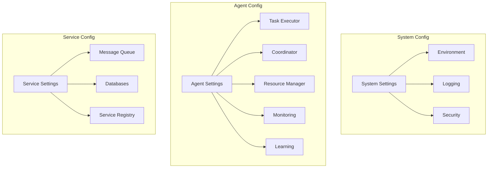

# Multi-Agent System Configuration Reference

## Overview

### Purpose & Scope
- Documentation Type: Configuration Reference
- Environment: Production Multi-Agent System
- Target Audience: System Administrators and DevOps

### Configuration Architecture


## System Configuration

### Environment Settings
```yaml
environment:
  deployment:
    environment: production  # [development, staging, production]
    region: us-west-2
    zone: a
    cluster: primary
  
  resources:
    compute:
      min_cores: 32
      min_memory: "128Gi"
      min_storage: "500Gi"
    networking:
      bandwidth: "10Gi"
      latency_threshold: "1ms"
  
  scaling:
    min_nodes: 3
    max_nodes: 20
    target_cpu_utilization: 0.75
    target_memory_utilization: 0.80
```

### Logging Configuration
```yaml
logging:
  level:
    default: INFO
    system: INFO
    agents: INFO
    services: INFO
  
  handlers:
    console:
      enabled: true
      format: json
      fields:
        - timestamp
        - level
        - message
        - context
    
    file:
      enabled: true
      path: /var/log/system
      max_size: "1Gi"
      max_files: 10
      compression: true
    
    remote:
      enabled: true
      endpoint: http://logging-service:8080
      batch_size: 1000
      flush_interval: "10s"
  
  metrics:
    enabled: true
    interval: "1m"
    retention: "30d"
```

### Security Settings
```yaml
security:
  authentication:
    method: jwt
    token_expiry: "24h"
    refresh_enabled: true
    refresh_expiry: "7d"
    
    jwt:
      algorithm: ES256
      public_key_path: /etc/keys/public.pem
      private_key_path: /etc/keys/private.pem
    
    certificates:
      ca_path: /etc/ssl/ca.pem
      cert_path: /etc/ssl/cert.pem
      key_path: /etc/ssl/key.pem
      rotation_period: "90d"
  
  authorization:
    method: rbac
    policy_path: /etc/policies
    default_role: viewer
    
    roles:
      admin:
        - all
      operator:
        - read
        - execute
      viewer:
        - read
  
  encryption:
    transport:
      protocol: TLS
      min_version: "1.2"
      cipher_suites:
        - TLS_AES_256_GCM_SHA384
        - TLS_CHACHA20_POLY1305_SHA256
    
    storage:
      algorithm: AES-256-GCM
      key_rotation: "30d"
      key_store: vault
```

## Agent Configuration

### Task Executor Settings
```yaml
task_executor:
  execution:
    max_concurrent_tasks: 100
    task_timeout: "1h"
    retry_limit: 3
    retry_delay: "30s"
  
  resources:
    cpu_request: "2"
    cpu_limit: "4"
    memory_request: "4Gi"
    memory_limit: "8Gi"
  
  queues:
    task_queue:
      max_size: 1000
      priority_levels: 10
    result_queue:
      max_size: 1000
      retention: "1h"
  
  monitoring:
    metrics_interval: "10s"
    health_check_interval: "30s"
    profiling_enabled: true
```

### Coordinator Settings
```yaml
coordinator:
  coordination:
    update_interval: "1s"
    state_sync_interval: "5s"
    cleanup_interval: "1m"
  
  scheduling:
    algorithm: "fair-share"
    max_retries: 3
    backoff_factor: 2
  
  resources:
    cpu_request: "4"
    cpu_limit: "8"
    memory_request: "8Gi"
    memory_limit: "16Gi"
  
  state_store:
    type: redis
    persistence: true
    snapshot_interval: "5m"
```

### Resource Manager Settings
```yaml
resource_manager:
  allocation:
    strategy: "best-fit"
    overcommit_factor: 1.2
    reservation_timeout: "5m"
  
  resources:
    tracking_interval: "1s"
    rebalance_interval: "5m"
    cleanup_interval: "1h"
  
  optimization:
    enabled: true
    interval: "15m"
    target_utilization: 0.8
  
  storage:
    type: mongodb
    collection: resources
    index_fields:
      - type
      - status
      - allocation
```

### Monitoring Settings
```yaml
monitoring:
  collection:
    interval: "10s"
    batch_size: 1000
    buffer_size: 10000
  
  storage:
    type: prometheus
    retention: "30d"
    scrape_interval: "10s"
    evaluation_interval: "30s"
  
  alerting:
    enabled: true
    evaluation_interval: "1m"
    notification_interval: "5m"
    channels:
      - type: email
        recipients: ["ops@example.com"]
      - type: slack
        webhook: "https://hooks.slack.com/..."
  
  dashboards:
    refresh_interval: "30s"
    default_timerange: "6h"
```

### Learning Settings
```yaml
learning:
  training:
    batch_size: 64
    learning_rate: 0.001
    epochs: 100
    validation_split: 0.2
  
  model:
    architecture: "transformer"
    hidden_size: 512
    num_layers: 6
    dropout: 0.1
  
  optimization:
    optimizer: "adam"
    weight_decay: 0.01
    gradient_clip: 1.0
    mixed_precision: true
  
  distribution:
    strategy: "parameter_server"
    num_workers: 4
    sync_period: "1m"
```

## Service Configuration

### Message Queue Settings
```yaml
message_queue:
  rabbitmq:
    hosts:
      - rabbitmq-0.rabbitmq:5672
      - rabbitmq-1.rabbitmq:5672
      - rabbitmq-2.rabbitmq:5672
    
    connection:
      heartbeat: 60
      blocked_connection_timeout: 300
    
    channels:
      prefetch_count: 100
      confirm_delivery: true
    
    queues:
      task_queue:
        durable: true
        max_length: 10000
        message_ttl: 3600000
      
      event_queue:
        durable: true
        max_length: 100000
        message_ttl: 86400000
    
    exchanges:
      task_exchange:
        type: direct
        durable: true
      
      event_exchange:
        type: topic
        durable: true
```

### Database Settings
```yaml
databases:
  mongodb:
    hosts:
      - mongodb-0.mongodb:27017
      - mongodb-1.mongodb:27017
      - mongodb-2.mongodb:27017
    
    replicaSet:
      name: rs0
      read_preference: primaryPreferred
    
    connection:
      max_pool_size: 100
      min_pool_size: 10
      max_idle_time: 300000
    
    collections:
      tasks:
        indexes:
          - keys: [status, priority]
            options: {background: true}
      resources:
        indexes:
          - keys: [type, status]
            options: {background: true}
  
  prometheus:
    retention:
      time: 30d
      size: 500GB
    
    scrape:
      interval: 10s
      timeout: 5s
    
    storage:
      tsdb_path: /data
      max_block_duration: 2h
```

### Service Registry Settings
```yaml
service_registry:
  consul:
    hosts:
      - consul-0.consul:8500
      - consul-1.consul:8500
      - consul-2.consul:8500
    
    registration:
      service_name: "{{service}}"
      check_interval: "10s"
      timeout: "5s"
    
    discovery:
      datacenter: primary
      near_node: ""
      tag_wait: "1s"
    
    watches:
      enabled: true
      handlers:
        service:
          - type: http
            url: http://handler:8080/service
        key:
          - type: http
            url: http://handler:8080/key
```

## Documentation

### Version History
- Version: 1.0.0
- Last Updated: 2024-03-21
- Changelog: [[changelog#config-ref-1.0.0]]

### Related Documentation
- Technical Implementation: [[technical-impl#system]]
- Deployment Guide: [[deployment#system]]
- Operations Manual: [[operations#system]]

## References
- [[config-patterns#distributed-systems]]
- [[settings-patterns#multi-agent]]
- [[best-practices#configuration]]

---
*Note: This configuration reference provides comprehensive details about all configuration options available in the multi-agent system.* 