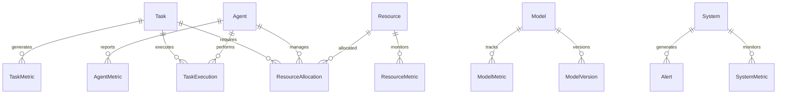

# Multi-Agent System Data Model Specifications

## Overview

### Purpose & Scope
- Documentation Type: Data Model Specification
- Environment: Production Multi-Agent System
- Target Audience: Developers and Data Architects

### Data Architecture


## Core Entities

### Task Model
```yaml
task:
  collection: tasks
  schema:
    task_id:
      type: string
      format: uuid
      primary_key: true
    
    type:
      type: string
      enum: [processing, analysis, learning]
      index: true
    
    status:
      type: string
      enum: [pending, scheduled, executing, completed, failed]
      index: true
    
    priority:
      type: integer
      minimum: 1
      maximum: 10
      index: true
    
    parameters:
      type: object
      properties:
        input_data:
          type: object
        configuration:
          type: object
        constraints:
          type: object
    
    deadline:
      type: datetime
      nullable: true
      index: true
    
    created_at:
      type: datetime
      auto: true
      index: true
    
    updated_at:
      type: datetime
      auto: true
      index: true
    
    metadata:
      type: object
      properties:
        source:
          type: string
        tags:
          type: array
          items:
            type: string
```

### Resource Model
```yaml
resource:
  collection: resources
  schema:
    resource_id:
      type: string
      format: uuid
      primary_key: true
    
    type:
      type: string
      enum: [compute, memory, storage, gpu]
      index: true
    
    capacity:
      type: object
      properties:
        total:
          type: number
        unit:
          type: string
    
    status:
      type: string
      enum: [available, allocated, maintenance, failed]
      index: true
    
    allocations:
      type: array
      items:
        type: object
        properties:
          allocation_id:
            type: string
          task_id:
            type: string
          quantity:
            type: number
          start_time:
            type: datetime
          end_time:
            type: datetime
    
    metrics:
      type: object
      properties:
        utilization:
          type: number
        performance:
          type: number
        health:
          type: number
    
    metadata:
      type: object
      properties:
        location:
          type: string
        provider:
          type: string
        tags:
          type: array
          items:
            type: string
```

### Agent Model
```yaml
agent:
  collection: agents
  schema:
    agent_id:
      type: string
      format: uuid
      primary_key: true
    
    type:
      type: string
      enum: [task_executor, coordinator, resource_manager, monitoring, learning]
      index: true
    
    status:
      type: string
      enum: [active, idle, busy, maintenance, offline]
      index: true
    
    capabilities:
      type: array
      items:
        type: object
        properties:
          type:
            type: string
          parameters:
            type: object
    
    resources:
      type: object
      properties:
        allocated:
          type: object
        utilized:
          type: object
    
    metrics:
      type: object
      properties:
        performance:
          type: number
        reliability:
          type: number
        efficiency:
          type: number
    
    configuration:
      type: object
      properties:
        settings:
          type: object
        constraints:
          type: object
```

### Model Entity
```yaml
model:
  collection: models
  schema:
    model_id:
      type: string
      format: uuid
      primary_key: true
    
    type:
      type: string
      enum: [policy, value_function, predictor, classifier]
      index: true
    
    current_version:
      type: string
      reference: model_versions
      index: true
    
    parameters:
      type: object
      properties:
        architecture:
          type: object
        hyperparameters:
          type: object
    
    metrics:
      type: object
      properties:
        accuracy:
          type: number
        loss:
          type: number
        convergence:
          type: number
    
    metadata:
      type: object
      properties:
        training_data:
          type: object
        validation_data:
          type: object
```

## Relationship Models

### Task Execution
```yaml
task_execution:
  collection: task_executions
  schema:
    execution_id:
      type: string
      format: uuid
      primary_key: true
    
    task_id:
      type: string
      reference: tasks
      index: true
    
    agent_id:
      type: string
      reference: agents
      index: true
    
    status:
      type: string
      enum: [starting, running, completed, failed]
      index: true
    
    progress:
      type: number
      minimum: 0
      maximum: 100
    
    metrics:
      type: object
      properties:
        duration:
          type: number
        resource_usage:
          type: object
        performance:
          type: object
    
    result:
      type: object
      properties:
        output:
          type: object
        errors:
          type: array
          items:
            type: object
```

### Resource Allocation
```yaml
resource_allocation:
  collection: resource_allocations
  schema:
    allocation_id:
      type: string
      format: uuid
      primary_key: true
    
    resource_id:
      type: string
      reference: resources
      index: true
    
    task_id:
      type: string
      reference: tasks
      index: true
    
    agent_id:
      type: string
      reference: agents
      index: true
    
    status:
      type: string
      enum: [pending, active, released, failed]
      index: true
    
    quantity:
      type: number
      minimum: 0
    
    period:
      type: object
      properties:
        start:
          type: datetime
        end:
          type: datetime
    
    metrics:
      type: object
      properties:
        utilization:
          type: number
        efficiency:
          type: number
```

## Metric Models

### System Metrics
```yaml
system_metric:
  collection: system_metrics
  schema:
    metric_id:
      type: string
      format: uuid
      primary_key: true
    
    name:
      type: string
      index: true
    
    type:
      type: string
      enum: [gauge, counter, histogram]
      index: true
    
    value:
      type: number
    
    timestamp:
      type: datetime
      index: true
    
    labels:
      type: object
      properties:
        component:
          type: string
        instance:
          type: string
        environment:
          type: string
    
    metadata:
      type: object
      properties:
        unit:
          type: string
        description:
          type: string
```

### Learning Metrics
```yaml
learning_metric:
  collection: learning_metrics
  schema:
    metric_id:
      type: string
      format: uuid
      primary_key: true
    
    model_id:
      type: string
      reference: models
      index: true
    
    type:
      type: string
      enum: [loss, accuracy, convergence]
      index: true
    
    value:
      type: number
    
    timestamp:
      type: datetime
      index: true
    
    context:
      type: object
      properties:
        batch_size:
          type: integer
        iteration:
          type: integer
        epoch:
          type: integer
    
    metadata:
      type: object
      properties:
        algorithm:
          type: string
        parameters:
          type: object
```

## Event Models

### System Events
```yaml
system_event:
  collection: system_events
  schema:
    event_id:
      type: string
      format: uuid
      primary_key: true
    
    type:
      type: string
      enum: [info, warning, error, critical]
      index: true
    
    source:
      type: string
      index: true
    
    message:
      type: string
    
    timestamp:
      type: datetime
      index: true
    
    context:
      type: object
      properties:
        component:
          type: string
        action:
          type: string
        details:
          type: object
    
    metadata:
      type: object
      properties:
        correlation_id:
          type: string
        tags:
          type: array
          items:
            type: string
```

### Alerts
```yaml
alert:
  collection: alerts
  schema:
    alert_id:
      type: string
      format: uuid
      primary_key: true
    
    severity:
      type: string
      enum: [info, warning, error, critical]
      index: true
    
    status:
      type: string
      enum: [active, acknowledged, resolved]
      index: true
    
    source:
      type: string
      index: true
    
    message:
      type: string
    
    timestamp:
      type: datetime
      index: true
    
    context:
      type: object
      properties:
        trigger:
          type: object
        threshold:
          type: object
        value:
          type: object
    
    resolution:
      type: object
      properties:
        timestamp:
          type: datetime
        action:
          type: string
        notes:
          type: string
```

## Storage Configuration

### Indexes
```yaml
indexes:
  tasks:
    - name: status_priority
      fields: [status, priority]
      type: compound
    
    - name: deadline_status
      fields: [deadline, status]
      type: compound
  
  resources:
    - name: type_status
      fields: [type, status]
      type: compound
    
    - name: allocations
      fields: [allocations.task_id]
      type: single
  
  metrics:
    - name: name_timestamp
      fields: [name, timestamp]
      type: compound
    
    - name: type_timestamp
      fields: [type, timestamp]
      type: compound
```

### Sharding Strategy
```yaml
sharding:
  tasks:
    key: task_id
    strategy: hash
  
  metrics:
    key: timestamp
    strategy: range
    ranges:
      - min: 2024-01-01
        max: 2024-04-01
      - min: 2024-04-01
        max: 2024-07-01
  
  events:
    key: timestamp
    strategy: range
    ranges:
      - min: 2024-01-01
        max: 2024-07-01
```

## Documentation

### Version History
- Version: 1.0.0
- Last Updated: 2024-03-21
- Changelog: [[changelog#data-model-1.0.0]]

### Related Documentation
- Technical Implementation: [[technical-impl#system]]
- API Documentation: [[api-doc#system]]
- Storage Guide: [[storage#system]]

## References
- [[data-patterns#document-model]]
- [[schema-patterns#time-series]]
- [[best-practices#data-modeling]]

---
*Note: This data model specification provides comprehensive details about all data structures and relationships in the multi-agent system.* 