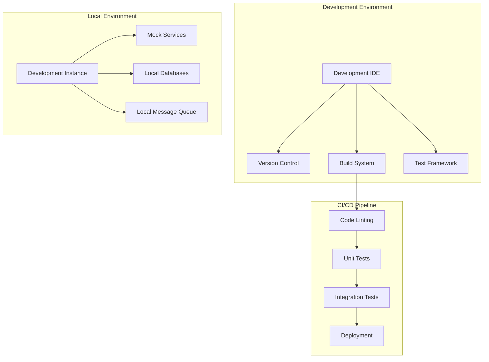

# Multi-Agent System Development Guide

## Overview

### Purpose & Scope
- Guide Type: Development Reference
- Environment: Multi-Agent System
- Target Audience: Developers and Engineers

### Development Architecture


## Development Setup

### Environment Setup
```yaml
development_environment:
  required_tools:
    python:
      version: ">=3.8"
      packages:
        - poetry: ">=1.4.0"  # Dependency management
        - black: ">=23.0.0"  # Code formatting
        - pylint: ">=2.17.0" # Code linting
        - pytest: ">=7.3.0"  # Testing framework
        - pytest-asyncio: "latest"  # Async testing
        - pytest-cov: "latest"  # Coverage reporting
    
    docker:
      version: ">=24.0"
      compose: ">=2.17"
    
    kubernetes:
      version: ">=1.28"
      tools:
        - kubectl
        - helm
        - k9s
    
    databases:
      - mongodb: ">=6.0"
      - redis: ">=7.0"
      - prometheus: ">=2.45"
    
    message_queue:
      - rabbitmq: ">=3.12"

  ide_setup:
    vscode:
      extensions:
        - ms-python.python
        - ms-python.vscode-pylance
        - ms-kubernetes-tools.vscode-kubernetes-tools
        - ms-azuretools.vscode-docker
      settings:
        "python.formatting.provider": "black"
        "python.linting.enabled": true
        "python.linting.pylintEnabled": true
        "editor.formatOnSave": true
```

### Project Structure
```
agents/
├── core/                     # Core agent functionality
│   ├── base/                # Base classes and interfaces
│   ├── utils/               # Utility functions
│   └── protocols/           # Communication protocols
├── executors/               # Task executor implementation
│   ├── handlers/            # Task handlers
│   ├── processors/          # Task processors
│   └── validators/          # Task validators
├── coordinator/             # Coordinator implementation
│   ├── orchestrator/        # Orchestration logic
│   ├── scheduler/          # Task scheduling
│   └── balancer/           # Load balancing
├── resources/              # Resource manager implementation
│   ├── allocator/          # Resource allocation
│   ├── tracker/            # Resource tracking
│   └── optimizer/          # Resource optimization
├── monitoring/             # Monitoring implementation
│   ├── collectors/         # Metric collectors
│   ├── analyzers/          # Metric analysis
│   └── alerting/           # Alert management
├── learning/               # Learning implementation
│   ├── models/             # Learning models
│   ├── trainers/           # Model training
│   └── optimizers/         # Model optimization
├── tests/                  # Test suite
│   ├── unit/              # Unit tests
│   ├── integration/       # Integration tests
│   └── performance/       # Performance tests
└── infrastructure/        # Infrastructure code
    ├── docker/            # Docker configurations
    ├── kubernetes/        # Kubernetes manifests
    └── terraform/         # Infrastructure as code
```

## Development Workflow

### Code Style Guide
```python
# Example code style
from typing import Dict, List, Optional
from datetime import datetime
import asyncio
import logging

class TaskProcessor:
    """Task processing implementation.
    
    This class handles the processing of tasks in the system, including
    validation, execution, and result handling.
    
    Attributes:
        config: Configuration dictionary
        logger: Logger instance
        validator: Task validator
        executor: Task executor
    """
    
    def __init__(self, config: Dict) -> None:
        """Initialize task processor.
        
        Args:
            config: Configuration dictionary containing processor settings
        """
        self.config = config
        self.logger = logging.getLogger(__name__)
        self.validator = TaskValidator(config)
        self.executor = TaskExecutor(config)
    
    async def process_task(self, task: Dict) -> Dict:
        """Process a single task.
        
        Args:
            task: Task dictionary containing task details
            
        Returns:
            Dict containing task results
            
        Raises:
            ValidationError: If task validation fails
            ExecutionError: If task execution fails
        """
        try:
            # Validate task
            await self.validator.validate(task)
            
            # Execute task
            result = await self.executor.execute(task)
            
            # Log completion
            self.logger.info(
                "Task completed successfully",
                extra={
                    "task_id": task["task_id"],
                    "duration": result["duration"]
                }
            )
            
            return result
            
        except ValidationError as e:
            self.logger.error(
                "Task validation failed",
                extra={"task_id": task["task_id"], "error": str(e)}
            )
            raise
        
        except ExecutionError as e:
            self.logger.error(
                "Task execution failed",
                extra={"task_id": task["task_id"], "error": str(e)}
            )
            raise
```

### Testing Guidelines
```python
# Example test implementation
import pytest
from unittest.mock import AsyncMock, Mock

class TestTaskProcessor:
    """Task processor test suite."""
    
    @pytest.fixture
    async def processor(self):
        """Create test processor instance."""
        config = {
            "validation": {"strict": True},
            "execution": {"timeout": 30}
        }
        return TaskProcessor(config)
    
    @pytest.mark.asyncio
    async def test_process_task_success(self, processor):
        """Test successful task processing."""
        # Arrange
        task = {
            "task_id": "test-1",
            "type": "processing",
            "data": {"key": "value"}
        }
        expected_result = {
            "status": "completed",
            "duration": 1.5
        }
        
        processor.validator.validate = AsyncMock()
        processor.executor.execute = AsyncMock(
            return_value=expected_result
        )
        
        # Act
        result = await processor.process_task(task)
        
        # Assert
        assert result == expected_result
        processor.validator.validate.assert_called_once_with(task)
        processor.executor.execute.assert_called_once_with(task)
    
    @pytest.mark.asyncio
    async def test_process_task_validation_error(self, processor):
        """Test task processing with validation error."""
        # Arrange
        task = {
            "task_id": "test-2",
            "type": "invalid"
        }
        processor.validator.validate = AsyncMock(
            side_effect=ValidationError("Invalid task type")
        )
        
        # Act/Assert
        with pytest.raises(ValidationError):
            await processor.process_task(task)
```

### Documentation Standards
```python
"""Module docstring example.

This module implements the task processing functionality for the agent system.
It handles task validation, execution, and result processing.

Typical usage example:

    processor = TaskProcessor(config)
    result = await processor.process_task(task)
"""

from typing import Dict, Optional
import logging

class TaskValidator:
    """Task validation implementation.
    
    This class provides validation functionality for tasks in the system.
    It ensures that tasks meet all required criteria before execution.
    
    Attributes:
        config: Validation configuration
        logger: Logger instance
        
    Example:
        validator = TaskValidator(config)
        await validator.validate(task)
    """
    
    def __init__(self, config: Dict) -> None:
        """Initialize task validator.
        
        Args:
            config: Configuration dictionary containing validation settings
            
        Raises:
            ConfigurationError: If required settings are missing
        """
        self._validate_config(config)
        self.config = config
        self.logger = logging.getLogger(__name__)
```

## Development Patterns

### Agent Implementation
```python
from abc import ABC, abstractmethod
from typing import Dict, List

class BaseAgent(ABC):
    """Base agent implementation.
    
    This class defines the base interface for all agents in the system.
    Concrete agents should implement all abstract methods.
    """
    
    @abstractmethod
    async def initialize(self) -> None:
        """Initialize agent resources."""
        pass
    
    @abstractmethod
    async def start(self) -> None:
        """Start agent operation."""
        pass
    
    @abstractmethod
    async def stop(self) -> None:
        """Stop agent operation."""
        pass
    
    @abstractmethod
    async def health_check(self) -> Dict:
        """Check agent health status."""
        pass

class TaskExecutorAgent(BaseAgent):
    """Task executor agent implementation."""
    
    def __init__(self, config: Dict):
        """Initialize task executor agent."""
        self.config = config
        self.processor = TaskProcessor(config)
        self.resource_client = ResourceClient(config)
        self.status_reporter = StatusReporter(config)
    
    async def initialize(self) -> None:
        """Initialize agent resources."""
        await self.resource_client.connect()
        await self.status_reporter.initialize()
    
    async def start(self) -> None:
        """Start task execution."""
        try:
            await self._start_task_consumers()
            await self._start_status_reporting()
            await self._register_with_coordinator()
        except Exception as e:
            self.logger.error(f"Failed to start agent: {e}")
            raise
```

### Protocol Implementation
```python
class MessageProtocol:
    """Message protocol implementation."""
    
    def __init__(self, config: Dict):
        """Initialize message protocol."""
        self.config = config
        self.serializer = MessageSerializer()
        self.validator = MessageValidator()
        self.encryption = MessageEncryption()
    
    async def encode_message(self, message: Dict) -> bytes:
        """Encode message for transmission.
        
        Args:
            message: Message dictionary to encode
            
        Returns:
            Encoded message bytes
            
        Raises:
            EncodingError: If message encoding fails
        """
        try:
            # Validate message
            await self.validator.validate(message)
            
            # Serialize message
            serialized = await self.serializer.serialize(message)
            
            # Encrypt message
            encrypted = await self.encryption.encrypt(serialized)
            
            return encrypted
            
        except Exception as e:
            self.logger.error(f"Message encoding failed: {e}")
            raise EncodingError(str(e))
    
    async def decode_message(self, data: bytes) -> Dict:
        """Decode received message.
        
        Args:
            data: Received message bytes
            
        Returns:
            Decoded message dictionary
            
        Raises:
            DecodingError: If message decoding fails
        """
        try:
            # Decrypt message
            decrypted = await self.encryption.decrypt(data)
            
            # Deserialize message
            deserialized = await self.serializer.deserialize(decrypted)
            
            # Validate message
            await self.validator.validate(deserialized)
            
            return deserialized
            
        except Exception as e:
            self.logger.error(f"Message decoding failed: {e}")
            raise DecodingError(str(e))
```

### Error Handling
```python
class AgentError(Exception):
    """Base agent error."""
    
    def __init__(self, message: str, details: Optional[Dict] = None):
        """Initialize agent error.
        
        Args:
            message: Error message
            details: Optional error details
        """
        self.message = message
        self.details = details or {}
        super().__init__(self.message)

class ValidationError(AgentError):
    """Validation error."""
    pass

class ExecutionError(AgentError):
    """Execution error."""
    pass

class ResourceError(AgentError):
    """Resource error."""
    pass

def handle_agent_error(error: Exception, context: Dict) -> None:
    """Handle agent errors.
    
    Args:
        error: Exception instance
        context: Error context dictionary
    """
    logger = logging.getLogger(__name__)
    
    # Log error with context
    logger.error(
        f"Agent error occurred: {error}",
        extra={
            "error_type": type(error).__name__,
            "context": context
        },
        exc_info=True
    )
    
    # Report error to monitoring
    monitoring.report_error(error, context)
    
    # Execute recovery if possible
    try:
        recovery.handle_error(error, context)
    except Exception as e:
        logger.error(f"Error recovery failed: {e}")
```

## Local Development

### Docker Compose Setup
```yaml
version: '3.8'

services:
  task-executor:
    build:
      context: .
      dockerfile: docker/task-executor.dockerfile
    environment:
      - BROKER_URL=amqp://rabbitmq
      - REGISTRY_URL=http://consul:8500
    depends_on:
      - rabbitmq
      - consul

  coordinator:
    build:
      context: .
      dockerfile: docker/coordinator.dockerfile
    environment:
      - BROKER_URL=amqp://rabbitmq
      - REGISTRY_URL=http://consul:8500
    depends_on:
      - rabbitmq
      - consul

  resource-manager:
    build:
      context: .
      dockerfile: docker/resource-manager.dockerfile
    environment:
      - BROKER_URL=amqp://rabbitmq
      - REGISTRY_URL=http://consul:8500
      - MONGODB_URL=mongodb://mongodb:27017
    depends_on:
      - rabbitmq
      - consul
      - mongodb

  monitoring:
    build:
      context: .
      dockerfile: docker/monitoring.dockerfile
    environment:
      - BROKER_URL=amqp://rabbitmq
      - REGISTRY_URL=http://consul:8500
      - PROMETHEUS_URL=http://prometheus:9090
    depends_on:
      - rabbitmq
      - consul
      - prometheus

  rabbitmq:
    image: rabbitmq:3.12-management
    ports:
      - "5672:5672"
      - "15672:15672"

  consul:
    image: consul:1.15
    ports:
      - "8500:8500"

  mongodb:
    image: mongo:6.0
    ports:
      - "27017:27017"

  prometheus:
    image: prom/prometheus:v2.45.0
    ports:
      - "9090:9090"
    volumes:
      - ./config/prometheus:/etc/prometheus
```

### Development Tools
```yaml
development_tools:
  debugging:
    - name: pdb
      usage: Python debugger
      commands:
        - breakpoint()  # Add breakpoint
        - n  # Next line
        - s  # Step into
        - c  # Continue
    
    - name: ipdb
      usage: IPython debugger
      installation: pip install ipdb
      benefits:
        - Better code completion
        - Syntax highlighting
        - Command history
    
    - name: debugpy
      usage: Remote debugging
      configuration:
        launch.json: |
          {
            "version": "0.2.0",
            "configurations": [
              {
                "name": "Python: Remote Attach",
                "type": "python",
                "request": "attach",
                "connect": {
                  "host": "localhost",
                  "port": 5678
                }
              }
            ]
          }
  
  profiling:
    - name: cProfile
      usage: CPU profiling
      commands:
        - python -m cProfile -o output.prof script.py
        - snakeviz output.prof  # Visualization
    
    - name: memory_profiler
      usage: Memory profiling
      installation: pip install memory_profiler
      usage: |
        @profile
        def memory_heavy_function():
            pass
    
    - name: py-spy
      usage: Sampling profiler
      installation: pip install py-spy
      commands:
        - py-spy record -o profile.svg --pid <PID>
```

## CI/CD Pipeline

### GitHub Actions Workflow
```yaml
name: CI/CD Pipeline

on:
  push:
    branches: [ main, develop ]
  pull_request:
    branches: [ main, develop ]

jobs:
  test:
    runs-on: ubuntu-latest
    steps:
      - uses: actions/checkout@v3
      
      - name: Set up Python
        uses: actions/setup-python@v4
        with:
          python-version: '3.8'
      
      - name: Install dependencies
        run: |
          python -m pip install --upgrade pip
          pip install poetry
          poetry install
      
      - name: Run linting
        run: |
          poetry run black . --check
          poetry run pylint agents/
      
      - name: Run tests
        run: |
          poetry run pytest tests/ --cov=agents
      
      - name: Upload coverage
        uses: codecov/codecov-action@v3

  build:
    needs: test
    runs-on: ubuntu-latest
    steps:
      - uses: actions/checkout@v3
      
      - name: Set up Docker Buildx
        uses: docker/setup-buildx-action@v2
      
      - name: Build images
        run: |
          docker-compose build
      
      - name: Run integration tests
        run: |
          docker-compose up -d
          ./scripts/run-integration-tests.sh
          docker-compose down

  deploy:
    needs: build
    if: github.ref == 'refs/heads/main'
    runs-on: ubuntu-latest
    steps:
      - name: Deploy to production
        run: |
          # Add deployment steps
```

## Documentation

### Version History
- Version: 1.0.0
- Last Updated: 2024-03-21
- Changelog: [[changelog#dev-guide-1.0.0]]

### Related Documentation
- API Documentation: [[api-doc#system]]
- Protocol Implementation: [[protocol-impl#system]]
- Testing Guide: [[testing#system]]

## References
- [[development-patterns#multi-agent]]
- [[coding-patterns#python]]
- [[best-practices#development]]

---
*Note: This development guide provides comprehensive instructions for developing and extending the multi-agent system.* 