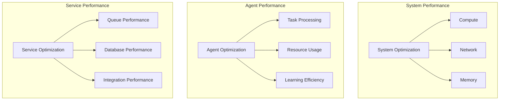

# Multi-Agent System Performance Tuning Guide

## Overview

### Purpose & Scope
- Guide Type: Performance Optimization
- Environment: Production Multi-Agent System
- Target Audience: System Operators and Performance Engineers

### Performance Architecture


## System Optimization

### Compute Optimization
```yaml
compute_optimization:
  cpu_tuning:
    kernel_parameters:
      - sysctl_vm_swappiness: 10
      - sysctl_kernel_numa_balancing: 1
      - sysctl_kernel_sched_migration_cost_ns: 5000000
    
    process_priorities:
      critical_services:
        nice: -10
        ionice_class: 1
      standard_services:
        nice: 0
        ionice_class: 2
    
    cpu_governor:
      policy: performance
      scaling_min_freq: 2.0GHz
      scaling_max_freq: 3.5GHz
  
  memory_tuning:
    vm_parameters:
      - vm_max_map_count: 262144
      - vm_overcommit_memory: 1
      - vm_overcommit_ratio: 85
    
    huge_pages:
      enabled: true
      size: 2MB
      reserved: 1024
    
    numa_configuration:
      policy: interleave
      balancing: true
```

### Network Optimization
```yaml
network_optimization:
  tcp_tuning:
    kernel_parameters:
      - net_ipv4_tcp_fin_timeout: 15
      - net_ipv4_tcp_keepalive_time: 300
      - net_ipv4_tcp_max_syn_backlog: 8192
      - net_core_somaxconn: 65535
    
    buffer_sizes:
      tcp_rmem: [4096, 87380, 16777216]
      tcp_wmem: [4096, 65536, 16777216]
      tcp_mem: [16777216, 16777216, 16777216]
    
    congestion_control:
      algorithm: bbr
      window_scaling: true
  
  dns_optimization:
    caching:
      enabled: true
      ttl_min: 60
      ttl_max: 3600
    resolution:
      timeout: 3
      attempts: 2
      rotate: true
```

### Storage Optimization
```yaml
storage_optimization:
  disk_tuning:
    io_scheduler:
      type: mq-deadline
      read_ahead_kb: 2048
      nr_requests: 256
    
    mount_options:
      noatime: true
      nodiratime: true
      data: ordered
      commit: 60
    
    filesystem_tuning:
      type: xfs
      parameters:
        - allocsize: 1m
        - nobarrier: true
        - logbufs: 8
  
  cache_optimization:
    page_cache:
      dirty_ratio: 20
      dirty_background_ratio: 10
      vfs_cache_pressure: 50
    
    io_cache:
      write_back_cache: enabled
      read_ahead_cache: enabled
      direct_io_threshold: 64k
```

## Agent Optimization

### Task Executor Optimization
```yaml
task_executor_optimization:
  processing_pipeline:
    batch_processing:
      enabled: true
      optimal_size: 100
      max_delay: "50ms"
    
    concurrency:
      worker_threads: 16
      io_threads: 4
      processing_queues: 8
    
    resource_management:
      memory_limit: "80%"
      cpu_limit: "90%"
      gpu_limit: "95%"
  
  task_scheduling:
    prioritization:
      levels: 10
      preemption: enabled
      fairness_factor: 0.8
    
    queueing:
      max_queue_size: 10000
      overflow_policy: drop_oldest
      backpressure_threshold: 0.8
```

### Coordinator Optimization
```yaml
coordinator_optimization:
  coordination_efficiency:
    state_sync:
      interval: "100ms"
      batch_size: 1000
      compression: enabled
    
    decision_making:
      cache_enabled: true
      cache_ttl: "1s"
      prediction_window: "5s"
    
    load_balancing:
      algorithm: least_loaded
      rebalance_threshold: 0.2
      stabilization_delay: "30s"
  
  resource_allocation:
    strategy: predictive
    overcommit_ratio: 1.2
    reservation_timeout: "5s"
    
    optimization:
      interval: "1m"
      target_utilization: 0.8
      balance_factor: 0.9
```

### Learning Optimization
```yaml
learning_optimization:
  training_efficiency:
    batch_optimization:
      size: 256
      prefetch_factor: 2
      pin_memory: true
    
    computation:
      mixed_precision: enabled
      gradient_accumulation: 4
      parallel_mode: model_parallel
    
    memory_management:
      checkpoint_frequency: 100
      gradient_checkpointing: enabled
      memory_efficient_attention: true
  
  model_optimization:
    architecture:
      pruning_enabled: true
      pruning_threshold: 0.001
      quantization: int8
    
    inference:
      batch_inference: true
      cache_predictions: true
      dynamic_batching: enabled
```

## Service Optimization

### Message Queue Optimization
```yaml
queue_optimization:
  broker_tuning:
    memory_management:
      vm_memory_high_watermark: 0.6
      vm_memory_high_watermark_paging_ratio: 0.75
    
    persistence:
      mode: sync
      sync_batch_size: 100
      lazy_queue_threshold: 1000
    
    flow_control:
      enabled: true
      threshold: 0.8
      reaction_time: "1s"
  
  queue_tuning:
    prefetch_count: 50
    consumer_timeout: "30s"
    message_ttl: "24h"
    
    batching:
      enabled: true
      size: 100
      timeout: "50ms"
```

### Database Optimization
```yaml
database_optimization:
  query_optimization:
    indexes:
      automatic_indexing: true
      index_usage_monitoring: true
      unused_index_cleanup: enabled
    
    query_cache:
      enabled: true
      size: "1GB"
      ttl: "1h"
    
    execution_plan:
      optimization_level: normal
      parallel_query: enabled
      max_parallel_workers: 8
  
  connection_optimization:
    pool_settings:
      min_size: 10
      max_size: 100
      idle_timeout: "5m"
    
    transaction_management:
      isolation_level: read_committed
      deadlock_timeout: "1s"
      statement_timeout: "30s"
```

### Service Registry Optimization
```yaml
registry_optimization:
  discovery_optimization:
    cache_ttl: "5s"
    negative_cache_ttl: "1s"
    refresh_interval: "10s"
    
    health_checks:
      interval: "10s"
      timeout: "5s"
      deregister_critical_service_after: "30s"
    
    dns_optimization:
      cache_enabled: true
      recursion_enabled: false
      stale_ttl: "10s"
  
  consistency_optimization:
    raft_multiplier: 1
    consistency_mode: default
    anti_entropy_interval: "30s"
    
    gossip_optimization:
      probe_interval: "1s"
      probe_timeout: "500ms"
      retransmit_multiplier: 3
```

## Performance Monitoring

### Metrics Collection
```yaml
performance_metrics:
  system_metrics:
    collection_interval: "10s"
    retention_period: "30d"
    aggregation_interval: "1m"
    
    metrics:
      - cpu_usage
      - memory_usage
      - io_throughput
      - network_latency
  
  agent_metrics:
    collection_interval: "5s"
    retention_period: "7d"
    aggregation_interval: "30s"
    
    metrics:
      - task_throughput
      - processing_time
      - queue_depth
      - error_rate
```

### Performance Alerts
```yaml
performance_alerts:
  thresholds:
    critical:
      cpu_usage: 90%
      memory_usage: 85%
      queue_depth: 1000
      response_time: 1s
    
    warning:
      cpu_usage: 80%
      memory_usage: 75%
      queue_depth: 500
      response_time: 500ms
  
  actions:
    auto_scale:
      enabled: true
      cooldown: "5m"
      max_scale_factor: 2
    
    notification:
      channels: [email, slack]
      throttle_period: "15m"
```

## Documentation

### Version History
- Version: 1.0.0
- Last Updated: 2024-03-21
- Changelog: [[changelog#performance-1.0.0]]

### Related Documentation
- System Architecture: [[architecture#system]]
- Operations Manual: [[operations#system]]
- Monitoring Guide: [[monitoring#system]]

## References
- [[performance-patterns#distributed-systems]]
- [[optimization-patterns#multi-agent]]
- [[best-practices#system-performance]]

---
*Note: This performance tuning guide provides comprehensive procedures for optimizing the performance of the multi-agent system in a production environment.* 