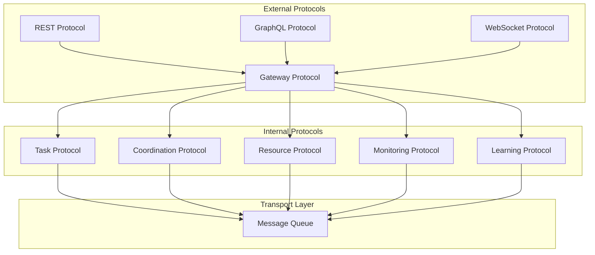

# Multi-Agent System Protocol Implementations

## Overview

### Purpose & Scope
- Documentation Type: Protocol Implementation
- Environment: Production Multi-Agent System
- Target Audience: Developers and System Integrators

### Protocol Architecture


## Core Protocols

### Task Protocol
```python
class TaskProtocol:
    """Task communication protocol implementation"""
    def __init__(self, config: Dict):
        self.config = config
        self.broker = MessageBroker()
        self.serializer = TaskSerializer()
        self.validator = TaskValidator()
    
    async def submit_task(self, task: Task) -> Dict:
        """Submit task for execution"""
        try:
            # Validate task
            await self.validator.validate_task(task)
            
            # Serialize task
            message = await self.serializer.serialize_task(task)
            
            # Publish task
            response = await self.broker.publish(
                topic="tasks.submit",
                message=message,
                headers={
                    "task_id": task.task_id,
                    "priority": str(task.priority)
                }
            )
            
            return response
            
        except Exception as e:
            await self._handle_submission_error(task, e)
            raise
    
    async def update_task_status(self, task_id: str, status: Dict) -> None:
        """Update task execution status"""
        try:
            # Validate status
            await self.validator.validate_status(status)
            
            # Serialize status
            message = await self.serializer.serialize_status(status)
            
            # Publish update
            await self.broker.publish(
                topic=f"tasks.status.{task_id}",
                message=message,
                headers={"update_type": "status"}
            )
            
        except Exception as e:
            await self._handle_status_error(task_id, status, e)
            raise
```

### Coordination Protocol
```python
class CoordinationProtocol:
    """Coordination communication protocol implementation"""
    def __init__(self, config: Dict):
        self.config = config
        self.broker = MessageBroker()
        self.serializer = CoordinationSerializer()
        self.validator = CoordinationValidator()
    
    async def coordinate_agents(self, directive: Dict) -> Dict:
        """Send coordination directive to agents"""
        try:
            # Validate directive
            await self.validator.validate_directive(directive)
            
            # Serialize directive
            message = await self.serializer.serialize_directive(directive)
            
            # Publish directive
            responses = await self.broker.publish_with_response(
                topic="coordination.directive",
                message=message,
                response_timeout=self.config.response_timeout,
                headers={
                    "directive_id": directive["directive_id"],
                    "priority": directive.get("priority", "normal")
                }
            )
            
            return await self._process_responses(responses)
            
        except Exception as e:
            await self._handle_coordination_error(directive, e)
            raise
    
    async def report_agent_status(self, agent_id: str, status: Dict) -> None:
        """Report agent status to coordinator"""
        try:
            # Validate status
            await self.validator.validate_agent_status(status)
            
            # Serialize status
            message = await self.serializer.serialize_status(status)
            
            # Publish status
            await self.broker.publish(
                topic=f"coordination.status.{agent_id}",
                message=message,
                headers={"agent_id": agent_id}
            )
            
        except Exception as e:
            await self._handle_status_error(agent_id, status, e)
            raise
```

### Resource Protocol
```python
class ResourceProtocol:
    """Resource management protocol implementation"""
    def __init__(self, config: Dict):
        self.config = config
        self.broker = MessageBroker()
        self.serializer = ResourceSerializer()
        self.validator = ResourceValidator()
    
    async def request_resources(self, request: Dict) -> Dict:
        """Request resource allocation"""
        try:
            # Validate request
            await self.validator.validate_request(request)
            
            # Serialize request
            message = await self.serializer.serialize_request(request)
            
            # Send request
            response = await self.broker.publish_with_response(
                topic="resources.request",
                message=message,
                response_timeout=self.config.allocation_timeout,
                headers={
                    "request_id": request["request_id"],
                    "priority": request.get("priority", "normal")
                }
            )
            
            return await self._process_allocation(response)
            
        except Exception as e:
            await self._handle_request_error(request, e)
            raise
    
    async def update_resource_status(self, resource_id: str, status: Dict) -> None:
        """Update resource status"""
        try:
            # Validate status
            await self.validator.validate_resource_status(status)
            
            # Serialize status
            message = await self.serializer.serialize_status(status)
            
            # Publish status
            await self.broker.publish(
                topic=f"resources.status.{resource_id}",
                message=message,
                headers={"resource_id": resource_id}
            )
            
        except Exception as e:
            await self._handle_status_error(resource_id, status, e)
            raise
```

### Monitoring Protocol
```python
class MonitoringProtocol:
    """Monitoring communication protocol implementation"""
    def __init__(self, config: Dict):
        self.config = config
        self.broker = MessageBroker()
        self.serializer = MetricSerializer()
        self.validator = MetricValidator()
    
    async def report_metrics(self, metrics: List[Dict]) -> None:
        """Report system metrics"""
        try:
            # Validate metrics
            await self.validator.validate_metrics(metrics)
            
            # Serialize metrics
            message = await self.serializer.serialize_metrics(metrics)
            
            # Publish metrics
            await self.broker.publish(
                topic="monitoring.metrics",
                message=message,
                headers={
                    "metric_count": str(len(metrics)),
                    "timestamp": str(datetime.utcnow())
                }
            )
            
        except Exception as e:
            await self._handle_metric_error(metrics, e)
            raise
    
    async def send_alert(self, alert: Dict) -> None:
        """Send system alert"""
        try:
            # Validate alert
            await self.validator.validate_alert(alert)
            
            # Serialize alert
            message = await self.serializer.serialize_alert(alert)
            
            # Publish alert
            await self.broker.publish(
                topic=f"monitoring.alerts.{alert['severity']}",
                message=message,
                headers={
                    "alert_id": alert["alert_id"],
                    "severity": alert["severity"]
                }
            )
            
        except Exception as e:
            await self._handle_alert_error(alert, e)
            raise
```

### Learning Protocol
```python
class LearningProtocol:
    """Learning communication protocol implementation"""
    def __init__(self, config: Dict):
        self.config = config
        self.broker = MessageBroker()
        self.serializer = ModelSerializer()
        self.validator = ModelValidator()
    
    async def distribute_model_update(self, model_update: Dict) -> Dict:
        """Distribute model update to agents"""
        try:
            # Validate update
            await self.validator.validate_model_update(model_update)
            
            # Serialize update
            message = await self.serializer.serialize_model_update(model_update)
            
            # Publish update
            responses = await self.broker.publish_with_response(
                topic="learning.model_update",
                message=message,
                response_timeout=self.config.update_timeout,
                headers={
                    "model_id": model_update["model_id"],
                    "version": model_update["version"]
                }
            )
            
            return await self._process_update_responses(responses)
            
        except Exception as e:
            await self._handle_update_error(model_update, e)
            raise
    
    async def report_learning_metrics(self, metrics: Dict) -> None:
        """Report learning metrics"""
        try:
            # Validate metrics
            await self.validator.validate_learning_metrics(metrics)
            
            # Serialize metrics
            message = await self.serializer.serialize_metrics(metrics)
            
            # Publish metrics
            await self.broker.publish(
                topic="learning.metrics",
                message=message,
                headers={
                    "model_id": metrics["model_id"],
                    "timestamp": str(datetime.utcnow())
                }
            )
            
        except Exception as e:
            await self._handle_metric_error(metrics, e)
            raise
```

## Transport Layer

### Message Queue Integration
```python
class MessageBroker:
    """Message broker integration"""
    def __init__(self, config: Dict):
        self.config = config
        self.connection = None
        self.channels = {}
        self.consumers = {}
    
    async def connect(self) -> None:
        """Establish broker connection"""
        try:
            # Create connection
            self.connection = await aio_pika.connect_robust(
                self.config.broker_url,
                client_properties={
                    "connection_name": self.config.service_name
                }
            )
            
            # Setup exchanges
            await self._setup_exchanges()
            
            # Setup queues
            await self._setup_queues()
            
        except Exception as e:
            await self._handle_connection_error(e)
            raise
    
    async def publish(
        self, 
        topic: str, 
        message: Dict,
        headers: Dict = None
    ) -> None:
        """Publish message to topic"""
        try:
            # Get channel
            channel = await self._get_channel(topic)
            
            # Create message
            message = aio_pika.Message(
                body=json.dumps(message).encode(),
                headers=headers or {},
                delivery_mode=aio_pika.DeliveryMode.PERSISTENT
            )
            
            # Publish message
            await channel.default_exchange.publish(
                message,
                routing_key=topic
            )
            
        except Exception as e:
            await self._handle_publish_error(topic, message, e)
            raise
```

### Message Serialization
```python
class MessageSerializer:
    """Message serialization base class"""
    def __init__(self):
        self.compression = MessageCompression()
        self.encryption = MessageEncryption()
    
    async def serialize(self, message: Dict) -> bytes:
        """Serialize message to bytes"""
        try:
            # Convert to JSON
            json_data = json.dumps(message)
            
            # Compress data
            compressed = await self.compression.compress(json_data)
            
            # Encrypt data
            encrypted = await self.encryption.encrypt(compressed)
            
            return encrypted
            
        except Exception as e:
            await self._handle_serialization_error(message, e)
            raise
    
    async def deserialize(self, data: bytes) -> Dict:
        """Deserialize bytes to message"""
        try:
            # Decrypt data
            decrypted = await self.encryption.decrypt(data)
            
            # Decompress data
            decompressed = await self.compression.decompress(decrypted)
            
            # Parse JSON
            message = json.loads(decompressed)
            
            return message
            
        except Exception as e:
            await self._handle_deserialization_error(data, e)
            raise
```

## Protocol Security

### Authentication
```python
class ProtocolAuthentication:
    """Protocol authentication implementation"""
    def __init__(self, config: Dict):
        self.config = config
        self.token_manager = TokenManager()
        self.cert_manager = CertificateManager()
    
    async def authenticate_client(self, credentials: Dict) -> bool:
        """Authenticate client connection"""
        try:
            # Validate credentials
            if not await self._validate_credentials(credentials):
                return False
            
            # Check certificate
            if not await self.cert_manager.verify_cert(credentials["cert"]):
                return False
            
            # Verify token
            if not await self.token_manager.verify_token(credentials["token"]):
                return False
            
            return True
            
        except Exception as e:
            await self._handle_auth_error(credentials, e)
            raise
```

### Encryption
```python
class ProtocolEncryption:
    """Protocol encryption implementation"""
    def __init__(self, config: Dict):
        self.config = config
        self.key_manager = KeyManager()
        self.cipher = AESCipher()
    
    async def encrypt_message(self, message: bytes) -> bytes:
        """Encrypt protocol message"""
        try:
            # Get encryption key
            key = await self.key_manager.get_current_key()
            
            # Encrypt message
            encrypted = await self.cipher.encrypt(message, key)
            
            return encrypted
            
        except Exception as e:
            await self._handle_encryption_error(e)
            raise
    
    async def decrypt_message(self, encrypted: bytes) -> bytes:
        """Decrypt protocol message"""
        try:
            # Get decryption key
            key = await self.key_manager.get_current_key()
            
            # Decrypt message
            decrypted = await self.cipher.decrypt(encrypted, key)
            
            return decrypted
            
        except Exception as e:
            await self._handle_decryption_error(e)
            raise
```

## Error Handling

### Protocol Errors
```python
class ProtocolError(Exception):
    """Base protocol error"""
    def __init__(self, message: str, details: Dict = None):
        self.message = message
        self.details = details or {}
        super().__init__(self.message)

class ValidationError(ProtocolError):
    """Protocol validation error"""
    pass

class AuthenticationError(ProtocolError):
    """Protocol authentication error"""
    pass

class TransportError(ProtocolError):
    """Protocol transport error"""
    pass
```

### Error Handling
```python
class ErrorHandler:
    """Protocol error handling"""
    def __init__(self, config: Dict):
        self.config = config
        self.logger = logging.getLogger("protocol")
    
    async def handle_error(self, error: Exception, context: Dict) -> None:
        """Handle protocol error"""
        try:
            # Log error
            self.logger.error(
                f"Protocol error: {str(error)}",
                extra={
                    "error_type": type(error).__name__,
                    "context": context
                }
            )
            
            # Report error
            await self._report_error(error, context)
            
            # Execute recovery
            await self._execute_recovery(error, context)
            
        except Exception as e:
            self.logger.exception(
                "Error handling failed",
                extra={"original_error": str(error)}
            )
```

## Documentation

### Version History
- Version: 1.0.0
- Last Updated: 2024-03-21
- Changelog: [[changelog#protocol-impl-1.0.0]]

### Related Documentation
- Technical Implementation: [[technical-impl#system]]
- API Documentation: [[api-doc#system]]
- Security Guide: [[security#system]]

## References
- [[protocol-patterns#messaging]]
- [[communication-patterns#async]]
- [[best-practices#protocols]]

---
*Note: This protocol implementation guide provides comprehensive details about all communication protocols in the multi-agent system.* 