# Task Execution Implementation Guide

## Overview

### Purpose & Scope
- Guide Type: Implementation Details
- Environment: Multi-Agent Task Execution System
- Target Audience: Developers and System Integrators

### Implementation Architecture

```mermaid
graph TD
    subgraph Task Processing
        TI[Task Ingestion] --> TV[Task Validation]
        TV --> TP[Task Planning]
        TP --> TE[Task Execution]
        TE --> TR[Task Reporting]
    end
    
    subgraph Execution Engine
        EE[Execution Engine] --> WM[Worker Management]
        WM --> RM[Resource Management]
        RM --> SM[State Management]
    end
    
    subgraph Reporting Engine
        RE[Reporting Engine] --> MC[Metrics Collection]
        MC --> DA[Data Aggregation]
        DA --> RG[Report Generation]
    end
```


## Task Implementation

### Task Definition
```python
from dataclasses import dataclass
from typing import Dict, List, Optional
from datetime import datetime
import uuid

@dataclass
class TaskRequirements:
    cpu_cores: int
    memory_gb: float
    storage_gb: float
    gpu_units: Optional[int] = None
    
    def validate(self) -> bool:
        """Validate resource requirements"""
        return (
            self.cpu_cores > 0 and
            self.memory_gb > 0 and
            self.storage_gb > 0
        )

@dataclass
class TaskDependency:
    task_id: str
    dependency_type: str  # upstream, downstream, resource
    condition: str  # completion, start, resource_available
    
    def is_satisfied(self) -> bool:
        """Check if dependency is satisfied"""
        # Implementation

@dataclass
class Task:
    id: str = field(default_factory=lambda: f"task-{uuid.uuid4()}")
    type: str
    priority: int
    deadline: datetime
    requirements: TaskRequirements
    dependencies: List[TaskDependency]
    metadata: Dict[str, any]
    
    def validate(self) -> bool:
        """Validate task configuration"""
        return (
            self.requirements.validate() and
            all(dep.is_satisfied() for dep in self.dependencies)
        )
```

### Execution Engine
```python
class TaskExecutionEngine:
    def __init__(self, config: Dict):
        self.worker_pool = WorkerPool(config['workers'])
        self.resource_manager = ResourceManager(config['resources'])
        self.state_manager = StateManager(config['state'])
        self.metrics_collector = MetricsCollector(config['metrics'])
    
    async def execute_task(self, task: Task) -> Dict:
        """Execute a task with full lifecycle management"""
        try:
            # Task validation
            if not task.validate():
                raise ValidationError(f"Task {task.id} validation failed")
            
            # Resource allocation
            resources = await self.resource_manager.allocate(
                task.requirements
            )
            
            # Worker assignment
            worker = await self.worker_pool.get_worker(
                task.type,
                task.requirements
            )
            
            # Task execution
            execution_context = ExecutionContext(
                task=task,
                resources=resources,
                worker=worker
            )
            
            result = await self._execute_with_monitoring(execution_context)
            
            # Resource cleanup
            await self.resource_manager.release(resources)
            
            return result
            
        except Exception as e:
            await self._handle_execution_error(task, e)
            raise
    
    async def _execute_with_monitoring(
        self,
        context: ExecutionContext
    ) -> Dict:
        """Execute task with monitoring and reporting"""
        try:
            # Initialize monitoring
            monitor = TaskMonitor(
                task_id=context.task.id,
                metrics_collector=self.metrics_collector
            )
            
            # Start execution
            await monitor.start()
            result = await context.worker.execute(context.task)
            
            # Track progress
            while not result.is_complete:
                metrics = await monitor.collect_metrics()
                await self._update_progress(context.task, metrics)
                await asyncio.sleep(1)
            
            # Finalize execution
            await monitor.stop()
            return result
            
        except Exception as e:
            await monitor.stop()
            raise
```

### Progress Tracking
```python
class TaskMonitor:
    def __init__(self, task_id: str, metrics_collector: MetricsCollector):
        self.task_id = task_id
        self.metrics_collector = metrics_collector
        self.start_time = None
        self.metrics_history = []
    
    async def start(self):
        """Start monitoring task"""
        self.start_time = datetime.now()
        await self.metrics_collector.register_task(self.task_id)
    
    async def collect_metrics(self) -> Dict:
        """Collect current task metrics"""
        metrics = await self.metrics_collector.collect(self.task_id)
        self.metrics_history.append(metrics)
        return metrics
    
    async def stop(self):
        """Stop monitoring and generate summary"""
        end_time = datetime.now()
        duration = (end_time - self.start_time).total_seconds()
        
        summary = {
            'task_id': self.task_id,
            'duration': duration,
            'metrics': self._analyze_metrics(),
            'status': self._determine_status()
        }
        
        await self.metrics_collector.unregister_task(self.task_id)
        return summary
    
    def _analyze_metrics(self) -> Dict:
        """Analyze collected metrics"""
        return {
            'cpu_usage': self._calculate_statistics('cpu'),
            'memory_usage': self._calculate_statistics('memory'),
            'throughput': self._calculate_statistics('throughput'),
            'latency': self._calculate_statistics('latency')
        }
```

## Reporting Implementation

### Metrics Collection
```python
class MetricsCollector:
    def __init__(self, config: Dict):
        self.storage = MetricsStorage(config['storage'])
        self.aggregator = MetricsAggregator(config['aggregation'])
        self.exporters = self._setup_exporters(config['exporters'])
    
    async def collect(self, task_id: str) -> Dict:
        """Collect metrics for a task"""
        raw_metrics = await self._collect_raw_metrics(task_id)
        processed_metrics = await self.aggregator.process(raw_metrics)
        
        # Store metrics
        await self.storage.store(task_id, processed_metrics)
        
        # Export metrics
        for exporter in self.exporters:
            await exporter.export(task_id, processed_metrics)
        
        return processed_metrics
    
    async def _collect_raw_metrics(self, task_id: str) -> Dict:
        """Collect raw metrics from various sources"""
        return {
            'system': await self._get_system_metrics(task_id),
            'application': await self._get_application_metrics(task_id),
            'custom': await self._get_custom_metrics(task_id)
        }
```

### Report Generation
```python
class ReportGenerator:
    def __init__(self, config: Dict):
        self.templates = ReportTemplates(config['templates'])
        self.formatters = ReportFormatters(config['formatters'])
        self.distributors = ReportDistributors(config['distribution'])
    
    async def generate_report(
        self,
        report_type: str,
        data: Dict,
        format: str
    ) -> Report:
        """Generate a formatted report"""
        # Get template
        template = await self.templates.get_template(report_type)
        
        # Format data
        formatter = self.formatters.get_formatter(format)
        formatted_report = await formatter.format(template, data)
        
        # Add metadata
        report = Report(
            id=f"report-{uuid.uuid4()}",
            type=report_type,
            content=formatted_report,
            metadata=self._generate_metadata()
        )
        
        return report
    
    async def distribute_report(self, report: Report, targets: List[str]):
        """Distribute report to specified targets"""
        for target in targets:
            distributor = self.distributors.get_distributor(target)
            await distributor.distribute(report)
```

## Integration Implementation

### Message Queue Integration
```python
class MessageQueueIntegration:
    def __init__(self, config: Dict):
        self.connection = MessageQueueConnection(config['connection'])
        self.publishers = {}
        self.consumers = {}
    
    async def setup_task_queue(self):
        """Setup task-related queues"""
        # Task submission queue
        self.publishers['task_submit'] = await self.connection.create_publisher(
            exchange='tasks',
            routing_key='submit'
        )
        
        # Task status queue
        self.publishers['task_status'] = await self.connection.create_publisher(
            exchange='tasks',
            routing_key='status'
        )
        
        # Task completion queue
        self.publishers['task_complete'] = await self.connection.create_publisher(
            exchange='tasks',
            routing_key='complete'
        )
    
    async def publish_task_status(self, task_id: str, status: Dict):
        """Publish task status update"""
        await self.publishers['task_status'].publish(
            message=status,
            routing_key=f"task.status.{task_id}"
        )
```

### Metrics Integration
```python
class MetricsIntegration:
    def __init__(self, config: Dict):
        self.prometheus = PrometheusClient(config['prometheus'])
        self.grafana = GrafanaClient(config['grafana'])
    
    async def setup_metrics(self):
        """Setup metrics integration"""
        # Register metrics
        await self.prometheus.register_metrics([
            Metric('task_duration_seconds', 'histogram'),
            Metric('task_cpu_usage_percent', 'gauge'),
            Metric('task_memory_usage_bytes', 'gauge'),
            Metric('task_throughput', 'counter')
        ])
        
        # Setup dashboards
        await self.grafana.setup_dashboards([
            Dashboard('task_overview', 'task-overview.json'),
            Dashboard('task_details', 'task-details.json'),
            Dashboard('task_performance', 'task-performance.json')
        ])
    
    async def export_metrics(self, task_id: str, metrics: Dict):
        """Export task metrics"""
        # Export to Prometheus
        await self.prometheus.push_metrics(
            job='task_execution',
            labels={'task_id': task_id},
            metrics=metrics
        )
```

## Error Handling

### Error Management
```python
class ErrorManager:
    def __init__(self, config: Dict):
        self.error_handlers = self._setup_handlers(config['handlers'])
        self.recovery_strategies = self._setup_strategies(config['recovery'])
    
    async def handle_error(
        self,
        error: Exception,
        context: Dict
    ) -> Optional[Dict]:
        """Handle task execution error"""
        try:
            # Log error
            await self._log_error(error, context)
            
            # Find appropriate handler
            handler = self._get_error_handler(error)
            
            # Handle error
            result = await handler.handle(error, context)
            
            # Attempt recovery if possible
            if result.get('recoverable', False):
                return await self._attempt_recovery(error, context)
            
            return None
            
        except Exception as e:
            # Escalate unhandled errors
            await self._escalate_error(e, context)
            raise
    
    async def _attempt_recovery(
        self,
        error: Exception,
        context: Dict
    ) -> Optional[Dict]:
        """Attempt to recover from error"""
        strategy = self.recovery_strategies.get_strategy(error)
        return await strategy.execute(context)
```

## Best Practices Implementation

### Code Organization
```python
# task_execution/
#   __init__.py
#   engine/
#     __init__.py
#     execution_engine.py
#     worker_pool.py
#     resource_manager.py
#     state_manager.py
#   monitoring/
#     __init__.py
#     task_monitor.py
#     metrics_collector.py
#     alert_manager.py
#   reporting/
#     __init__.py
#     report_generator.py
#     formatters.py
#     distributors.py
#   integration/
#     __init__.py
#     message_queue.py
#     metrics_export.py
#     external_systems.py
#   utils/
#     __init__.py
#     validation.py
#     error_handling.py
#     logging.py
```

### Configuration Management
```yaml
task_execution:
  engine:
    worker_pool:
      min_workers: 5
      max_workers: 50
      scaling_factor: 1.5
    
    resource_manager:
      allocation_strategy: best_fit
      overcommit_ratio: 1.2
      rebalance_interval: 300
    
    state_manager:
      persistence: true
      sync_interval: 1
  
  monitoring:
    metrics_collection:
      interval: 1
      batch_size: 100
      buffer_size: 1000
    
    alert_management:
      check_interval: 5
      alert_threshold: 0.9
      cooldown_period: 300
  
  reporting:
    report_generation:
      formats: [json, pdf, html]
      templates_path: /etc/task_execution/templates
      cache_size: 1000
    
    distribution:
      retry_attempts: 3
      retry_delay: 5
      timeout: 30
```

## Documentation

### Version History
- Version: 1.0.0
- Last Updated: 2024-03-21
- Changelog: [[changelog#task-execution-1.0.0]]

### Related Documentation
- Project Management: [[project-management#system]]
- Task Management: [[task-management#system]]
- Performance Guide: [[performance#system]]

## References
- [[implementation-patterns#task-execution]]
- [[monitoring-patterns#task-tracking]]
- [[best-practices#implementation]]

---
*Note: This implementation guide provides detailed technical specifications for implementing task execution and reporting in the multi-agent system.* 