# Task Performance Analysis Guide

## Overview

### Purpose & Scope
- Guide Type: Performance Analysis
- Environment: Multi-Agent Task System
- Target Audience: Performance Engineers and System Operators

### Analysis Architecture

```mermaid
graph TD
    subgraph Data Collection
        DC[Data Collection] --> MP[Metrics Processing]
        MP --> DA[Data Aggregation]
        DA --> DS[Data Storage]
    end
    
    subgraph Analysis Pipeline
        AP[Analysis Planning] --> DP[Data Processing]
        DP --> SA[Statistical Analysis]
        SA --> ML[Machine Learning]
    end
    
    subgraph Reporting System
        RP[Report Generation] --> VZ[Visualization]
        VZ --> AL[Alert Generation]
        AL --> RC[Recommendations]
    end
```


## Performance Metrics

### Core Metrics
```yaml
core_metrics:
  execution_metrics:
    task_duration:
      type: histogram
      unit: milliseconds
      aggregations: [p50, p90, p99]
      thresholds:
        warning: p90 > 1000ms
        critical: p99 > 2000ms
    
    task_throughput:
      type: counter
      unit: tasks_per_second
      aggregations: [rate_1m, rate_5m, rate_15m]
      thresholds:
        warning: rate_5m < 100
        critical: rate_5m < 50
    
    success_rate:
      type: gauge
      unit: percentage
      aggregations: [mean_1m, mean_5m]
      thresholds:
        warning: mean_5m < 98%
        critical: mean_5m < 95%

  resource_metrics:
    cpu_usage:
      type: gauge
      unit: percentage
      aggregations: [mean, max]
      thresholds:
        warning: mean > 80%
        critical: max > 90%
    
    memory_usage:
      type: gauge
      unit: bytes
      aggregations: [mean, max]
      thresholds:
        warning: mean > 80%
        critical: max > 90%
    
    io_throughput:
      type: counter
      unit: bytes_per_second
      aggregations: [rate_1m, rate_5m]
      thresholds:
        warning: rate_5m > 100MB/s
        critical: rate_5m > 200MB/s
```

### Advanced Metrics
```yaml
advanced_metrics:
  efficiency_metrics:
    resource_efficiency:
      type: gauge
      calculation: output_value / resource_cost
      aggregations: [mean_5m, trend_1h]
    
    cost_efficiency:
      type: gauge
      calculation: value_delivered / total_cost
      aggregations: [mean_1h, trend_24h]
    
    scaling_efficiency:
      type: gauge
      calculation: throughput_increase / resource_increase
      aggregations: [mean_1h, trend_24h]

  quality_metrics:
    accuracy:
      type: gauge
      calculation: correct_results / total_results
      thresholds:
        warning: < 0.98
        critical: < 0.95
    
    error_rate:
      type: gauge
      calculation: errors / total_attempts
      thresholds:
        warning: > 0.02
        critical: > 0.05
```

## Analysis Implementation

### Metric Collection
```python
class MetricsCollector:
    def __init__(self, config: Dict):
        self.storage = MetricStorage(config['storage'])
        self.processors = self._setup_processors(config['processors'])
        self.aggregators = self._setup_aggregators(config['aggregators'])
    
    async def collect_metrics(self, task_id: str) -> Dict:
        """Collect comprehensive task metrics"""
        try:
            # Collect raw metrics
            raw_metrics = await self._collect_raw_metrics(task_id)
            
            # Process metrics
            processed_metrics = await self._process_metrics(raw_metrics)
            
            # Aggregate metrics
            aggregated_metrics = await self._aggregate_metrics(processed_metrics)
            
            # Store metrics
            await self.storage.store_metrics(task_id, aggregated_metrics)
            
            return aggregated_metrics
            
        except Exception as e:
            await self._handle_collection_error(e, task_id)
            raise
    
    async def _process_metrics(self, metrics: Dict) -> Dict:
        """Process raw metrics with various processors"""
        processed = {}
        for processor in self.processors:
            processed.update(await processor.process(metrics))
        return processed
```

### Performance Analysis
```python
class PerformanceAnalyzer:
    def __init__(self, config: Dict):
        self.analyzers = self._setup_analyzers(config['analyzers'])
        self.ml_models = self._setup_ml_models(config['ml_models'])
        self.threshold_checker = ThresholdChecker(config['thresholds'])
    
    async def analyze_performance(self, task_id: str, metrics: Dict) -> Dict:
        """Analyze task performance metrics"""
        try:
            # Basic statistical analysis
            stats = await self._analyze_statistics(metrics)
            
            # Trend analysis
            trends = await self._analyze_trends(metrics)
            
            # Anomaly detection
            anomalies = await self._detect_anomalies(metrics)
            
            # Performance prediction
            predictions = await self._predict_performance(metrics)
            
            return {
                'statistics': stats,
                'trends': trends,
                'anomalies': anomalies,
                'predictions': predictions
            }
            
        except Exception as e:
            await self._handle_analysis_error(e, task_id)
            raise
    
    async def _detect_anomalies(self, metrics: Dict) -> Dict:
        """Detect anomalies in performance metrics"""
        anomalies = {}
        for model in self.ml_models['anomaly_detection']:
            anomalies.update(await model.detect(metrics))
        return anomalies
```

### Performance Optimization
```python
class PerformanceOptimizer:
    def __init__(self, config: Dict):
        self.optimizers = self._setup_optimizers(config['optimizers'])
        self.resource_manager = ResourceManager(config['resources'])
    
    async def optimize_performance(
        self,
        task_id: str,
        analysis: Dict
    ) -> Dict:
        """Generate performance optimization recommendations"""
        try:
            # Analyze bottlenecks
            bottlenecks = await self._identify_bottlenecks(analysis)
            
            # Generate optimization strategies
            strategies = await self._generate_strategies(bottlenecks)
            
            # Evaluate strategies
            evaluated_strategies = await self._evaluate_strategies(
                strategies,
                analysis
            )
            
            # Select best strategies
            recommendations = await self._select_recommendations(
                evaluated_strategies
            )
            
            return recommendations
            
        except Exception as e:
            await self._handle_optimization_error(e, task_id)
            raise
```

## Analysis Tools

### Statistical Analysis
```python
class StatisticalAnalyzer:
    def __init__(self, config: Dict):
        self.calculators = self._setup_calculators(config['calculators'])
        self.significance_level = config['significance_level']
    
    async def analyze_distribution(self, data: List[float]) -> Dict:
        """Analyze metric distribution"""
        return {
            'mean': np.mean(data),
            'median': np.median(data),
            'std': np.std(data),
            'percentiles': {
                '50': np.percentile(data, 50),
                '90': np.percentile(data, 90),
                '99': np.percentile(data, 99)
            }
        }
    
    async def analyze_trend(self, data: List[float]) -> Dict:
        """Analyze metric trends"""
        return {
            'slope': self._calculate_slope(data),
            'seasonality': self._detect_seasonality(data),
            'change_points': self._detect_change_points(data)
        }
```

### Machine Learning Analysis
```python
class MLAnalyzer:
    def __init__(self, config: Dict):
        self.models = self._setup_models(config['models'])
        self.feature_extractors = self._setup_extractors(config['features'])
    
    async def predict_performance(self, metrics: Dict) -> Dict:
        """Predict future performance metrics"""
        try:
            # Extract features
            features = await self._extract_features(metrics)
            
            # Make predictions
            predictions = {}
            for metric, model in self.models.items():
                predictions[metric] = await model.predict(features)
            
            return predictions
            
        except Exception as e:
            await self._handle_prediction_error(e)
            raise
```

## Visualization & Reporting

### Performance Dashboards
```yaml
dashboards:
  overview_dashboard:
    panels:
      - name: Task Execution Overview
        type: stat_panel
        metrics: [task_throughput, success_rate]
      - name: Resource Usage
        type: graph_panel
        metrics: [cpu_usage, memory_usage]
      - name: Performance Trends
        type: time_series
        metrics: [task_duration, error_rate]
  
  detailed_dashboard:
    panels:
      - name: Task Analysis
        type: heatmap
        metrics: [task_duration_distribution]
      - name: Resource Analysis
        type: gauge
        metrics: [resource_efficiency]
      - name: Quality Metrics
        type: bar_gauge
        metrics: [accuracy, error_rate]
```

### Performance Reports
```yaml
performance_reports:
  daily_report:
    sections:
      - name: Executive Summary
        metrics: [throughput_summary, success_rate_summary]
      - name: Performance Analysis
        metrics: [detailed_metrics, trend_analysis]
      - name: Resource Utilization
        metrics: [resource_usage, efficiency_metrics]
      - name: Recommendations
        content: [optimization_suggestions, action_items]
  
  weekly_report:
    sections:
      - name: Performance Overview
        metrics: [weekly_trends, comparative_analysis]
      - name: System Health
        metrics: [stability_metrics, reliability_scores]
      - name: Optimization Progress
        metrics: [improvement_metrics, optimization_impact]
      - name: Future Planning
        content: [capacity_planning, scaling_recommendations]
```

## Best Practices

### Analysis Best Practices
```yaml
analysis_best_practices:
  data_collection:
    - collect_comprehensive_metrics
    - ensure_data_quality
    - maintain_historical_data
    - implement_sampling_strategies
  
  analysis:
    - use_appropriate_statistical_methods
    - validate_assumptions
    - consider_confidence_intervals
    - account_for_seasonality
  
  optimization:
    - focus_on_critical_metrics
    - validate_optimization_impact
    - monitor_side_effects
    - maintain_performance_baselines
```

### Performance Tuning
```yaml
performance_tuning:
  methodology:
    - establish_baseline
    - identify_bottlenecks
    - implement_improvements
    - measure_impact
  
  considerations:
    - resource_constraints
    - system_dependencies
    - scalability_requirements
    - cost_effectiveness
```

## Documentation

### Version History
- Version: 1.0.0
- Last Updated: 2024-03-21
- Changelog: [[changelog#performance-analysis-1.0.0]]

### Related Documentation
- Task Implementation: [[task-implementation#system]]
- Monitoring Guide: [[monitoring#system]]
- Optimization Guide: [[optimization#system]]

## References
- [[analysis-patterns#performance]]
- [[metrics-patterns#task-metrics]]
- [[best-practices#performance-analysis]]

---
*Note: This analysis guide provides comprehensive procedures for analyzing and optimizing task performance in the multi-agent system.* 