# Task Recovery Procedures

## Overview

### Purpose & Scope
- Guide Type: Recovery Procedures
- Environment: Multi-Agent Task System
- Target Audience: System Operators and Support Teams

### Recovery Architecture

```mermaid
graph TD
    subgraph Failure Detection
        FD[Failure Detection] --> FA[Failure Analysis]
        FA --> FI[Failure Impact]
        FI --> FR[Failure Response]
    end
    
    subgraph Recovery Process
        RP[Recovery Planning] --> RS[Recovery Strategy]
        RS --> RE[Recovery Execution]
        RE --> RV[Recovery Validation]
    end
    
    subgraph State Management
        SM[State Assessment] --> SR[State Recovery]
        SR --> SV[State Verification]
        SV --> SC[State Consistency]
    end
```


## Failure Scenarios

### Task Failures
```yaml
task_failures:
  execution_failure:
    symptoms:
      - task_status: "failed"
      - error_code: present
      - resource_state: inconsistent
    diagnosis:
      - check_logs:
          path: /var/log/tasks/
          pattern: "ERROR.*task_id"
      - verify_resources:
          command: check_resource_state
          args: [task_id, resource_ids]
    recovery:
      - cleanup_resources:
          command: release_resources
          args: [task_id]
      - restore_state:
          command: restore_checkpoint
          args: [task_id, latest_checkpoint]
      - retry_execution:
          command: retry_task
          args: [task_id, retry_count]

  resource_failure:
    symptoms:
      - resource_status: "unavailable"
      - task_status: "blocked"
      - system_metrics: degraded
    diagnosis:
      - check_resources:
          command: verify_resource_health
          args: [resource_ids]
      - analyze_metrics:
          command: analyze_resource_metrics
          args: [resource_ids, timeframe]
    recovery:
      - reallocate_resources:
          command: allocate_new_resources
          args: [task_id, requirements]
      - migrate_task:
          command: migrate_task
          args: [task_id, new_resources]
```

### System Failures
```yaml
system_failures:
  agent_failure:
    symptoms:
      - agent_heartbeat: missing
      - task_progress: stalled
      - system_state: inconsistent
    diagnosis:
      - check_agent_status:
          command: verify_agent_health
          args: [agent_id]
      - analyze_logs:
          command: analyze_agent_logs
          args: [agent_id, timeframe]
    recovery:
      - restart_agent:
          command: restart_agent
          args: [agent_id]
      - reassign_tasks:
          command: reassign_agent_tasks
          args: [agent_id, new_agent_id]

  communication_failure:
    symptoms:
      - message_delivery: failed
      - queue_status: blocked
      - network_metrics: degraded
    diagnosis:
      - check_connectivity:
          command: verify_network_status
          args: [endpoints]
      - analyze_queues:
          command: check_queue_health
          args: [queue_ids]
    recovery:
      - restore_connectivity:
          command: reset_connections
          args: [endpoints]
      - reprocess_messages:
          command: replay_messages
          args: [queue_ids, timeframe]
```

## Recovery Implementation

### Recovery Engine
```python
class RecoveryEngine:
    def __init__(self, config: Dict):
        self.state_manager = StateManager(config['state'])
        self.resource_manager = ResourceManager(config['resources'])
        self.task_manager = TaskManager(config['tasks'])
    
    async def recover_task(self, task_id: str, failure_info: Dict) -> bool:
        """Execute task recovery procedure"""
        try:
            # Analyze failure
            analysis = await self._analyze_failure(task_id, failure_info)
            
            # Select recovery strategy
            strategy = await self._select_recovery_strategy(analysis)
            
            # Execute recovery
            success = await self._execute_recovery(task_id, strategy)
            
            # Verify recovery
            if success:
                await self._verify_recovery(task_id)
            
            return success
            
        except Exception as e:
            await self._handle_recovery_failure(task_id, e)
            return False
    
    async def _execute_recovery(
        self,
        task_id: str,
        strategy: RecoveryStrategy
    ) -> bool:
        """Execute selected recovery strategy"""
        try:
            # Prepare recovery
            await self._prepare_recovery(task_id)
            
            # Execute recovery steps
            for step in strategy.steps:
                success = await self._execute_recovery_step(step)
                if not success:
                    return False
            
            # Finalize recovery
            await self._finalize_recovery(task_id)
            
            return True
            
        except Exception as e:
            await self._handle_step_failure(task_id, e)
            return False
```

### State Recovery
```python
class StateRecovery:
    def __init__(self, config: Dict):
        self.checkpoint_manager = CheckpointManager(config['checkpoints'])
        self.state_store = StateStore(config['state'])
    
    async def recover_state(self, task_id: str) -> bool:
        """Recover task state from checkpoint"""
        try:
            # Find latest valid checkpoint
            checkpoint = await self._find_latest_checkpoint(task_id)
            
            # Validate checkpoint
            if not await self._validate_checkpoint(checkpoint):
                raise CheckpointValidationError(f"Invalid checkpoint for {task_id}")
            
            # Restore state
            await self._restore_state(task_id, checkpoint)
            
            # Verify state consistency
            await self._verify_state_consistency(task_id)
            
            return True
            
        except Exception as e:
            await self._handle_state_recovery_failure(task_id, e)
            return False
    
    async def _restore_state(self, task_id: str, checkpoint: Dict):
        """Restore task state from checkpoint"""
        try:
            # Prepare state restoration
            await self.state_store.prepare_restore(task_id)
            
            # Apply checkpoint data
            await self.state_store.restore_from_checkpoint(
                task_id,
                checkpoint
            )
            
            # Update related states
            await self._update_related_states(task_id)
            
        except Exception as e:
            await self._handle_restore_failure(task_id, e)
            raise
```

### Resource Recovery
```python
class ResourceRecovery:
    def __init__(self, config: Dict):
        self.resource_manager = ResourceManager(config['resources'])
        self.allocation_manager = AllocationManager(config['allocation'])
    
    async def recover_resources(
        self,
        task_id: str,
        failed_resources: List[str]
    ) -> bool:
        """Recover or reallocate task resources"""
        try:
            # Release failed resources
            await self._release_failed_resources(failed_resources)
            
            # Get resource requirements
            requirements = await self._get_resource_requirements(task_id)
            
            # Allocate new resources
            new_resources = await self._allocate_new_resources(
                task_id,
                requirements
            )
            
            # Update task allocation
            await self._update_task_allocation(task_id, new_resources)
            
            return True
            
        except Exception as e:
            await self._handle_resource_recovery_failure(task_id, e)
            return False
```

## Recovery Procedures

### Automatic Recovery
```yaml
automatic_recovery:
  conditions:
    - type: task_failure
      max_retries: 3
      retry_delay: 30s
    - type: resource_failure
      max_retries: 2
      retry_delay: 15s
    
  procedures:
    task_retry:
      steps:
        - cleanup_previous
        - restore_checkpoint
        - reallocate_resources
        - restart_execution
      
    resource_reallocation:
      steps:
        - release_old_resources
        - allocate_new_resources
        - update_task_state
        - resume_execution
```

### Manual Recovery
```yaml
manual_recovery:
  prerequisites:
    - system_access: admin
    - documentation: recovery_guide
    - tools: recovery_toolkit
  
  procedures:
    task_recovery:
      steps:
        - assess_failure:
            command: analyze_task_failure
            args: [task_id]
        - plan_recovery:
            command: create_recovery_plan
            args: [task_id, analysis]
        - execute_recovery:
            command: execute_recovery_plan
            args: [task_id, plan]
        - verify_recovery:
            command: verify_task_state
            args: [task_id]
    
    state_recovery:
      steps:
        - backup_current:
            command: backup_state
            args: [task_id]
        - restore_checkpoint:
            command: restore_checkpoint
            args: [task_id, checkpoint_id]
        - verify_state:
            command: verify_state
            args: [task_id]
```

## Monitoring & Verification

### Recovery Monitoring
```python
class RecoveryMonitor:
    def __init__(self, config: Dict):
        self.metrics_collector = MetricsCollector(config['metrics'])
        self.alert_manager = AlertManager(config['alerts'])
    
    async def monitor_recovery(self, task_id: str):
        """Monitor recovery progress and health"""
        try:
            # Start monitoring
            await self._start_monitoring(task_id)
            
            # Collect metrics
            while await self._is_recovery_active(task_id):
                metrics = await self._collect_recovery_metrics(task_id)
                await self._analyze_metrics(metrics)
                
                if await self._should_alert(metrics):
                    await self._send_alert(task_id, metrics)
                
                await asyncio.sleep(1)
            
            # Generate recovery report
            await self._generate_recovery_report(task_id)
            
        except Exception as e:
            await self._handle_monitoring_failure(task_id, e)
```

### Recovery Verification
```python
class RecoveryVerification:
    def __init__(self, config: Dict):
        self.state_verifier = StateVerifier(config['state'])
        self.resource_verifier = ResourceVerifier(config['resources'])
    
    async def verify_recovery(self, task_id: str) -> bool:
        """Verify successful recovery"""
        try:
            # Verify task state
            state_valid = await self._verify_task_state(task_id)
            if not state_valid:
                return False
            
            # Verify resources
            resources_valid = await self._verify_resources(task_id)
            if not resources_valid:
                return False
            
            # Verify execution capability
            execution_valid = await self._verify_execution(task_id)
            if not execution_valid:
                return False
            
            return True
            
        except Exception as e:
            await self._handle_verification_failure(task_id, e)
            return False
```

## Best Practices

### Recovery Design
```yaml
recovery_best_practices:
  design:
    - implement_idempotency
    - maintain_audit_trail
    - ensure_consistency
    - minimize_recovery_time
  
  implementation:
    - use_checkpoints
    - validate_states
    - handle_partial_failures
    - monitor_progress
  
  verification:
    - verify_completeness
    - check_consistency
    - validate_resources
    - test_functionality
```

### Performance Considerations
```yaml
performance_considerations:
  recovery_time:
    - minimize_downtime
    - optimize_restoration
    - parallel_recovery
    - efficient_checkpointing
  
  resource_usage:
    - manage_recovery_resources
    - optimize_state_transfer
    - balance_load
    - control_impact
```

## Documentation

### Version History
- Version: 1.0.0
- Last Updated: 2024-03-21
- Changelog: [[changelog#recovery-1.0.0]]

### Related Documentation
- Task Implementation: [[task-implementation#system]]
- Error Handling: [[error-handling#system]]
- Monitoring Guide: [[monitoring#system]]

## References
- [[recovery-patterns#task-recovery]]
- [[fault-tolerance#distributed-systems]]
- [[best-practices#recovery]]

---
*Note: This recovery guide provides comprehensive procedures for recovering from task failures in the multi-agent system.* 