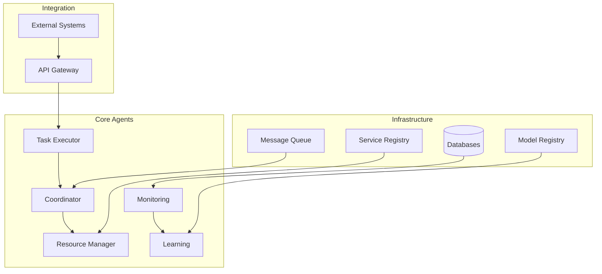

# Multi-Agent System Technical Implementation Guide

## Overview

### Purpose & Scope
- Guide Type: Technical Implementation Documentation
- Environment: Production Multi-Agent System
- Target Audience: Development and DevOps Teams

### System Architecture


## Implementation Prerequisites

### Development Environment
```yaml
development_requirements:
  languages:
    python:
      version: ">=3.8"
      packages:
        - aiohttp: ">=3.8.0"
        - pydantic: ">=2.0.0"
        - asyncio: "latest"
        - pytorch: ">=2.0.0"
        - tensorflow: ">=2.12.0"
        - ray: ">=2.5.0"
        - prometheus_client: "latest"
        - opentelemetry-api: "latest"
    
  tools:
    - docker: ">=24.0"
    - kubernetes: ">=1.28"
    - helm: ">=3.0"
    - terraform: ">=1.5"
    
  infrastructure:
    compute:
      min_cores: 16
      min_memory: 64GB
      gpu: "CUDA-compatible"
    storage:
      capacity: 200GB
      type: SSD
```

### System Dependencies
```yaml
system_dependencies:
  message_broker:
    service: RabbitMQ
    version: ">=3.8"
    configuration:
      clusters: 2
      replication: 3
  
  databases:
    timeseries:
      service: Prometheus
      version: ">=2.45"
    document:
      service: MongoDB
      version: ">=6.0"
    graph:
      service: Neo4j
      version: ">=5.11"
  
  service_discovery:
    service: Consul
    version: ">=1.9"
    configuration:
      cluster_size: 3
      consistency: strong
  
  monitoring:
    metrics: Prometheus
    logging: ELK Stack
    tracing: Jaeger
```

## Core Agent Implementation

### 1. Task Executor Agent
```python
from typing import Dict, List
import asyncio
from pydantic import BaseModel

class Task(BaseModel):
    """Task model definition"""
    task_id: str
    type: str
    parameters: Dict
    priority: int
    deadline: Optional[datetime]

class TaskExecutor:
    """Task Executor Agent implementation"""
    def __init__(self, config: Dict):
        self.config = config
        self.task_queue = asyncio.Queue()
        self.resource_client = ResourceClient()
        self.status_reporter = StatusReporter()
    
    async def execute_task(self, task: Task) -> Dict:
        """Execute a single task"""
        try:
            # Request resources
            resources = await self.resource_client.request_resources(
                task.parameters.get('requirements', {})
            )
            
            # Execute task
            result = await self._execute_with_resources(task, resources)
            
            # Report status
            await self.status_reporter.report_completion(task, result)
            
            # Release resources
            await self.resource_client.release_resources(resources)
            
            return result
            
        except Exception as e:
            await self._handle_execution_error(task, e)
            raise
```

### 2. Coordinator Agent
```python
class CoordinationState(BaseModel):
    """Coordination state model"""
    agent_states: Dict[str, Dict]
    resource_states: Dict[str, Dict]
    task_states: Dict[str, Dict]

class Coordinator:
    """Coordinator Agent implementation"""
    def __init__(self, config: Dict):
        self.config = config
        self.state = CoordinationState()
        self.resource_manager = ResourceManagerClient()
        self.task_distributor = TaskDistributor()
    
    async def coordinate_task(self, task: Task) -> Dict:
        """Coordinate task execution"""
        try:
            # Check resource availability
            resources = await self.resource_manager.check_availability(
                task.requirements
            )
            
            if resources.available:
                # Select suitable executor
                executor = await self._select_executor(task, resources)
                
                # Assign task
                assignment = await self.task_distributor.assign_task(
                    task, executor
                )
                
                # Monitor execution
                await self._monitor_execution(assignment)
                
                return assignment
            else:
                return await self._handle_resource_unavailable(task)
            
        except Exception as e:
            await self._handle_coordination_error(task, e)
            raise
```

### 3. Resource Manager Agent
```python
class ResourceState(BaseModel):
    """Resource state model"""
    resource_id: str
    type: str
    capacity: Dict[str, float]
    allocated: Dict[str, float]
    reservations: List[Dict]

class ResourceManager:
    """Resource Manager Agent implementation"""
    def __init__(self, config: Dict):
        self.config = config
        self.resources = {}
        self.allocations = {}
        self.reservation_manager = ReservationManager()
    
    async def allocate_resources(self, request: Dict) -> Dict:
        """Allocate resources for a request"""
        try:
            # Validate request
            await self._validate_request(request)
            
            # Check availability
            available = await self._check_availability(request)
            
            if available:
                # Reserve resources
                reservation = await self.reservation_manager.reserve(
                    request
                )
                
                # Allocate resources
                allocation = await self._allocate(reservation)
                
                # Update state
                await self._update_state(allocation)
                
                return allocation
            else:
                return await self._handle_unavailable(request)
            
        except Exception as e:
            await self._handle_allocation_error(request, e)
            raise
```

### 4. Monitoring Agent
```python
class MetricCollector:
    """Metric collection implementation"""
    def __init__(self, config: Dict):
        self.config = config
        self.collectors = self._setup_collectors()
        self.storage = MetricStorage()
    
    async def collect_metrics(self):
        """Collect system-wide metrics"""
        try:
            # Collect from all sources
            metrics = await asyncio.gather(*[
                collector.collect()
                for collector in self.collectors.values()
            ])
            
            # Process metrics
            processed = await self._process_metrics(metrics)
            
            # Store metrics
            await self.storage.store(processed)
            
            # Check alert conditions
            await self._check_alerts(processed)
            
            return processed
            
        except Exception as e:
            await self._handle_collection_error(e)
            raise

class MonitoringAgent:
    """Monitoring Agent implementation"""
    def __init__(self, config: Dict):
        self.config = config
        self.collector = MetricCollector(config)
        self.analyzer = MetricAnalyzer()
        self.alerter = AlertManager()
    
    async def monitor_system(self):
        """Monitor system health and performance"""
        while True:
            # Collect metrics
            metrics = await self.collector.collect_metrics()
            
            # Analyze metrics
            analysis = await self.analyzer.analyze(metrics)
            
            # Handle alerts
            if analysis.alerts:
                await self.alerter.process_alerts(analysis.alerts)
            
            # Store analysis
            await self._store_analysis(analysis)
            
            await asyncio.sleep(self.config.collection_interval)
```

### 5. Learning Agent
```python
class LearningAgent:
    """Learning Agent implementation"""
    def __init__(self, config: Dict):
        self.config = config
        self.experience_collector = ExperienceCollector()
        self.model_manager = ModelManager()
        self.optimizer = ModelOptimizer()
    
    async def learn_from_experience(self):
        """Learn from system experience"""
        try:
            # Collect experience
            experience = await self.experience_collector.collect()
            
            # Process experience
            processed = await self._process_experience(experience)
            
            # Update models
            updates = await self.model_manager.update_models(processed)
            
            # Optimize models
            optimized = await self.optimizer.optimize(updates)
            
            # Distribute updates
            await self._distribute_updates(optimized)
            
            return optimized
            
        except Exception as e:
            await self._handle_learning_error(e)
            raise
```

## Integration Implementation

### 1. Communication Infrastructure
```python
class MessageBroker:
    """Message broker integration"""
    def __init__(self, config: Dict):
        self.config = config
        self.connection = None
        self.channels = {}
    
    async def setup(self):
        """Setup message broker connection"""
        self.connection = await self._connect()
        await self._setup_exchanges()
        await self._setup_queues()
    
    async def publish(self, topic: str, message: Dict):
        """Publish message to topic"""
        channel = await self._get_channel(topic)
        await channel.basic_publish(
            exchange=topic,
            routing_key='',
            body=json.dumps(message)
        )
    
    async def subscribe(self, topic: str, callback: Callable):
        """Subscribe to topic"""
        channel = await self._get_channel(topic)
        await channel.basic_consume(
            queue=topic,
            callback=callback
        )
```

### 2. Service Discovery
```python
class ServiceRegistry:
    """Service registry integration"""
    def __init__(self, config: Dict):
        self.config = config
        self.client = ConsulClient(config)
    
    async def register_service(self, service: Dict):
        """Register service with registry"""
        await self.client.agent.service.register(
            name=service['name'],
            address=service['address'],
            port=service['port'],
            tags=service['tags']
        )
    
    async def discover_service(self, service_name: str) -> Dict:
        """Discover service by name"""
        services = await self.client.catalog.service(service_name)
        if services:
            return self._select_service(services)
        raise ServiceNotFoundError(service_name)
```

### 3. Monitoring Integration
```python
class MonitoringIntegration:
    """Monitoring system integration"""
    def __init__(self, config: Dict):
        self.config = config
        self.metrics = PrometheusClient()
        self.logging = LoggingClient()
        self.tracing = TracingClient()
    
    async def setup_monitoring(self):
        """Setup monitoring integration"""
        await self.metrics.setup()
        await self.logging.setup()
        await self.tracing.setup()
    
    async def record_metric(self, name: str, value: float, labels: Dict):
        """Record metric"""
        await self.metrics.record(name, value, labels)
    
    async def log_event(self, level: str, message: str, context: Dict):
        """Log event"""
        await self.logging.log(level, message, context)
    
    async def trace_operation(self, name: str, context: Dict):
        """Trace operation"""
        return await self.tracing.start_span(name, context)
```

### 4. Security Integration
```python
class SecurityIntegration:
    """Security system integration"""
    def __init__(self, config: Dict):
        self.config = config
        self.auth = AuthenticationClient()
        self.crypto = CryptoClient()
    
    async def authenticate_request(self, credentials: Dict) -> bool:
        """Authenticate request"""
        return await self.auth.verify_credentials(credentials)
    
    async def authorize_action(self, principal: str, action: str) -> bool:
        """Authorize action"""
        return await self.auth.check_permission(principal, action)
    
    async def encrypt_data(self, data: Dict) -> bytes:
        """Encrypt sensitive data"""
        return await self.crypto.encrypt(data)
    
    async def decrypt_data(self, encrypted: bytes) -> Dict:
        """Decrypt sensitive data"""
        return await self.crypto.decrypt(encrypted)
```

## Deployment Implementation

### 1. Container Configuration
```yaml
container_config:
  task_executor:
    image: task-executor:1.0.0
    resources:
      requests:
        cpu: "2"
        memory: "4Gi"
      limits:
        cpu: "4"
        memory: "8Gi"
    env:
      - name: BROKER_URL
        valueFrom:
          configMapKeyRef:
            name: system-config
            key: broker_url
  
  coordinator:
    image: coordinator:1.0.0
    resources:
      requests:
        cpu: "4"
        memory: "8Gi"
      limits:
        cpu: "8"
        memory: "16Gi"
    env:
      - name: REGISTRY_URL
        valueFrom:
          configMapKeyRef:
            name: system-config
            key: registry_url
```

### 2. Kubernetes Deployment
```yaml
kubernetes_deployment:
  task_executor:
    apiVersion: apps/v1
    kind: Deployment
    metadata:
      name: task-executor
    spec:
      replicas: 3
      selector:
        matchLabels:
          app: task-executor
      template:
        metadata:
          labels:
            app: task-executor
        spec:
          containers:
            - name: task-executor
              image: task-executor:1.0.0
              resources:
                requests:
                  cpu: "2"
                  memory: "4Gi"
                limits:
                  cpu: "4"
                  memory: "8Gi"
              env:
                - name: BROKER_URL
                  valueFrom:
                    configMapKeyRef:
                      name: system-config
                      key: broker_url
```

### 3. Service Configuration
```yaml
service_config:
  task_executor:
    apiVersion: v1
    kind: Service
    metadata:
      name: task-executor
    spec:
      selector:
        app: task-executor
      ports:
        - protocol: TCP
          port: 80
          targetPort: 8080
      type: ClusterIP
```

## Testing Implementation

### 1. Unit Testing
```python
class TestTaskExecutor:
    """Task Executor unit tests"""
    @pytest.fixture
    async def executor(self):
        config = {
            "broker_url": "memory://",
            "registry_url": "memory://"
        }
        return TaskExecutor(config)
    
    @pytest.mark.asyncio
    async def test_task_execution(self, executor):
        task = Task(
            task_id="test-1",
            type="processing",
            parameters={"data": "test"},
            priority=1
        )
        result = await executor.execute_task(task)
        assert result.status == "completed"
```

### 2. Integration Testing
```python
class TestSystemIntegration:
    """System integration tests"""
    @pytest.fixture
    async def system(self):
        config = await load_test_config()
        return await setup_test_system(config)
    
    @pytest.mark.asyncio
    async def test_end_to_end_flow(self, system):
        # Create task
        task = create_test_task()
        
        # Submit task
        result = await system.coordinator.submit_task(task)
        
        # Verify execution
        assert result.status == "completed"
        assert result.output is not None
```

### 3. Performance Testing
```python
class TestSystemPerformance:
    """System performance tests"""
    @pytest.fixture
    async def system(self):
        config = await load_performance_config()
        return await setup_performance_system(config)
    
    @pytest.mark.asyncio
    async def test_system_throughput(self, system):
        # Generate load
        tasks = generate_test_load(1000)
        
        # Measure execution time
        start_time = time.time()
        results = await system.process_tasks(tasks)
        end_time = time.time()
        
        # Verify performance
        duration = end_time - start_time
        throughput = len(results) / duration
        assert throughput >= 100  # tasks per second
```

## Documentation

### Version History
- Version: 1.0.0
- Last Updated: 2024-03-21
- Changelog: [[changelog#technical-impl-1.0.0]]

### Related Documentation
- System Architecture: [[architecture#system]]
- Deployment Guide: [[deployment#system]]
- Operations Manual: [[operations#system]]

## References
- [[implementation-patterns#multi-agent]]
- [[development-patterns#distributed-systems]]
- [[best-practices#system-implementation]]

---
*Note: This technical implementation guide provides detailed instructions for implementing the multi-agent system components and their interactions.* 