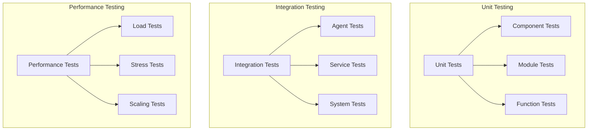

# Multi-Agent System Testing Guide

## Overview

### Purpose & Scope
- Guide Type: Testing Reference
- Environment: Multi-Agent System
- Target Audience: Developers and QA Engineers

### Testing Architecture


## Test Categories

### Unit Testing
```python
# Example unit test implementation
import pytest
from unittest.mock import AsyncMock, Mock
from agents.core.validation import TaskValidator

class TestTaskValidator:
    """Task validator test suite."""
    
    @pytest.fixture
    def validator(self):
        """Create test validator instance."""
        config = {
            "validation": {
                "strict": True,
                "required_fields": ["task_id", "type"]
            }
        }
        return TaskValidator(config)
    
    @pytest.mark.asyncio
    async def test_validate_valid_task(self, validator):
        """Test validation of valid task."""
        # Arrange
        task = {
            "task_id": "test-1",
            "type": "processing",
            "data": {"key": "value"}
        }
        
        # Act
        result = await validator.validate(task)
        
        # Assert
        assert result is True
    
    @pytest.mark.asyncio
    async def test_validate_invalid_task(self, validator):
        """Test validation of invalid task."""
        # Arrange
        task = {
            "task_id": "test-2"
            # Missing required 'type' field
        }
        
        # Act/Assert
        with pytest.raises(ValidationError) as exc:
            await validator.validate(task)
        assert "Missing required field: type" in str(exc.value)
    
    @pytest.mark.parametrize("task_type", [
        "processing",
        "analysis",
        "learning"
    ])
    @pytest.mark.asyncio
    async def test_validate_task_types(self, validator, task_type):
        """Test validation of different task types."""
        # Arrange
        task = {
            "task_id": "test-3",
            "type": task_type
        }
        
        # Act
        result = await validator.validate(task)
        
        # Assert
        assert result is True
```

### Integration Testing
```python
# Example integration test implementation
import pytest
from agents.executors import TaskExecutorAgent
from agents.coordinator import CoordinatorAgent
from agents.resources import ResourceManagerAgent

class TestSystemIntegration:
    """System integration test suite."""
    
    @pytest.fixture
    async def system(self):
        """Set up test system."""
        # Create configuration
        config = {
            "broker_url": "memory://",
            "registry_url": "memory://",
            "database_url": "memory://"
        }
        
        # Initialize agents
        executor = await TaskExecutorAgent.create(config)
        coordinator = await CoordinatorAgent.create(config)
        resource_manager = await ResourceManagerAgent.create(config)
        
        # Start agents
        await executor.start()
        await coordinator.start()
        await resource_manager.start()
        
        yield {
            "executor": executor,
            "coordinator": coordinator,
            "resource_manager": resource_manager
        }
        
        # Cleanup
        await executor.stop()
        await coordinator.stop()
        await resource_manager.stop()
    
    @pytest.mark.asyncio
    async def test_task_execution_flow(self, system):
        """Test complete task execution flow."""
        # Arrange
        task = {
            "task_id": "test-1",
            "type": "processing",
            "priority": 1,
            "data": {"input": "test"}
        }
        
        # Act
        # Submit task
        task_id = await system["coordinator"].submit_task(task)
        
        # Wait for execution
        result = await system["coordinator"].wait_for_task(task_id)
        
        # Assert
        assert result["status"] == "completed"
        assert "output" in result
    
    @pytest.mark.asyncio
    async def test_resource_allocation(self, system):
        """Test resource allocation flow."""
        # Arrange
        resource_request = {
            "type": "compute",
            "quantity": 2,
            "duration": "1h"
        }
        
        # Act
        # Request resources
        allocation = await system["resource_manager"].allocate_resources(
            resource_request
        )
        
        # Assert
        assert allocation["status"] == "allocated"
        assert allocation["resources"]["compute"] == 2
```

### Performance Testing
```python
# Example performance test implementation
import pytest
import asyncio
from agents.testing.load import LoadGenerator
from agents.testing.metrics import MetricsCollector

class TestSystemPerformance:
    """System performance test suite."""
    
    @pytest.fixture
    async def load_generator(self):
        """Create load generator."""
        config = {
            "rate": 100,  # requests per second
            "duration": "5m",
            "distribution": "poisson"
        }
        return LoadGenerator(config)
    
    @pytest.fixture
    async def metrics_collector(self):
        """Create metrics collector."""
        config = {
            "metrics": [
                "response_time",
                "throughput",
                "error_rate",
                "resource_usage"
            ],
            "aggregation": "1s"
        }
        return MetricsCollector(config)
    
    @pytest.mark.performance
    async def test_system_throughput(self, load_generator, metrics_collector):
        """Test system throughput under load."""
        # Arrange
        target_throughput = 1000  # tasks per second
        
        # Act
        # Start metrics collection
        await metrics_collector.start()
        
        # Generate load
        await load_generator.generate_load(
            task_template={
                "type": "processing",
                "priority": 1,
                "data": {"size": "small"}
            }
        )
        
        # Collect metrics
        metrics = await metrics_collector.get_metrics()
        
        # Assert
        assert metrics["throughput"].mean() >= target_throughput
        assert metrics["error_rate"].max() <= 0.01  # 1% error rate
        assert metrics["response_time"].percentile(95) <= 0.1  # 100ms
    
    @pytest.mark.performance
    async def test_system_scalability(self, load_generator, metrics_collector):
        """Test system scalability."""
        # Arrange
        load_levels = [100, 500, 1000, 2000]  # tasks per second
        metrics_by_load = {}
        
        # Act
        for load in load_levels:
            # Configure load generator
            load_generator.rate = load
            
            # Start metrics collection
            await metrics_collector.start()
            
            # Generate load
            await load_generator.generate_load(
                task_template={
                    "type": "processing",
                    "priority": 1,
                    "data": {"size": "small"}
                }
            )
            
            # Collect metrics
            metrics_by_load[load] = await metrics_collector.get_metrics()
            
            # Cool down
            await asyncio.sleep(30)
        
        # Assert
        for load in load_levels:
            metrics = metrics_by_load[load]
            assert metrics["throughput"].mean() >= load * 0.95  # 95% of target
            assert metrics["error_rate"].max() <= 0.02  # 2% error rate
            assert metrics["response_time"].percentile(95) <= 0.2  # 200ms
```

## Test Implementation

### Test Structure
```python
# Example test structure
from typing import Dict, List
import pytest
from agents.testing.fixtures import *

class TestBase:
    """Base test class with common functionality."""
    
    @pytest.fixture
    async def config(self):
        """Create test configuration."""
        return {
            "environment": "test",
            "logging": {"level": "DEBUG"},
            "metrics": {"enabled": True}
        }
    
    @pytest.fixture
    async def logger(self):
        """Create test logger."""
        return TestLogger()
    
    async def verify_result(self, result: Dict, expected: Dict):
        """Verify test result."""
        for key, value in expected.items():
            assert key in result
            assert result[key] == value

class TestTaskExecution(TestBase):
    """Task execution test suite."""
    
    @pytest.fixture
    async def executor(self, config, logger):
        """Create test executor."""
        return await setup_test_executor(config, logger)
    
    @pytest.mark.asyncio
    async def test_simple_task(self, executor):
        """Test simple task execution."""
        # Test implementation
        pass
    
    @pytest.mark.asyncio
    async def test_complex_task(self, executor):
        """Test complex task execution."""
        # Test implementation
        pass

class TestResourceManagement(TestBase):
    """Resource management test suite."""
    
    @pytest.fixture
    async def resource_manager(self, config, logger):
        """Create test resource manager."""
        return await setup_test_resource_manager(config, logger)
    
    @pytest.mark.asyncio
    async def test_resource_allocation(self, resource_manager):
        """Test resource allocation."""
        # Test implementation
        pass
```

### Test Fixtures
```python
# Example test fixtures
import pytest
from typing import Dict, AsyncGenerator
from agents.testing.mocks import *

@pytest.fixture
async def message_broker() -> AsyncGenerator:
    """Create test message broker."""
    broker = MockMessageBroker()
    await broker.start()
    yield broker
    await broker.stop()

@pytest.fixture
async def database() -> AsyncGenerator:
    """Create test database."""
    db = MockDatabase()
    await db.initialize()
    yield db
    await db.cleanup()

@pytest.fixture
async def service_registry() -> AsyncGenerator:
    """Create test service registry."""
    registry = MockServiceRegistry()
    await registry.start()
    yield registry
    await registry.stop()

@pytest.fixture
async def test_system(
    message_broker,
    database,
    service_registry
) -> AsyncGenerator:
    """Create complete test system."""
    system = TestSystem(
        broker=message_broker,
        database=database,
        registry=service_registry
    )
    await system.start()
    yield system
    await system.stop()
```

### Test Utilities
```python
# Example test utilities
from typing import Dict, List
import asyncio
from datetime import datetime

class TestHelper:
    """Test helper utilities."""
    
    @staticmethod
    async def wait_for_condition(
        condition: callable,
        timeout: float = 5.0,
        interval: float = 0.1
    ) -> bool:
        """Wait for condition to be true."""
        start_time = datetime.now()
        while (datetime.now() - start_time).total_seconds() < timeout:
            if await condition():
                return True
            await asyncio.sleep(interval)
        return False
    
    @staticmethod
    async def generate_test_data(
        count: int,
        template: Dict
    ) -> List[Dict]:
        """Generate test data."""
        return [
            {**template, "id": f"test-{i}"}
            for i in range(count)
        ]
    
    @staticmethod
    async def verify_metrics(
        metrics: Dict,
        thresholds: Dict
    ) -> List[str]:
        """Verify metrics against thresholds."""
        violations = []
        for metric, threshold in thresholds.items():
            if metric not in metrics:
                violations.append(f"Missing metric: {metric}")
            elif metrics[metric] > threshold:
                violations.append(
                    f"Metric {metric} exceeds threshold: "
                    f"{metrics[metric]} > {threshold}"
                )
        return violations
```

## Test Execution

### Running Tests
```yaml
test_execution:
  unit_tests:
    command: pytest tests/unit/
    options:
      - -v  # verbose output
      - --asyncio-mode=auto  # async support
      - --cov=agents  # coverage
  
  integration_tests:
    command: pytest tests/integration/
    options:
      - -v
      - --asyncio-mode=auto
      - --integration  # integration test marker
  
  performance_tests:
    command: pytest tests/performance/
    options:
      - -v
      - --asyncio-mode=auto
      - --performance  # performance test marker
```

### Test Configuration
```yaml
test_configuration:
  environments:
    unit:
      broker: memory://
      database: memory://
      registry: memory://
    
    integration:
      broker: amqp://localhost:5672
      database: mongodb://localhost:27017
      registry: http://localhost:8500
    
    performance:
      broker: amqp://test-broker:5672
      database: mongodb://test-db:27017
      registry: http://test-registry:8500
  
  logging:
    level: DEBUG
    format: json
    output: console
  
  metrics:
    enabled: true
    collection_interval: 1s
    output_format: prometheus
```

### Test Reports
```yaml
test_reports:
  coverage:
    tool: pytest-cov
    output:
      - terminal
      - html
      - xml
    thresholds:
      total: 90
      unit: 95
      integration: 85
  
  performance:
    tool: locust
    output:
      - html
      - csv
    metrics:
      - response_time
      - throughput
      - error_rate
  
  quality:
    tool: pytest-quality
    checks:
      - complexity
      - maintainability
      - test_coverage
```

## Documentation

### Version History
- Version: 1.0.0
- Last Updated: 2024-03-21
- Changelog: [[changelog#testing-1.0.0]]

### Related Documentation
- Development Guide: [[dev-guide#system]]
- API Documentation: [[api-doc#system]]
- Performance Guide: [[performance#system]]

## References
- [[testing-patterns#distributed-systems]]
- [[quality-patterns#multi-agent]]
- [[best-practices#testing]]

---
*Note: This testing guide provides comprehensive procedures for testing and validating the multi-agent system.* 