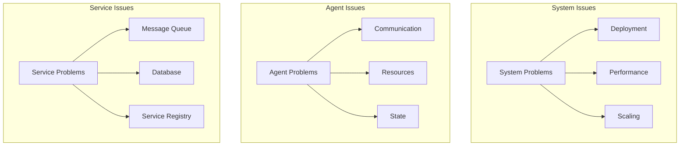

# Multi-Agent System Troubleshooting Guide

## Overview

### Purpose & Scope
- Guide Type: Troubleshooting Reference
- Environment: Production Multi-Agent System
- Target Audience: System Operators and Support Teams

### Problem Categories


## System Problems

### Deployment Issues
```yaml
deployment_problems:
  pod_startup_failure:
    symptoms:
      - Pods stuck in Pending/ContainerCreating state
      - Error events in pod description
    diagnosis:
      - Check pod events:
          command: kubectl describe pod <pod-name>
      - Check node resources:
          command: kubectl describe node <node-name>
      - Verify pod specifications:
          command: kubectl get pod <pod-name> -o yaml
    resolution:
      - Ensure sufficient node resources
      - Verify image availability
      - Check pod resource requests/limits
    prevention:
      - Regular resource monitoring
      - Proper capacity planning
      - Image version control

  service_discovery_failure:
    symptoms:
      - Services unable to communicate
      - DNS resolution failures
      - Connection timeouts
    diagnosis:
      - Check service definition:
          command: kubectl get svc <service-name> -o yaml
      - Verify endpoints:
          command: kubectl get endpoints <service-name>
      - Test DNS resolution:
          command: nslookup <service-name>
    resolution:
      - Fix service selectors
      - Verify port configurations
      - Check network policies
    prevention:
      - Regular service testing
      - Automated health checks
      - Network policy validation
```

### Performance Issues
```yaml
performance_problems:
  high_latency:
    symptoms:
      - Increased response times
      - Request timeouts
      - Queue buildup
    diagnosis:
      - Check system metrics:
          command: kubectl top pods
      - Monitor network latency:
          command: ping <service>
      - Analyze request patterns:
          path: /var/log/system/requests.log
    resolution:
      - Scale affected services
      - Optimize resource allocation
      - Adjust timeout values
    prevention:
      - Performance monitoring
      - Load testing
      - Capacity planning

  resource_exhaustion:
    symptoms:
      - OOM kills
      - CPU throttling
      - Disk pressure
    diagnosis:
      - Check resource usage:
          command: kubectl top nodes
      - Monitor system metrics:
          command: df -h
      - Analyze memory consumption:
          command: free -m
    resolution:
      - Scale resources
      - Optimize workloads
      - Clean up unused resources
    prevention:
      - Resource monitoring
      - Automatic scaling
      - Regular cleanup
```

### Scaling Issues
```yaml
scaling_problems:
  autoscaling_failure:
    symptoms:
      - Pods not scaling under load
      - Incorrect number of replicas
      - HPA not responding
    diagnosis:
      - Check HPA status:
          command: kubectl describe hpa <hpa-name>
      - Verify metrics:
          command: kubectl get --raw "/apis/metrics.k8s.io/v1beta1/pods"
      - Monitor scaling events:
          command: kubectl get events
    resolution:
      - Adjust HPA configuration
      - Verify metrics collection
      - Check resource quotas
    prevention:
      - Regular HPA testing
      - Metric validation
      - Quota monitoring

  load_balancing_issues:
    symptoms:
      - Uneven load distribution
      - Service hotspots
      - Connection problems
    diagnosis:
      - Check service endpoints:
          command: kubectl get endpoints
      - Monitor pod metrics:
          command: kubectl top pods
      - Analyze traffic patterns:
          path: /var/log/system/traffic.log
    resolution:
      - Adjust load balancer settings
      - Verify service configuration
      - Rebalance workloads
    prevention:
      - Load testing
      - Traffic monitoring
      - Regular balancing checks
```

## Agent Problems

### Communication Issues
```yaml
communication_problems:
  message_delivery_failure:
    symptoms:
      - Failed message deliveries
      - Timeout errors
      - Queue buildup
    diagnosis:
      - Check broker status:
          command: rabbitmqctl status
      - Monitor queue status:
          command: rabbitmqctl list_queues
      - Verify network connectivity:
          command: netstat -an | grep 5672
    resolution:
      - Restart message broker
      - Clear blocked queues
      - Fix network issues
    prevention:
      - Queue monitoring
      - Network health checks
      - Regular maintenance

  protocol_errors:
    symptoms:
      - Serialization failures
      - Protocol version mismatch
      - Invalid messages
    diagnosis:
      - Check protocol logs:
          path: /var/log/system/protocol.log
      - Verify message format:
          command: rabbitmqctl get_message <queue>
      - Monitor error rates:
          path: /var/log/system/errors.log
    resolution:
      - Update protocol version
      - Fix message format
      - Clear invalid messages
    prevention:
      - Protocol validation
      - Version compatibility checks
      - Message format verification
```

### Resource Issues
```yaml
resource_problems:
  allocation_failure:
    symptoms:
      - Resource requests failing
      - Allocation timeouts
      - Resource conflicts
    diagnosis:
      - Check resource status:
          command: kubectl describe resourcequota
      - Monitor allocation logs:
          path: /var/log/system/resources.log
      - Verify resource availability:
          command: kubectl describe nodes
    resolution:
      - Release unused resources
      - Fix allocation conflicts
      - Scale resource pool
    prevention:
      - Resource monitoring
      - Allocation tracking
      - Capacity planning

  resource_leaks:
    symptoms:
      - Increasing resource usage
      - Memory growth
      - Resource exhaustion
    diagnosis:
      - Monitor resource trends:
          command: kubectl top pods --containers
      - Check memory usage:
          command: ps aux | grep <process>
      - Analyze resource allocation:
          path: /var/log/system/allocation.log
    resolution:
      - Fix memory leaks
      - Release stuck resources
      - Restart leaking components
    prevention:
      - Resource tracking
      - Leak detection
      - Regular monitoring
```

### State Issues
```yaml
state_problems:
  state_inconsistency:
    symptoms:
      - Inconsistent agent states
      - Synchronization failures
      - State conflicts
    diagnosis:
      - Check state logs:
          path: /var/log/system/state.log
      - Verify state storage:
          command: redis-cli info
      - Monitor state changes:
          path: /var/log/system/changes.log
    resolution:
      - Force state sync
      - Resolve conflicts
      - Reset state if needed
    prevention:
      - State validation
      - Regular sync checks
      - Conflict detection

  state_corruption:
    symptoms:
      - Invalid state data
      - State access errors
      - Behavioral anomalies
    diagnosis:
      - Analyze state data:
          command: redis-cli dump <key>
      - Check state integrity:
          path: /var/log/system/integrity.log
      - Monitor state operations:
          path: /var/log/system/operations.log
    resolution:
      - Restore from backup
      - Fix corrupted data
      - Reset affected components
    prevention:
      - Data validation
      - Regular backups
      - Integrity checks
```

## Service Problems

### Message Queue Issues
```yaml
queue_problems:
  broker_failure:
    symptoms:
      - Connection failures
      - Queue unavailability
      - Message loss
    diagnosis:
      - Check broker status:
          command: rabbitmqctl cluster_status
      - Monitor broker logs:
          path: /var/log/rabbitmq/rabbit@hostname.log
      - Verify cluster health:
          command: rabbitmqctl health_check
    resolution:
      - Restart broker nodes
      - Recover messages
      - Fix cluster issues
    prevention:
      - Cluster monitoring
      - Regular health checks
      - Backup configuration

  queue_overflow:
    symptoms:
      - High memory usage
      - Slow message processing
      - Back pressure
    diagnosis:
      - Check queue metrics:
          command: rabbitmqctl list_queues name messages_ready
      - Monitor memory usage:
          command: rabbitmqctl status
      - Analyze flow control:
          path: /var/log/rabbitmq/flow.log
    resolution:
      - Increase queue capacity
      - Scale consumers
      - Enable flow control
    prevention:
      - Queue monitoring
      - Consumer scaling
      - Flow control setup
```

### Database Issues
```yaml
database_problems:
  connection_failure:
    symptoms:
      - Connection timeouts
      - Query failures
      - High latency
    diagnosis:
      - Check database status:
          command: mongosh --eval "db.serverStatus()"
      - Monitor connections:
          command: netstat -an | grep 27017
      - Analyze connection logs:
          path: /var/log/mongodb/mongod.log
    resolution:
      - Restart database
      - Fix connection issues
      - Scale connection pool
    prevention:
      - Connection monitoring
      - Pool management
      - Regular maintenance

  data_consistency:
    symptoms:
      - Inconsistent queries
      - Replication lag
      - Data conflicts
    diagnosis:
      - Check replication status:
          command: mongosh --eval "rs.status()"
      - Verify data integrity:
          command: mongosh --eval "db.runCommand({dbHash:1})"
      - Monitor consistency:
          path: /var/log/mongodb/consistency.log
    resolution:
      - Force sync
      - Resolve conflicts
      - Repair data
    prevention:
      - Consistency checks
      - Regular validation
      - Monitoring replication
```

### Service Registry Issues
```yaml
registry_problems:
  registration_failure:
    symptoms:
      - Service registration fails
      - Discovery errors
      - Health check failures
    diagnosis:
      - Check registry status:
          command: consul members
      - Monitor registration:
          command: consul catalog services
      - Verify health checks:
          command: consul health
    resolution:
      - Fix registration
      - Update health checks
      - Restart services
    prevention:
      - Health monitoring
      - Regular validation
      - Automated checks

  consistency_issues:
    symptoms:
      - Inconsistent service list
      - Stale entries
      - Discovery problems
    diagnosis:
      - Check consistency:
          command: consul info
      - Verify service status:
          command: consul catalog nodes
      - Monitor updates:
          path: /var/log/consul/consul.log
    resolution:
      - Clean stale entries
      - Force sync
      - Update registry
    prevention:
      - Regular cleanup
      - Consistency checks
      - Update validation
```

## Documentation

### Version History
- Version: 1.0.0
- Last Updated: 2024-03-21
- Changelog: [[changelog#troubleshooting-1.0.0]]

### Related Documentation
- Operations Manual: [[operations#system]]
- Monitoring Guide: [[monitoring#system]]
- Maintenance Guide: [[maintenance#system]]

## References
- [[troubleshooting-patterns#distributed-systems]]
- [[debugging-patterns#multi-agent]]
- [[best-practices#problem-solving]]

---
*Note: This troubleshooting guide provides comprehensive procedures for diagnosing and resolving common issues in the multi-agent system.* 