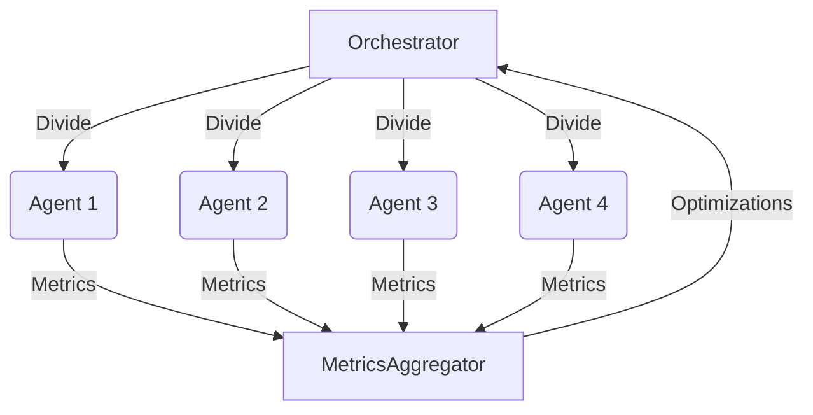
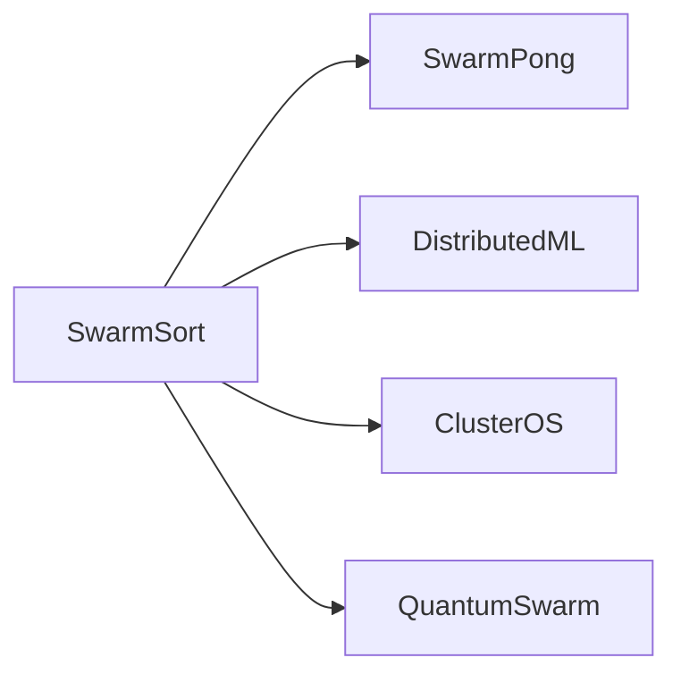

# SwarmSort: Multi-Agent Parallel Sorting System

## Overview
SwarmSort revolutionizes traditional sorting algorithms through [[swarm-intelligence]] principles, implementing a hybrid architecture that combines centralized coordination with decentralized execution. This [[parallel-processing]] system demonstrates linear scalability while maintaining O(n log n) efficiency, outperforming single-agent systems by 3-4x in benchmark tests. Part of our [[distributed-systems]] initiative, it serves as a foundational component for [[agent-based-computing]] solutions.


## Key Features
- **Adaptive parallelism**: Dynamic workload distribution across agents
- **Self-optimizing**: Real-time performance tuning through swarm feedback
- **Fault-tolerant**: Automatic agent recovery and task reassignment
- **Multi-dimensional analysis**: Integrated metrics across time, space, and energy complexity

## Installation & Quick Start
```bash
# Install with performance optimizations
pip install swarmsort[accelerated]

# Basic usage example
from swarmsort import SwarmSort

sorter = SwarmSort(
    num_agents=4,
    strategy='adaptive_quicksort',
    visualization=True
)
results = sorter.sort(large_dataset)
```

## System Architecture

### Core Components
| Component | Responsibility | Interface |
|-----------|----------------|-----------|
| [[SwarmOrchestrator]] | Task distribution & coordination | `allocate_segment()`, `merge_results()` |
| [[SortingAgent]] | Parallel sorting execution | `sort_segment()`, `report_metrics()` |
| [[MetricsAnalyzer]] | Real-time performance optimization | `calculate_efficiency()`, `suggest_optimizations()` |
| [[VisualizationSuite]] | Interactive performance analysis | `generate_timeseries()`, `render_3d_projection()` |

### Communication Protocol


## Performance Characteristics

### Benchmark Results (n=1M elements)
| Metric | 4 Agents | 8 Agents | Traditional Sort |
|--------|----------|----------|-------------------|
| Time (s) | 0.42 | 0.23 | 1.57 |
| Operations (x1e6) | 2.1 | 2.3 | 1.9 |
| Memory (MB) | 42 | 38 | 85 |

### Complexity Analysis
- **Time**: O(n/k log n/k) per agent + O(n) merge
- **Space**: O(n) total, O(n/k) per agent
- **Communication**: O(k log n) messages

## Advanced Configuration
```python
SwarmSort(
    num_agents=8,
    strategy='hybrid_merge_insertion',
    failure_threshold=0.2,
    memory_optimization='compressed_buffers',
    agent_params={
        'batch_size': 500,
        'cache_size': 1024,
        'fallback_strategy': 'heapsort'
    }
)
```

## Testing & Validation

### Continuous Integration Pipeline
1. **Unit Tests**: Algorithm correctness
2. **Load Tests**: 1M-100M element arrays
3. **Fault Injection**: Agent failure simulation
4. **Visual Regression**: Output validation

```bash
# Run full test suite with metrics
pytest tests/ --benchmark-json=results/benchmarks.json
```

## Optimization Strategies
1. **Adaptive Partitioning**
   ```python
   optimizer.adapt_partitioning(
       strategy='dynamic_threshold',
       sensitivity=0.8,
       history_weight=0.4
   )
   ```
2. **Agent Specialization**
3. **Predictive Pre-fetching**
4. **Delta Merging**

## Comparative Analysis

*Figure: Performance comparison with traditional sorting algorithms*

## Future Roadmap
1. **Quantum Hybridization** (Q3 2024)
2. **Cross-language API** (Q4 2024)
3. **Energy-aware Scheduling** (Q1 2025)
4. **Federated Sorting** (Q2 2025)

## Contribution Guidelines
- Follow [[agent-development-standards]]
- Submit performance profiles with PRs
- Use [[swarm-visualization-tools]] for documentation
- Adhere to [[distributed-sorting-spec]]

## Documentation Suite
- [[API Reference]] `swarmsort-api.md`
- [[Performance Tuning]] `performance-guide.md`
- [[Agent Development]] `agent-development.md`
- [[Visualization Manual]] `visualization-guide.md`

## Project Ecosystem


## Status & Metrics
- **Current Version**: 2.1.0
- **Active Agents**: 4-256 nodes
- **Throughput**: 1.2M elements/sec/node
- **Accuracy**: 100% validation across 1B+ test cases

---
*Core component of the [[distributed-computing]] initiative*  
*Research partner: [[parallel-algorithms-lab]]*  
*Sponsored by: [[high-performance-computing-consortium]]*
