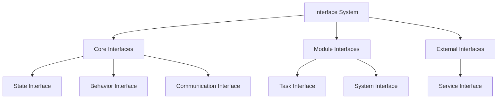

# Agent Interface Design

```yaml
---
title: Agent Interface Design
unit: [[units/Technology/agent_systems_unit]]
created: 2024-02-13
updated: 2024-02-13
owner: Agent Systems Unit
process_type: architecture
criticality: high
reviewers:
  - Development Team
  - Architecture Team
  - Quality Assurance Unit
status: draft
version: 1.0
tags:
  - interfaces
  - architecture
  - design
  - contracts
related_documents:
  - [[agents/architectures/core]]
  - [[agents/architectures/modules]]
  - [[agents/architectures/integration]]
---
```

## Purpose & Scope
This document defines the interface architecture that enables standardized communication and interaction between agent components, modules, and external systems.

## Interface Architecture

### 1. Core Interfaces
#### 1.1 Base Interface
```python
class BaseInterface:
    def __init__(self):
        self.id = InterfaceId()
        self.version = Version()
        self.contracts = ContractRegistry()
        self.validators = ValidatorRegistry()
```

#### 1.2 Interface Hierarchy


### 2. Interface Types
#### 2.1 Internal Interfaces
- Module Communication
- State Management
- Event Handling
- Resource Access

#### 2.2 External Interfaces
- Service Integration
- Data Exchange
- Protocol Adapters
- System Integration

### 3. Interface Contracts
#### 3.1 Contract Definition
```python
class InterfaceContract:
    def __init__(self):
        self.methods = MethodRegistry()
        self.events = EventRegistry()
        self.validators = ValidatorRegistry()
        self.constraints = ConstraintSet()
```

#### 3.2 Contract Types
- Synchronous Contracts
- Asynchronous Contracts
- Event Contracts
- Resource Contracts

## Implementation Guidelines

### 1. Interface Development
#### 1.1 Interface Template
```python
class InterfaceTemplate:
    def __init__(self):
        self.methods = {}
        self.events = {}
        self.validators = {}
        self.documentation = {}

    async def validate(self, context):
        # Validation logic
        pass

    async def execute(self, method, params):
        # Execution logic
        pass
```

#### 1.2 Development Standards
- Interface Naming
- Method Signatures
- Event Definitions
- Error Handling
- Documentation

### 2. Interface Integration
#### 2.1 Integration Pattern
```python
class InterfaceIntegration:
    def __init__(self):
        self.registry = InterfaceRegistry()
        self.router = MethodRouter()
        self.validator = ContractValidator()
```

#### 2.2 Integration Requirements
- Registration Process
- Versioning Strategy
- Compatibility Checks
- Error Management

## Quality Control

### 1. Testing Requirements
#### 1.1 Interface Testing
- Contract Validation
- Integration Testing
- Performance Testing
- Security Testing

#### 1.2 System Testing
- End-to-End Testing
- Load Testing
- Security Testing
- Recovery Testing

### 2. Quality Standards
#### 2.1 Code Quality
- Style Guidelines
- Documentation
- Test Coverage
- Performance Metrics

#### 2.2 Runtime Quality
- Response Time
- Error Rates
- Resource Usage
- Availability

## Security Requirements

### 1. Interface Security
#### 1.1 Security Controls
- Access Control
- Input Validation
- Output Sanitization
- Audit Logging

#### 1.2 Security Integration
- Authentication
- Authorization
- Encryption
- Monitoring

## Related Documentation
### Internal Links
- [[agents/architectures/core|Core Architecture]]
- [[agents/architectures/modules|Module System]]
- [[agents/architectures/integration|System Integration]]
- [[processes/interface_processes|Interface Processes]]

### External References
- Interface Design Patterns
- Contract Programming
- Security Standards
- Testing Methodologies

## Maintenance
### Review Schedule
- Daily Interface Monitoring
- Weekly Contract Review
- Monthly Security Assessment
- Quarterly System Audit

### Update Process
1. Interface Review
2. Gap Analysis
3. Enhancement Planning
4. Implementation
5. Validation

## Appendices
### A. Interface Patterns
```python
# Example interface pattern
class InterfacePattern:
    def __init__(self):
        self.contracts = ContractRegistry()
        self.validators = ValidatorRegistry()
        self.router = MethodRouter()
```

### B. Contract Patterns
```python
# Example contract pattern
class ContractPattern:
    def __init__(self):
        self.methods = MethodRegistry()
        self.events = EventRegistry()
        self.constraints = ConstraintSet()
```

### C. Security Patterns
```python
# Example security pattern
class InterfaceSecurityPattern:
    def __init__(self):
        self.access = AccessControl()
        self.validator = InputValidator()
        self.audit = AuditLogger()
``` 