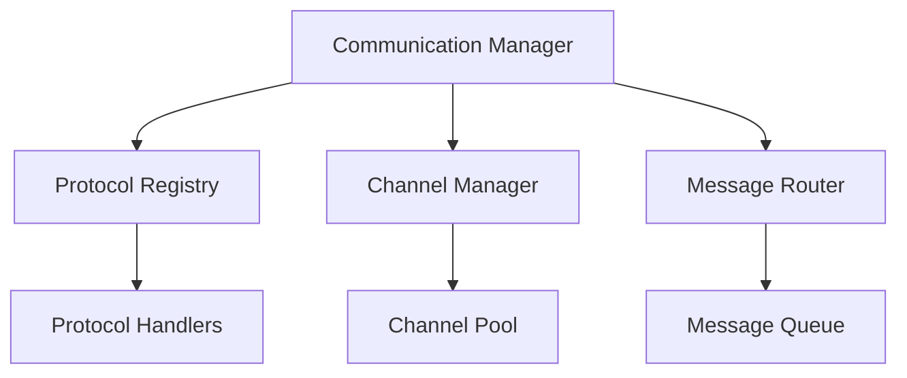

# Agent Communication System

```yaml
---
title: Agent Communication System
unit: [[units/Technology/agent_systems_unit]]
created: 2024-02-13
updated: 2024-02-13
owner: Agent Systems Unit
process_type: implementation
criticality: high
reviewers:
  - Development Team
  - Architecture Team
  - Security Team
status: draft
version: 1.0
tags:
  - communication
  - core
  - protocols
  - messaging
related_documents:
  - [[agents/architectures/core]]
  - [[agents/architectures/modules]]
  - [[agents/modules/core/state]]
  - [[agents/modules/core/behavior]]
---
```

## Purpose & Scope
This document defines the communication system for agents, providing comprehensive message handling, protocol support, and channel management capabilities as specified in the [[agents/architectures/modules|Module System]].

## Communication Architecture

### 1. Core Components
#### 1.1 Communication Manager
```python
class CommunicationManager:
    def __init__(self):
        self.protocols = ProtocolRegistry()
        self.channels = ChannelManager()
        self.router = MessageRouter()
        self.handler = MessageHandler()
```

#### 1.2 Component Relationships


### 2. Message Structure
#### 2.1 Base Message
```python
class Message:
    def __init__(self):
        self.id = MessageId()
        self.type = MessageType()
        self.protocol = ProtocolType()
        self.payload = MessagePayload()
        self.metadata = MessageMetadata()
```

#### 2.2 Message Types
- Command Messages
- Event Messages
- Query Messages
- Response Messages

### 3. Protocol System
#### 3.1 Protocol Definition
```python
class Protocol:
    def __init__(self):
        self.id = ProtocolId()
        self.version = ProtocolVersion()
        self.handlers = HandlerRegistry()
        self.validators = ValidatorRegistry()

    async def handle_message(self, message):
        # Message handling logic
        pass

    async def validate_message(self, message):
        # Message validation logic
        pass
```

#### 3.2 Protocol Types
- Internal Protocols
- External Protocols
- System Protocols
- Custom Protocols

### 4. Channel Management
#### 4.1 Channel System
```python
class ChannelManager:
    def __init__(self):
        self.channels = ChannelRegistry()
        self.pool = ChannelPool()
        self.monitor = ChannelMonitor()
```

#### 4.2 Channel Operations
- Channel Creation
- Channel Management
- Channel Monitoring
- Channel Security

## Implementation Guidelines

### 1. Protocol Implementation
#### 1.1 Protocol Development
```python
class ProtocolImplementation:
    async def define_protocol(self, spec):
        # Protocol definition logic
        pass

    async def implement_handlers(self, handlers):
        # Handler implementation logic
        pass

    async def setup_validation(self, validators):
        # Validation setup logic
        pass
```

#### 1.2 Protocol Standards
- Message Format
- Handler Implementation
- Validation Rules
- Error Handling

### 2. Message Processing
#### 2.1 Processing Pipeline
```python
class MessageProcessor:
    async def process_message(self, message):
        await self.validate(message)
        await self.route(message)
        await self.handle(message)
        await self.respond(message)
```

#### 2.2 Processing Steps
1. Message Validation
2. Protocol Selection
3. Message Routing
4. Message Handling
5. Response Generation

## Quality Control

### 1. Communication Quality
#### 1.1 Quality Metrics
- Message Latency
- Throughput Rate
- Error Rate
- Success Rate

#### 1.2 Quality Checks
- Protocol Compliance
- Message Validation
- Channel Health
- Performance Monitoring

### 2. Performance Management
#### 2.1 Performance Metrics
- Processing Time
- Queue Length
- Channel Capacity
- Resource Usage

#### 2.2 Optimization
- Message Batching
- Channel Pooling
- Load Balancing
- Resource Management

## Security Requirements

### 1. Communication Security
#### 1.1 Security Controls
```python
class CommunicationSecurity:
    async def secure_channel(self, channel):
        # Channel security setup
        pass

    async def encrypt_message(self, message):
        # Message encryption
        pass

    async def validate_message(self, message):
        # Security validation
        pass
```

#### 1.2 Security Operations
- Channel Security
- Message Security
- Access Control
- Audit Logging

### 2. Protocol Security
- Protocol Validation
- Message Integrity
- Channel Protection
- Error Handling

## Related Documentation
### Internal Links
- [[agents/modules/core/state|State System]]
- [[agents/modules/core/behavior|Behavior System]]
- [[processes/communication_management|Communication Management]]
- [[security/communication_security|Communication Security]]

### External References
- Communication Patterns
- Protocol Standards
- Security Guidelines
- Performance Best Practices

## Maintenance
### Review Schedule
- Daily Communication Monitoring
- Weekly Performance Review
- Monthly Protocol Assessment
- Quarterly System Audit

### Update Process
1. Protocol Analysis
2. Performance Review
3. Security Assessment
4. Enhancement Planning
5. Implementation

## Appendices
### A. Protocol Patterns
```python
# Example protocol pattern
class ProtocolPattern:
    def __init__(self):
        self.handlers = HandlerRegistry()
        self.validators = ValidatorRegistry()
        self.router = MessageRouter()
```

### B. Channel Patterns
```python
# Example channel pattern
class ChannelPattern:
    def __init__(self):
        self.pool = ChannelPool()
        self.monitor = ChannelMonitor()
        self.security = ChannelSecurity()
```

### C. Security Patterns
```python
# Example security pattern
class CommunicationSecurityPattern:
    def __init__(self):
        self.encryption = EncryptionSystem()
        self.authentication = AuthSystem()
        self.audit = AuditLogger()
``` 