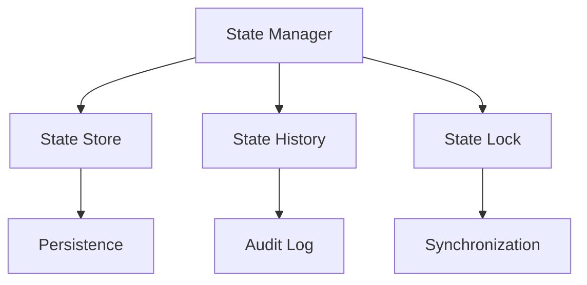

# Agent State Management System

```yaml
---
title: Agent State Management System
unit: [[units/Technology/agent_systems_unit]]
created: 2024-02-13
updated: 2024-02-13
owner: Agent Systems Unit
process_type: implementation
criticality: high
reviewers:
  - Development Team
  - Architecture Team
  - Quality Assurance Unit
status: draft
version: 1.0
tags:
  - state
  - core
  - management
  - persistence
related_documents:
  - [[agents/architectures/core]]
  - [[agents/architectures/modules]]
  - [[agents/modules/core/behavior]]
---
```

## Purpose & Scope
This document defines the state management system for agents, providing comprehensive state handling, persistence, and synchronization capabilities as specified in the [[agents/architectures/modules|Module System]].

## State System Architecture

### 1. Core Components
#### 1.1 State Manager
```python
class StateManager:
    def __init__(self):
        self.current_state = None
        self.state_history = StateHistory()
        self.state_store = StateStore()
        self.state_lock = StateLock()
```

#### 1.2 Component Relationships


### 2. State Structure
#### 2.1 Base State
```python
class AgentState:
    def __init__(self):
        self.id = StateId()
        self.timestamp = Timestamp()
        self.data = StateData()
        self.metadata = StateMetadata()
```

#### 2.2 State Types
- Runtime State
- Persistent State
- Shared State
- Temporary State

### 3. State Operations
#### 3.1 Core Operations
```python
class StateOperations:
    async def get_state(self, key):
        # State retrieval logic
        pass

    async def set_state(self, key, value):
        # State update logic
        pass

    async def delete_state(self, key):
        # State deletion logic
        pass

    async def clear_state(self):
        # State clearing logic
        pass
```

#### 3.2 Advanced Operations
- State Merging
- State Diffing
- State Validation
- State Recovery

### 4. State Persistence
#### 4.1 Storage System
```python
class StateStore:
    def __init__(self):
        self.storage = StorageBackend()
        self.cache = StateCache()
        self.index = StateIndex()
```

#### 4.2 Persistence Operations
- Save Operations
- Load Operations
- Backup Operations
- Recovery Operations

## Implementation Guidelines

### 1. State Management
#### 1.1 State Lifecycle
1. State Creation
2. State Validation
3. State Persistence
4. State Recovery
5. State Cleanup

#### 1.2 State Access
```python
class StateAccess:
    async def atomic_update(self, key, update_fn):
        async with self.state_lock:
            current = await self.get_state(key)
            new_state = await update_fn(current)
            await self.set_state(key, new_state)
            return new_state
```

### 2. Synchronization
#### 2.1 Lock Management
```python
class StateLock:
    def __init__(self):
        self.locks = LockRegistry()
        self.timeouts = TimeoutConfig()
        self.deadlock_detection = DeadlockDetector()
```

#### 2.2 Consistency Controls
- Lock Acquisition
- Lock Release
- Deadlock Prevention
- Timeout Handling

## Quality Control

### 1. Data Integrity
#### 1.1 Validation Rules
- Type Validation
- Schema Validation
- Constraint Checking
- Reference Integrity

#### 1.2 Consistency Checks
- State Consistency
- Reference Consistency
- History Consistency
- Index Consistency

### 2. Performance
#### 2.1 Performance Metrics
- Access Latency
- Update Throughput
- Storage Efficiency
- Cache Hit Rate

#### 2.2 Optimization
- Cache Strategy
- Index Optimization
- Batch Operations
- Compression

## Security Requirements

### 1. Access Control
#### 1.1 Security Controls
- Access Permissions
- Operation Validation
- Audit Logging
- Encryption

#### 1.2 Security Operations
```python
class StateSecurityManager:
    async def validate_access(self, operation, context):
        # Access validation logic
        pass

    async def encrypt_state(self, state_data):
        # Encryption logic
        pass

    async def decrypt_state(self, encrypted_data):
        # Decryption logic
        pass
```

### 2. Data Protection
- Encryption at Rest
- Encryption in Transit
- Secure Backup
- Secure Recovery

## Related Documentation
### Internal Links
- [[agents/modules/core/behavior|Behavior System]]
- [[agents/modules/core/communication|Communication System]]
- [[processes/state_management|State Management Processes]]
- [[security/state_security|State Security]]

### External References
- State Management Patterns
- Data Persistence Patterns
- Security Standards
- Performance Guidelines

## Maintenance
### Review Schedule
- Daily State Monitoring
- Weekly Performance Review
- Monthly Security Assessment
- Quarterly System Audit

### Update Process
1. State Analysis
2. Performance Review
3. Security Assessment
4. Enhancement Planning
5. Implementation

## Appendices
### A. State Patterns
```python
# Example state pattern
class StatePattern:
    def __init__(self):
        self.data = StateData()
        self.validator = StateValidator()
        self.handler = StateHandler()
```

### B. Storage Patterns
```python
# Example storage pattern
class StoragePattern:
    def __init__(self):
        self.store = StorageBackend()
        self.cache = CacheLayer()
        self.index = SearchIndex()
```

### C. Security Patterns
```python
# Example security pattern
class StateSecurityPattern:
    def __init__(self):
        self.access = AccessControl()
        self.crypto = CryptoSystem()
        self.audit = AuditLogger()
``` 