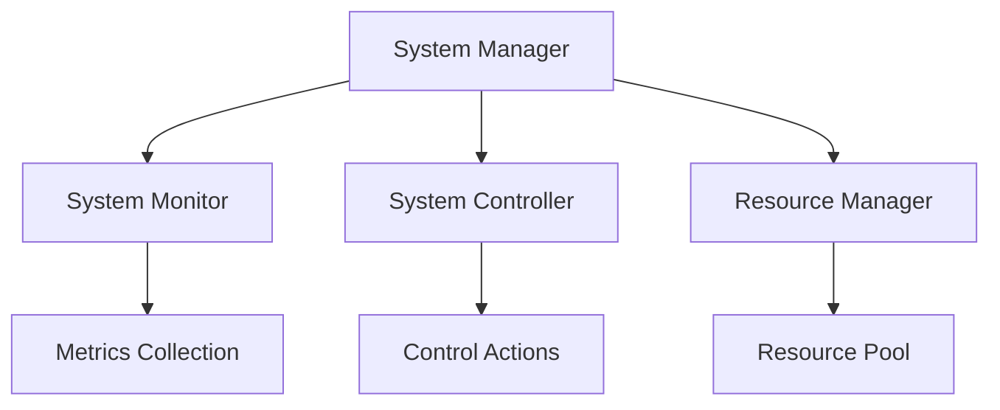

# System Agent Module

```yaml
---
title: System Agent Module
unit: [[units/Technology/agent_systems_unit]]
created: 2024-02-13
updated: 2024-02-13
owner: Agent Systems Unit
process_type: implementation
criticality: high
reviewers:
  - Development Team
  - Architecture Team
  - Security Team
status: draft
version: 1.0
tags:
  - system
  - agents
  - modules
  - management
related_documents:
  - [[agents/architectures/core]]
  - [[agents/modules/core/state]]
  - [[agents/modules/core/behavior]]
  - [[agents/modules/core/communication]]
---
```

## Purpose & Scope
This document defines the system module for agents, providing comprehensive system management, monitoring, and control capabilities that build upon the core agent modules.

## System Architecture

### 1. Core Components
#### 1.1 System Manager
```python
class SystemManager:
    def __init__(self):
        self.monitor = SystemMonitor()
        self.controller = SystemController()
        self.resources = ResourceManager()
        self.health = HealthManager()
        self.config = ConfigManager()
```

#### 1.2 Component Relationships


### 2. System Operations
#### 2.1 Base Operations
```python
class SystemOperations:
    def __init__(self):
        self.commands = CommandRegistry()
        self.handlers = HandlerRegistry()
        self.policies = PolicyManager()
        self.controls = ControlSystem()

    async def execute_operation(self, operation):
        # Operation execution logic
        pass

    async def validate_operation(self, operation):
        # Operation validation logic
        pass

    async def monitor_operation(self, operation):
        # Operation monitoring logic
        pass
```

#### 2.2 Operation Types
- Resource Operations
- Service Operations
- Health Operations
- Configuration Operations

### 3. System Monitoring
#### 3.1 Monitoring System
```python
class SystemMonitor:
    def __init__(self):
        self.collectors = MetricCollectors()
        self.analyzers = DataAnalyzers()
        self.alerts = AlertSystem()
        self.reporters = ReportGenerator()
```

#### 3.2 Monitoring Areas
- Resource Usage
- Service Health
- Performance Metrics
- System Events

### 4. Resource Management
#### 4.1 Resource System
```python
class ResourceManager:
    def __init__(self):
        self.inventory = ResourceInventory()
        self.allocator = ResourceAllocator()
        self.scheduler = ResourceScheduler()
        self.optimizer = ResourceOptimizer()

    async def manage_resources(self, requirements):
        async with self.inventory.transaction():
            await self.validate_availability(requirements)
            allocation = await self.allocate_resources(requirements)
            await self.monitor_usage(allocation)
            return allocation
```

#### 4.2 Resource Types
- Compute Resources
- Memory Resources
- Storage Resources
- Network Resources

## Implementation Guidelines

### 1. System Development
#### 1.1 Component Implementation
```python
class SystemImplementation:
    async def implement_component(self, spec):
        # Component implementation logic
        pass

    async def setup_monitoring(self, config):
        # Monitoring setup logic
        pass

    async def configure_controls(self, settings):
        # Control configuration logic
        pass
```

#### 1.2 Development Standards
- Component Structure
- Monitoring Integration
- Control Implementation
- Error Handling

### 2. Control Integration
#### 2.1 Control System
```python
class SystemController:
    def __init__(self):
        self.controls = ControlRegistry()
        self.policies = PolicyEngine()
        self.executor = ControlExecutor()
```

#### 2.2 Control Operations
- State Control
- Resource Control
- Service Control
- Health Control

## Quality Control

### 1. System Quality
#### 1.1 Quality Metrics
- System Availability
- Resource Efficiency
- Service Performance
- Error Rates

#### 1.2 Quality Monitoring
```python
class QualityMonitor:
    async def monitor_metrics(self):
        # Metric monitoring logic
        pass

    async def analyze_performance(self):
        # Performance analysis logic
        pass

    async def generate_reports(self):
        # Report generation logic
        pass
```

### 2. Performance Management
#### 2.1 Performance Areas
- Resource Utilization
- Service Response
- System Throughput
- Operation Latency

#### 2.2 Optimization
- Resource Optimization
- Service Optimization
- Control Optimization
- Performance Tuning

## Security Requirements

### 1. System Security
#### 1.1 Security Controls
```python
class SystemSecurity:
    async def secure_operation(self, operation):
        # Operation security logic
        pass

    async def validate_access(self, request):
        # Access validation logic
        pass

    async def audit_action(self, action):
        # Audit logging logic
        pass
```

#### 1.2 Security Operations
- Access Control
- Operation Security
- Resource Protection
- Audit Logging

### 2. Resource Security
- Resource Isolation
- Access Management
- Usage Control
- Security Monitoring

## Related Documentation
### Internal Links
- [[agents/modules/core/state|State System]]
- [[agents/modules/core/behavior|Behavior System]]
- [[agents/modules/core/communication|Communication System]]
- [[processes/system_management|System Management]]

### External References
- System Patterns
- Resource Management
- Performance Optimization
- Security Standards

## Maintenance
### Review Schedule
- Daily System Monitoring
- Weekly Performance Review
- Monthly Security Assessment
- Quarterly Architecture Review

### Update Process
1. System Analysis
2. Performance Review
3. Security Assessment
4. Enhancement Planning
5. Implementation

## Appendices
### A. System Patterns
```python
# Example system pattern
class SystemPattern:
    def __init__(self):
        self.monitor = SystemMonitor()
        self.controller = SystemController()
        self.resources = ResourceManager()
```

### B. Control Patterns
```python
# Example control pattern
class ControlPattern:
    def __init__(self):
        self.executor = ControlExecutor()
        self.validator = ControlValidator()
        self.monitor = ControlMonitor()
```

### C. Security Patterns
```python
# Example security pattern
class SystemSecurityPattern:
    def __init__(self):
        self.access = AccessControl()
        self.validator = SecurityValidator()
        self.audit = AuditLogger()
``` 