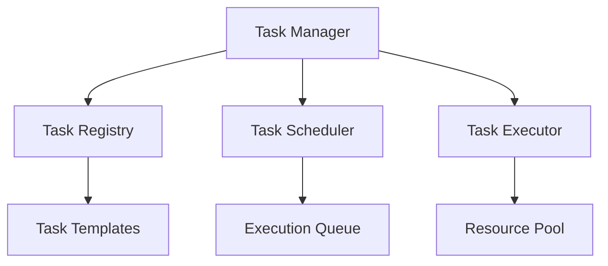

# Task Agent Module System

```yaml
---
title: Task Agent Module System
unit: [[units/Technology/agent_systems_unit]]
created: 2024-02-13
updated: 2024-02-13
owner: Agent Systems Unit
process_type: implementation
criticality: high
reviewers:
  - Development Team
  - Architecture Team
  - Quality Assurance Unit
status: draft
version: 1.0
tags:
  - tasks
  - agents
  - modules
  - execution
related_documents:
  - [[agents/architectures/core]]
  - [[agents/modules/core/state]]
  - [[agents/modules/core/behavior]]
  - [[agents/modules/core/communication]]
---
```

## Purpose & Scope
This document defines the task module system for agents, providing comprehensive task management, execution, and optimization capabilities that build upon the core agent modules.

## Task System Architecture

### 1. Core Components
#### 1.1 Task Manager
```python
class TaskManager:
    def __init__(self):
        self.registry = TaskRegistry()
        self.scheduler = TaskScheduler()
        self.executor = TaskExecutor()
        self.monitor = TaskMonitor()
        self.optimizer = TaskOptimizer()
```

#### 1.2 Component Relationships


### 2. Task Structure
#### 2.1 Base Task
```python
class Task:
    def __init__(self):
        self.id = TaskId()
        self.type = TaskType()
        self.priority = Priority()
        self.state = TaskState()
        self.context = TaskContext()
        self.resources = ResourceRequirements()

    async def execute(self):
        # Task execution logic
        pass

    async def validate(self):
        # Task validation logic
        pass

    async def rollback(self):
        # Rollback logic
        pass
```

#### 2.2 Task Types
- Processing Tasks
- Analysis Tasks
- Integration Tasks
- Control Tasks

### 3. Task Management
#### 3.1 Task Lifecycle
```python
class TaskLifecycle:
    def __init__(self):
        self.stages = LifecycleStages()
        self.transitions = StateTransitions()
        self.handlers = EventHandlers()
        self.monitors = StageMonitors()
```

#### 3.2 Lifecycle Stages
1. Task Creation
2. Validation
3. Resource Allocation
4. Execution
5. Completion/Rollback

### 4. Task Execution
#### 4.1 Execution Engine
```python
class TaskExecutor:
    def __init__(self):
        self.engine = ExecutionEngine()
        self.context = ExecutionContext()
        self.resources = ResourceManager()
        self.monitor = ExecutionMonitor()

    async def execute_task(self, task):
        async with self.context.scope(task):
            await self.validate_resources(task)
            await self.prepare_execution(task)
            result = await self.run_task(task)
            await self.handle_completion(task, result)
```

#### 4.2 Execution Patterns
- Sequential Execution
- Parallel Execution
- Distributed Execution
- Priority-based Execution

## Implementation Guidelines

### 1. Task Development
#### 1.1 Task Definition
```python
class TaskImplementation:
    async def define_task(self, spec):
        # Task definition logic
        pass

    async def implement_handlers(self, handlers):
        # Handler implementation
        pass

    async def setup_resources(self, requirements):
        # Resource setup
        pass
```

#### 1.2 Development Standards
- Task Structure
- Handler Implementation
- Resource Management
- Error Handling

### 2. Resource Management
#### 2.1 Resource Control
```python
class ResourceController:
    def __init__(self):
        self.allocator = ResourceAllocator()
        self.monitor = ResourceMonitor()
        self.optimizer = ResourceOptimizer()
```

#### 2.2 Resource Operations
- Allocation
- Monitoring
- Optimization
- Release

## Quality Control

### 1. Task Quality
#### 1.1 Quality Metrics
- Execution Success Rate
- Performance Metrics
- Resource Efficiency
- Error Rates

#### 1.2 Quality Checks
- Pre-execution Validation
- Runtime Monitoring
- Post-execution Analysis
- Resource Auditing

### 2. Performance Optimization
#### 2.1 Optimization Areas
- Execution Speed
- Resource Usage
- Queue Management
- Load Distribution

#### 2.2 Optimization Techniques
```python
class TaskOptimizer:
    async def optimize_execution(self, task):
        # Execution optimization
        pass

    async def optimize_resources(self, allocation):
        # Resource optimization
        pass

    async def optimize_scheduling(self, queue):
        # Schedule optimization
        pass
```

## Security Requirements

### 1. Task Security
#### 1.1 Security Controls
```python
class TaskSecurity:
    async def validate_task(self, task):
        # Task validation
        pass

    async def secure_execution(self, context):
        # Execution security
        pass

    async def audit_task(self, task, result):
        # Audit logging
        pass
```

#### 1.2 Security Operations
- Task Validation
- Resource Protection
- Execution Security
- Audit Logging

### 2. Resource Security
- Access Control
- Resource Isolation
- Usage Monitoring
- Security Boundaries

## Related Documentation
### Internal Links
- [[agents/modules/core/state|State System]]
- [[agents/modules/core/behavior|Behavior System]]
- [[agents/modules/core/communication|Communication System]]
- [[processes/task_management|Task Management]]

### External References
- Task Patterns
- Resource Management
- Performance Optimization
- Security Standards

## Maintenance
### Review Schedule
- Daily Task Monitoring
- Weekly Performance Review
- Monthly System Assessment
- Quarterly Architecture Review

### Update Process
1. Performance Analysis
2. Resource Optimization
3. Security Assessment
4. Enhancement Planning
5. Implementation

## Appendices
### A. Task Patterns
```python
# Example task pattern
class TaskPattern:
    def __init__(self):
        self.executor = TaskExecutor()
        self.validator = TaskValidator()
        self.monitor = TaskMonitor()
```

### B. Resource Patterns
```python
# Example resource pattern
class ResourcePattern:
    def __init__(self):
        self.allocator = ResourceAllocator()
        self.monitor = ResourceMonitor()
        self.optimizer = ResourceOptimizer()
```

### C. Security Patterns
```python
# Example security pattern
class TaskSecurityPattern:
    def __init__(self):
        self.validator = SecurityValidator()
        self.control = AccessControl()
        self.audit = AuditLogger()
``` 