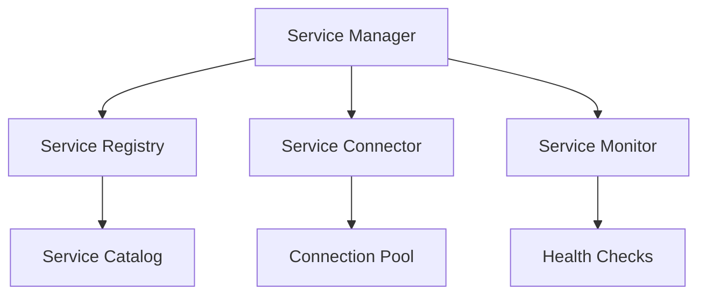

# Service Integration Module

```yaml
---
title: Service Integration Module
unit: [[units/Technology/agent_systems_unit]]
created: 2024-02-13
updated: 2024-02-13
owner: Agent Systems Unit
process_type: implementation
criticality: high
reviewers:
  - Development Team
  - Architecture Team
  - Integration Team
status: draft
version: 1.0
tags:
  - services
  - integration
  - connectivity
  - external
related_documents:
  - [[agents/architectures/core]]
  - [[agents/modules/core/communication]]
  - [[agents/modules/extensions/system]]
  - [[agents/modules/extensions/tasks]]
---
```

## Purpose & Scope
This document defines the service integration module for agents, providing comprehensive service discovery, connection, management, and monitoring capabilities for external system integration.

## Integration Architecture

### 1. Core Components
#### 1.1 Service Manager
```python
class ServiceManager:
    def __init__(self):
        self.registry = ServiceRegistry()
        self.connector = ServiceConnector()
        self.monitor = ServiceMonitor()
        self.adapter = ServiceAdapter()
        self.gateway = ServiceGateway()
```

#### 1.2 Component Relationships


### 2. Service Structure
#### 2.1 Base Service
```python
class Service:
    def __init__(self):
        self.id = ServiceId()
        self.type = ServiceType()
        self.config = ServiceConfig()
        self.state = ServiceState()
        self.endpoints = EndpointRegistry()
        self.protocols = ProtocolSupport()

    async def connect(self):
        # Connection logic
        pass

    async def validate(self):
        # Validation logic
        pass

    async def monitor(self):
        # Monitoring logic
        pass
```

#### 2.2 Service Types
- REST Services
- gRPC Services
- Message Queue Services
- Database Services

### 3. Integration Management
#### 3.1 Integration System
```python
class IntegrationSystem:
    def __init__(self):
        self.adapters = AdapterRegistry()
        self.transformers = DataTransformers()
        self.validators = SchemaValidators()
        self.handlers = ErrorHandlers()

    async def integrate_service(self, service):
        async with self.adapters.get_adapter(service.type):
            await self.validate_integration(service)
            connection = await self.establish_connection(service)
            await self.monitor_integration(connection)
            return connection
```

#### 3.2 Integration Types
- Direct Integration
- Adapter-based Integration
- Gateway Integration
- Event-driven Integration

### 4. Service Operations
#### 4.1 Operation System
```python
class ServiceOperations:
    def __init__(self):
        self.executor = OperationExecutor()
        self.router = OperationRouter()
        self.monitor = OperationMonitor()
        self.cache = OperationCache()

    async def execute_operation(self, operation):
        async with self.executor.context():
            await self.validate_operation(operation)
            result = await self.process_operation(operation)
            await self.cache_result(operation, result)
            return result
```

#### 4.2 Operation Types
- Query Operations
- Command Operations
- Event Operations
- Stream Operations

## Implementation Guidelines

### 1. Service Development
#### 1.1 Service Implementation
```python
class ServiceImplementation:
    async def implement_service(self, spec):
        # Service implementation logic
        pass

    async def configure_endpoints(self, endpoints):
        # Endpoint configuration
        pass

    async def setup_protocols(self, protocols):
        # Protocol setup
        pass
```

#### 1.2 Development Standards
- Service Structure
- Protocol Support
- Error Handling
- Retry Logic

### 2. Integration Development
#### 2.1 Adapter System
```python
class ServiceAdapter:
    def __init__(self):
        self.converters = DataConverters()
        self.mappers = DataMappers()
        self.validators = SchemaValidators()
```

#### 2.2 Integration Patterns
- Request-Response
- Event Publishing
- Message Queue
- Stream Processing

## Quality Control

### 1. Service Quality
#### 1.1 Quality Metrics
- Service Availability
- Response Time
- Error Rate
- Data Quality

#### 1.2 Quality Monitoring
```python
class ServiceQuality:
    async def monitor_service(self, service):
        # Quality monitoring logic
        pass

    async def validate_data(self, data):
        # Data validation logic
        pass

    async def measure_performance(self, metrics):
        # Performance measurement
        pass
```

### 2. Performance Management
#### 2.1 Performance Areas
- Connection Performance
- Operation Latency
- Resource Usage
- Cache Efficiency

#### 2.2 Optimization
- Connection Pooling
- Request Batching
- Response Caching
- Load Balancing

## Security Requirements

### 1. Service Security
#### 1.1 Security Controls
```python
class ServiceSecurity:
    async def secure_connection(self, connection):
        # Connection security logic
        pass

    async def authenticate_service(self, service):
        # Authentication logic
        pass

    async def authorize_operation(self, operation):
        # Authorization logic
        pass
```

#### 1.2 Security Operations
- Connection Security
- Authentication
- Authorization
- Audit Logging

### 2. Data Security
- Data Encryption
- Access Control
- Data Validation
- Privacy Controls

## Related Documentation
### Internal Links
- [[agents/modules/core/communication|Communication System]]
- [[agents/modules/extensions/system|System Module]]
- [[processes/service_management|Service Management]]
- [[security/service_security|Service Security]]

### External References
- Integration Patterns
- Service Standards
- Security Guidelines
- Performance Best Practices

## Maintenance
### Review Schedule
- Daily Service Monitoring
- Weekly Performance Review
- Monthly Security Assessment
- Quarterly Architecture Review

### Update Process
1. Service Analysis
2. Performance Review
3. Security Assessment
4. Enhancement Planning
5. Implementation

## Appendices
### A. Service Patterns
```python
# Example service pattern
class ServicePattern:
    def __init__(self):
        self.connector = ServiceConnector()
        self.adapter = ServiceAdapter()
        self.monitor = ServiceMonitor()
```

### B. Integration Patterns
```python
# Example integration pattern
class IntegrationPattern:
    def __init__(self):
        self.transformer = DataTransformer()
        self.validator = SchemaValidator()
        self.handler = ErrorHandler()
```

### C. Security Patterns
```python
# Example security pattern
class ServiceSecurityPattern:
    def __init__(self):
        self.authenticator = ServiceAuthenticator()
        self.authorizer = OperationAuthorizer()
        self.auditor = SecurityAuditor()
``` 