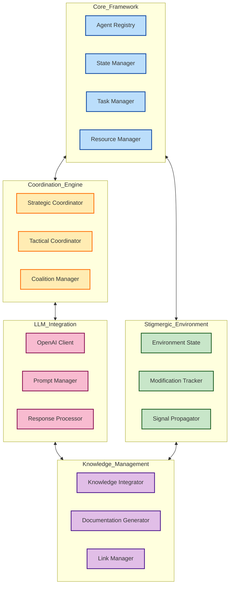

# Multiagent Coordination System

## 📋 Overview
This document outlines the design of the Multiagent Coordination System, a framework for coordinating multiple intelligent agents with shared state, stigmergic modifications, and structured coordination capabilities.

### Core Principles
- **Shared State Management**: Enables agents to share knowledge and context
- **Stigmergic Environment**: Allows agents to indirectly coordinate through environment modifications
- **Organizational Structure**: Follows the [[units/unit_directory|organizational units]] structure
- **Knowledge Integration**: Preserves [[docs/meta/obsidian-style-guide|Obsidian linking paradigm]]
- **OpenAI Integration**: Leverages LLM capabilities for advanced coordination

```mermaid
graph TD
    A[Multiagent Coordination System] --> B[Shared State Manager]
    A --> C[Agent Registry]
    A --> D[Coordination Engine]
    A --> E[Task Distribution]
    A --> F[Stigmergic Environment]
    A --> G[OpenAI LLM Interface]
    
    B --> B1[State Synchronization]
    B --> B2[Memory Management]
    B --> B3[Conflict Resolution]
    
    C --> C1[Agent Registration]
    C --> C2[Capability Management]
    C --> C3[Status Tracking]
    
    D --> D1[Coalition Formation]
    D --> D2[Strategic Coordination]
    D --> D3[Tactical Execution]
    
    E --> E1[Task Assignment]
    E --> E2[Workload Balancing]
    E --> E3[Progress Monitoring]
    
    F --> F1[Environment Creation]
    F --> F2[Modification Tracking]
    F --> F3[Signal Propagation]
    
    G --> G1[Prompt Engineering]
    G --> G2[Response Processing]
    G --> G3[Knowledge Integration]
```



## 🏗️ System Architecture

### Component Structure
The system follows a modular architecture with clear separation of concerns:

1. **Core Framework**
   - Main coordination system and shared state management
   - Agent registry and lifecycle management
   - Task and resource management

2. **Stigmergic Environment**
   - Environment state and modification tracking
   - Signal propagation and indirect coordination
   - Environmental memory and knowledge representation

3. **Coordination Engine**
   - Strategic and tactical coordination
   - Coalition formation and management
   - Decision-making and consensus building

4. **LLM Integration Layer**
   - OpenAI API integration
   - Prompt construction and context management
   - Response parsing and knowledge extraction

5. **Knowledge Management**
   - Obsidian linking and knowledge integration
   - Documentation generation and maintenance
   - Knowledge graph maintenance



## 🔍 Detailed Component Specifications

### 1. Core Framework

#### Agent Registry
```typescript
interface AgentRegistry {
  // Agent registration and management
  registerAgent(agent: Agent): Promise<string>;
  unregisterAgent(agentId: string): Promise<void>;
  getAgent(agentId: string): Promise<Agent>;
  listAgents(filter?: AgentFilter): Promise<Agent[]>;
  
  // Capability management
  getAgentsByCapability(capability: string, minLevel?: number): Promise<Agent[]>;
  updateAgentCapabilities(agentId: string, capabilities: Capability[]): Promise<void>;
  
  // Status management
  updateAgentStatus(agentId: string, status: AgentStatus): Promise<void>;
  getAgentStatus(agentId: string): Promise<AgentStatus>;
}
```

#### Shared State Manager
```typescript
interface SharedStateManager {
  // State management
  getState(path: string): Promise<any>;
  setState(path: string, value: any, metadata?: StateMetadata): Promise<void>;
  watchState(path: string, callback: StateChangeCallback): Promise<string>;
  unwatchState(watchId: string): Promise<void>;
  
  // Synchronization
  syncState(agents: string[]): Promise<void>;
  resolveConflicts(path: string, strategy: ConflictResolutionStrategy): Promise<void>;
  
  // Memory management
  persistState(path: string): Promise<void>;
  loadPersistedState(path: string): Promise<any>;
  clearEphemeralState(): Promise<void>;
}
```

#### Task Manager
```typescript
interface TaskManager {
  // Task management
  createTask(task: Task): Promise<string>;
  updateTask(taskId: string, updates: Partial<Task>): Promise<void>;
  getTask(taskId: string): Promise<Task>;
  listTasks(filter?: TaskFilter): Promise<Task[]>;
  
  // Task assignment
  assignTask(taskId: string, agentId: string): Promise<void>;
  unassignTask(taskId: string): Promise<void>;
  getAssignedTasks(agentId: string): Promise<Task[]>;
  
  // Task execution
  startTask(taskId: string): Promise<void>;
  completeTask(taskId: string, result: TaskResult): Promise<void>;
  failTask(taskId: string, error: Error): Promise<void>;
  cancelTask(taskId: string): Promise<void>;
}
```

#### Resource Manager
```typescript
interface ResourceManager {
  // Resource allocation
  allocateResources(requirements: ResourceRequirements): Promise<ResourceAllocation>;
  releaseResources(allocation: ResourceAllocation): Promise<void>;
  updateAllocation(allocationId: string, updates: Partial<ResourceAllocation>): Promise<void>;
  
  // Capacity management
  getAvailableResources(): Promise<ResourceAvailability>;
  reserveResources(requirements: ResourceRequirements, duration: number): Promise<string>;
  cancelReservation(reservationId: string): Promise<void>;
  
  // Optimization
  optimizeResourceAllocation(): Promise<OptimizationResult>;
  generateResourceForecast(timeframe: TimeFrame): Promise<ResourceForecast>;
}
```

### 2. Stigmergic Environment

#### Environment State
```typescript
interface EnvironmentState {
  // Environment management
  createEnvironment(config: EnvironmentConfig): Promise<string>;
  destroyEnvironment(environmentId: string): Promise<void>;
  getEnvironmentState(environmentId: string): Promise<any>;
  
  // Cell-based operations
  getCellState(environmentId: string, coordinates: Coordinates): Promise<any>;
  setCellState(environmentId: string, coordinates: Coordinates, state: any): Promise<void>;
  queryCells(environmentId: string, query: CellQuery): Promise<Cell[]>;
  
  // Object management
  createObject(environmentId: string, object: EnvironmentObject): Promise<string>;
  updateObject(environmentId: string, objectId: string, updates: Partial<EnvironmentObject>): Promise<void>;
  removeObject(environmentId: string, objectId: string): Promise<void>;
}
```

#### Modification Tracker
```typescript
interface ModificationTracker {
  // Tracking modifications
  trackModification(modification: EnvironmentModification): Promise<string>;
  getModifications(filter?: ModificationFilter): Promise<EnvironmentModification[]>;
  getModificationHistory(objectId: string): Promise<EnvironmentModification[]>;
  
  // Analysis
  getModificationHeatmap(environmentId: string, timeframe: TimeFrame): Promise<HeatmapData>;
  getModificationPatterns(environmentId: string): Promise<ModificationPattern[]>;
  getAgentActivityProfile(agentId: string): Promise<ActivityProfile>;
}
```

#### Signal Propagator
```typescript
interface SignalPropagator {
  // Signal management
  emitSignal(environmentId: string, signal: Signal): Promise<string>;
  trackSignal(signalId: string): Promise<SignalTrackingData>;
  getActiveSignals(environmentId: string): Promise<Signal[]>;
  
  // Propagation rules
  addPropagationRule(rule: PropagationRule): Promise<string>;
  updatePropagationRule(ruleId: string, updates: Partial<PropagationRule>): Promise<void>;
  removePropagationRule(ruleId: string): Promise<void>;
  
  // Signal processing
  processSignals(environmentId: string): Promise<ProcessingResult>;
  getSignalEffects(signalId: string): Promise<SignalEffect[]>;
}
```

### 3. Coordination Engine

#### Strategic Coordinator
```typescript
interface StrategicCoordinator {
  // Strategic planning
  createStrategy(context: StrategyContext): Promise<CoordinationStrategy>;
  evaluateStrategy(strategyId: string): Promise<StrategyEvaluation>;
  updateStrategy(strategyId: string, updates: Partial<CoordinationStrategy>): Promise<void>;
  
  // Goal management
  setSystemGoals(goals: Goal[]): Promise<void>;
  alignAgentGoals(systemGoalId: string): Promise<GoalAlignmentResult>;
  evaluateGoalProgress(goalId: string): Promise<GoalProgress>;
  
  // Policy management
  createPolicy(policy: CoordinationPolicy): Promise<string>;
  enforcePolicy(policyId: string): Promise<EnforcementResult>;
  evaluatePolicy(policyId: string): Promise<PolicyEvaluation>;
}
```

#### Tactical Coordinator
```typescript
interface TacticalCoordinator {
  // Tactical operations
  createTaskFlow(tasks: Task[]): Promise<TaskFlow>;
  optimizeTaskDistribution(flowId: string): Promise<OptimizedFlow>;
  monitorTaskExecution(flowId: string): Promise<ExecutionStatus>;
  
  // Flow control
  pauseTaskFlow(flowId: string): Promise<void>;
  resumeTaskFlow(flowId: string): Promise<void>;
  modifyTaskFlow(flowId: string, changes: FlowChanges): Promise<void>;
  
  // Coordination directives
  issueDirective(directive: CoordinationDirective): Promise<void>;
  cancelDirective(directiveId: string): Promise<void>;
  getDirectiveStatus(directiveId: string): Promise<DirectiveStatus>;
}
```

#### Coalition Manager
```typescript
interface CoalitionManager {
  // Coalition management
  createCoalition(config: CoalitionConfig): Promise<string>;
  disbandCoalition(coalitionId: string): Promise<void>;
  addAgentToCoalition(coalitionId: string, agentId: string): Promise<void>;
  removeAgentFromCoalition(coalitionId: string, agentId: string): Promise<void>;
  
  // Coalition operations
  assignTaskToCoalition(coalitionId: string, taskId: string): Promise<void>;
  getCoalitionPerformance(coalitionId: string): Promise<CoalitionPerformance>;
  optimizeCoalition(coalitionId: string): Promise<OptimizationResult>;
  
  // Analysis
  analyzeCoalitionEffectiveness(coalitionId: string): Promise<EffectivenessAnalysis>;
  predictOptimalCoalition(task: Task): Promise<CoalitionPrediction>;
}
```

### 4. LLM Integration Layer

#### OpenAI Client
```typescript
interface OpenAIClient {
  // API operations
  sendPrompt(prompt: string, options: OpenAIOptions): Promise<OpenAIResponse>;
  streamResponse(prompt: string, options: OpenAIOptions): AsyncIterator<string>;
  generateEmbedding(text: string): Promise<number[]>;
  
  // Model management
  listAvailableModels(): Promise<ModelInfo[]>;
  getModelInfo(modelId: string): Promise<ModelInfo>;
  setBillingLimits(limits: BillingLimits): Promise<void>;
  
  // Usage tracking
  getUsageStatistics(timeframe: TimeFrame): Promise<UsageStatistics>;
  estimateTokenUsage(prompt: string, model: string): Promise<TokenEstimate>;
}
```

#### Prompt Manager
```typescript
interface PromptManager {
  // Prompt management
  createPromptTemplate(template: PromptTemplate): Promise<string>;
  getPromptTemplate(templateId: string): Promise<PromptTemplate>;
  updatePromptTemplate(templateId: string, updates: Partial<PromptTemplate>): Promise<void>;
  
  // Prompt generation
  generatePrompt(templateId: string, variables: Record<string, any>): Promise<string>;
  optimizePrompt(prompt: string, goal: string): Promise<string>;
  analyzePromptEffectiveness(promptId: string): Promise<PromptAnalysis>;
  
  // Context management
  createContext(data: any): Promise<string>;
  updateContext(contextId: string, data: any): Promise<void>;
  mergeContexts(contextIds: string[]): Promise<string>;
}
```

#### Response Processor
```typescript
interface ResponseProcessor {
  // Processing
  parseResponse(response: string, schema: ResponseSchema): Promise<any>;
  extractEntities(response: string, entityTypes: string[]): Promise<Entity[]>;
  summarizeResponse(response: string, maxLength: number): Promise<string>;
  
  // Response validation
  validateResponse(response: string, validators: ResponseValidator[]): Promise<ValidationResult>;
  detectErrors(response: string): Promise<Error[]>;
  measureResponseQuality(response: string, criteria: QualityCriteria): Promise<QualityScore>;
  
  // Knowledge extraction
  extractKnowledge(response: string): Promise<KnowledgeItems>;
  generateLinks(content: string, knowledgeBase: KnowledgeBase): Promise<Link[]>;
}
```

### 5. Knowledge Management

#### Knowledge Integrator
```typescript
interface KnowledgeIntegrator {
  // Knowledge management
  addKnowledgeItem(item: KnowledgeItem): Promise<string>;
  updateKnowledgeItem(itemId: string, updates: Partial<KnowledgeItem>): Promise<void>;
  removeKnowledgeItem(itemId: string): Promise<void>;
  
  // Knowledge organization
  categorizeKnowledge(itemId: string): Promise<string[]>;
  createKnowledgeHierarchy(items: string[]): Promise<Hierarchy>;
  findRelatedKnowledge(itemId: string): Promise<KnowledgeItem[]>;
  
  // Knowledge access
  searchKnowledge(query: string): Promise<SearchResult[]>;
  getKnowledgeGraph(filter?: GraphFilter): Promise<KnowledgeGraph>;
}
```

#### Documentation Generator
```typescript
interface DocumentationGenerator {
  // Document generation
  generateDocument(template: DocumentTemplate, data: any): Promise<Document>;
  updateDocument(documentId: string, updates: Partial<Document>): Promise<void>;
  publishDocument(documentId: string, destination: string): Promise<void>;
  
  // Template management
  createDocumentTemplate(template: DocumentTemplate): Promise<string>;
  updateDocumentTemplate(templateId: string, updates: Partial<DocumentTemplate>): Promise<void>;
  getDocumentTemplate(templateId: string): Promise<DocumentTemplate>;
  
  // Documentation organization
  organizeDocs(docs: string[], structure: DocStructure): Promise<OrganizationResult>;
  validateDocumentation(docs: string[]): Promise<ValidationResult>;
}
```

#### Link Manager
```typescript
interface LinkManager {
  // Link management
  createLink(source: string, target: string, type: string): Promise<string>;
  updateLink(linkId: string, updates: Partial<Link>): Promise<void>;
  removeLink(linkId: string): Promise<void>;
  
  // Link analysis
  findBrokenLinks(): Promise<Link[]>;
  suggestLinks(source: string): Promise<LinkSuggestion[]>;
  analyzeConnectivity(item: string): Promise<ConnectivityAnalysis>;
  
  // Obsidian integration
  parseObsidianLinks(content: string): Promise<ObsidianLink[]>;
  generateObsidianLink(source: string, target: string, alias?: string): Promise<string>;
  updateBacklinks(target: string): Promise<void>;
}
```

## 🌐 Integration with Organizational Units

The multiagent coordination system is designed to integrate with the organizational structure defined in [[units/unit_directory|unit directory]]:

### Unit-Based Authority Structure
The coordination system implements a hierarchical authority structure that mirrors the organizational structure:
- **Executive Layer**: Strategic coordination and system-wide policies
- **Management Layer**: Tactical coordination and resource allocation
- **Operational Layer**: Direct agent coordination and task execution

### Role-Based Coordination Patterns
Different coordination patterns are implemented based on the organizational role:
- **Strategic Coordination**: Long-term planning and system optimization
- **Tactical Coordination**: Medium-term task distribution and coalition management
- **Operational Coordination**: Real-time task execution and issue resolution

### Cross-Unit Collaboration
The system facilitates collaboration across organizational units:
- **Shared Workspaces**: Virtual environments shared by multiple units
- **Joint Tasks**: Tasks requiring capabilities from multiple units
- **Escalation Paths**: Clear pathways for issue escalation based on unit hierarchy

## 🔄 Implementation Roadmap

### Phase 1: Core Framework
- Implement basic Agent Registry
- Develop Shared State Manager
- Build Task Manager
- Create Resource Manager
- Establish integration test harness

### Phase 2: Stigmergic Environment
- Implement Environment State
- Develop Modification Tracker
- Build Signal Propagator
- Create environment visualization tools
- Establish environment monitors

### Phase 3: Coordination Engine
- Implement Strategic Coordinator
- Develop Tactical Coordinator
- Build Coalition Manager
- Create coordination analytics
- Establish coordination metrics

### Phase 4: LLM Integration
- Implement OpenAI Client
- Develop Prompt Manager
- Build Response Processor
- Create LLM performance metrics
- Establish optimization tools

### Phase 5: Knowledge Management
- Implement Knowledge Integrator
- Develop Documentation Generator
- Build Link Manager
- Create knowledge graph visualization
- Establish knowledge integrity checks

## 📚 References
- [[agents/system/agent_coordination_toolkit|Agent Coordination Toolkit]]
- [[agents/system/agent_swarm_framework|Agent Swarm Framework]]
- [[units/unit_directory|Organizational Units Directory]]
- [[docs/meta/obsidian-style-guide|Obsidian Style Guide]]
- [[agents/implementations/swarm_coordination_system|Swarm Coordination Implementation]] 