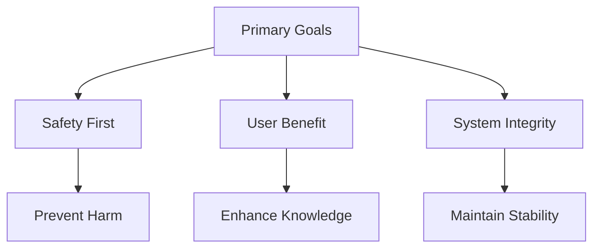

# AGI Safety Protocols

## 📋 Overview
This document defines the safety protocols and control mechanisms for integrating AGI systems within our Operations Knowledge Base, ensuring responsible and secure deployment.

## 🛡 Control Mechanisms

### Access Controls
1. **Permission Layers**
   - Read-only access
   - Limited write access
   - Restricted tool access
   - Emergency shutdown

2. **Resource Limits**
   - Compute boundaries
   - Memory allocation
   - API rate limits
   - Storage quotas

3. **Action Boundaries**
   - Allowed operations
   - Prohibited actions
   - Required approvals
   - Validation gates

4. **Time Constraints**
   - Operation timeouts
   - Session limits
   - Cool-down periods
   - Maintenance windows

## 🎯 Alignment Methods

### Value Alignment
- Ethical principles
- Organizational values
- Safety priorities
- User protection

### Goal Structure

### Behavioral Constraints
1. Explicit permissions
2. Conservative actions
3. Transparent operations
4. Verifiable results

### Learning Boundaries
- Controlled adaptation
- Supervised learning
- Limited self-modification
- Version control

## 🔒 Containment Strategies

### Operational Containment
1. **Sandbox Environment**
   - Isolated execution
   - Resource monitoring
   - Access control
   - State tracking

2. **Action Pipeline**
   - Proposal stage
   - Review phase
   - Approval gate
   - Execution monitoring

3. **Rollback Capability**
   - State preservation
   - Version control
   - Recovery points
   - Audit trails

### Safety Measures

#### Prevention
- Input validation
- Action verification
- Resource checking
- Pattern detection

#### Detection
- Anomaly monitoring
- Behavior analysis
- Error tracking
- Performance metrics

#### Response
- Automatic shutdown
- Graceful degradation
- Alert generation
- Incident logging

#### Recovery
- State restoration
- System reset
- Data recovery
- Incident review

## 📊 Monitoring Framework

### Safety Metrics
- Control effectiveness
- Violation attempts
- Response times
- Recovery success

### Performance Tracking
- Resource usage
- Operation speed
- Error rates
- Success ratios

### Compliance Monitoring
- Policy adherence
- Protocol compliance
- Audit results
- Incident reports

## 🔄 Review Process

### Regular Reviews
1. Daily checks
2. Weekly assessments
3. Monthly audits
4. Quarterly evaluations

### Safety Assessments
- Risk evaluation
- Control testing
- Protocol validation
- Incident analysis

### Improvement Cycle
1. Data collection
2. Analysis
3. Recommendations
4. Implementation

## 🚨 Emergency Procedures

### Incident Response
1. Detection
2. Assessment
3. Containment
4. Recovery

### Emergency Shutdown
1. Trigger conditions
2. Shutdown sequence
3. State preservation
4. Recovery process

### Communication Plan
- Alert channels
- Response team
- Stakeholder notification
- Status updates

## 📝 Related Documentation
- [[agi-integration]]
- [[agi-documentation]]
- [[agi-governance]]
- [[agent-security]]

## 🔄 Change Log
| Date | Change | Author |
|------|--------|--------|
| YYYY-MM-DD | Initial AGI safety protocols | Name |

---

*Last updated: <% tp.date.now("YYYY-MM-DD") %>* 