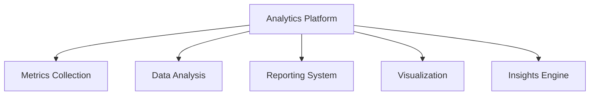

# Analytics Platform

## 📋 Overview
This document defines the comprehensive analytics platform for our Operations Knowledge Base, establishing metrics collection, data analysis, reporting capabilities, and continuous improvement processes.

## 🎯 Platform Architecture

### Core Components


### Platform Layers
```yaml
analytics_platform:
  metrics_collection:
    - system_metrics
    - application_metrics
    - business_metrics
    - custom_metrics
  data_analysis:
    - historical_analysis
    - predictive_analytics
    - capacity_planning
    - performance_insights
  reporting:
    - standard_reports
    - custom_reports
    - dashboards
    - visualizations
  insights:
    - trend_analysis
    - pattern_detection
    - anomaly_detection
    - recommendations
```

## 🔄 Metrics Collection

### System Metrics
1. **Infrastructure Metrics**
   ```python
   def collect_system_metrics():
       gather_resource_metrics()
       monitor_performance()
       track_availability()
       measure_reliability()
   ```

2. **Application Metrics**
   ```json
   {
     "app_metrics": {
       "performance": ["response_time", "throughput", "errors", "latency"],
       "usage": ["requests", "users", "sessions", "transactions"],
       "resources": ["cpu", "memory", "disk", "network"],
       "quality": ["availability", "reliability", "errors", "satisfaction"]
     }
   }
   ```

### Business Metrics
1. **Operational Metrics**
   - Process efficiency
   - Resource utilization
   - Cost effectiveness
   - Quality indicators

2. **Performance Metrics**
   - Service levels
   - Response times
   - Success rates
   - Error rates

## 🛠 Data Analysis

### Historical Analysis
1. **Trend Analysis**
   - Performance trends
   - Usage patterns
   - Resource utilization
   - Error patterns

2. **Pattern Recognition**
   - Usage patterns
   - Behavior analysis
   - System patterns
   - Error patterns

### Predictive Analytics
1. **Forecasting**
   - Capacity needs
   - Resource requirements
   - Performance trends
   - Usage patterns

2. **Optimization**
   - Resource optimization
   - Performance tuning
   - Cost optimization
   - Process improvement

## 📊 Reporting System

### Standard Reports
1. **System Reports**
   - Performance reports
   - Resource usage
   - Error analysis
   - Availability metrics

2. **Business Reports**
   - Operational metrics
   - Quality metrics
   - Cost analysis
   - Efficiency metrics

### Custom Reports
1. **Report Builder**
   - Metric selection
   - Data filtering
   - Visualization options
   - Export capabilities

2. **Analysis Tools**
   - Data exploration
   - Custom queries
   - Advanced analytics
   - Insight generation

## 📈 Visualization

### Dashboards
1. **System Dashboards**
   - Real-time metrics
   - Performance views
   - Resource usage
   - Alert status

2. **Business Dashboards**
   - KPI tracking
   - Trend analysis
   - Performance metrics
   - Quality indicators

### Visual Analytics
1. **Chart Types**
   - Time series
   - Heat maps
   - Scatter plots
   - Correlation graphs

2. **Interactive Features**
   - Drill-down
   - Filtering
   - Sorting
   - Exploration

## 🎯 Insights Engine

### Pattern Detection
1. **Anomaly Detection**
   - Performance anomalies
   - Usage anomalies
   - Security anomalies
   - Quality issues

2. **Trend Analysis**
   - Long-term trends
   - Seasonal patterns
   - Usage patterns
   - Performance patterns

### Recommendations
1. **Optimization Suggestions**
   - Performance optimization
   - Resource allocation
   - Cost reduction
   - Process improvement

2. **Action Items**
   - Priority tasks
   - Risk mitigation
   - Improvement opportunities
   - Maintenance needs

## 📝 Related Documentation
- [[monitoring-system]]
- [[performance-testing]]
- [[security-testing]]
- [[quality-assurance]]
- [[continuous-improvement]]
- [[reporting-framework]]

## 🔄 Change Log
| Date | Change | Author |
|------|--------|--------|
| YYYY-MM-DD | Initial analytics platform documentation | Name |

---

*Last updated: <% tp.date.now("YYYY-MM-DD") %>*