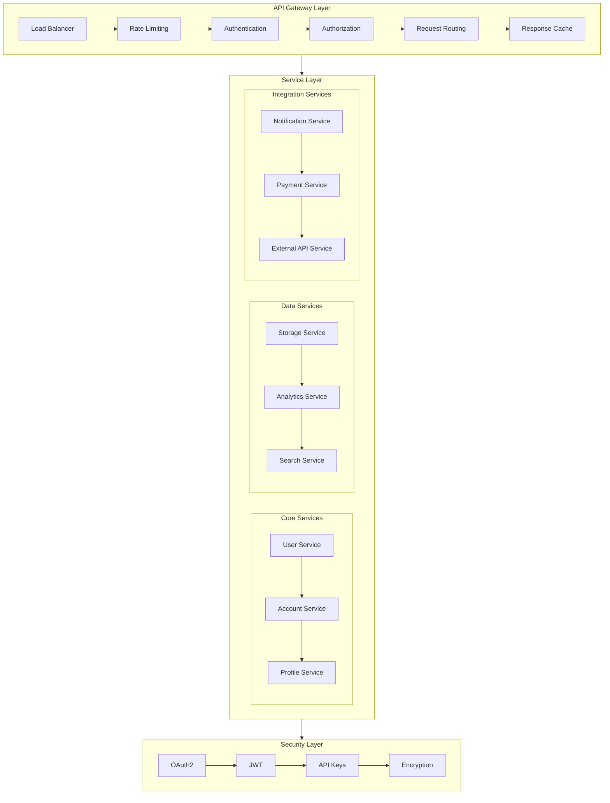
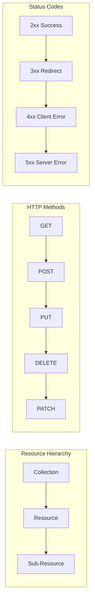
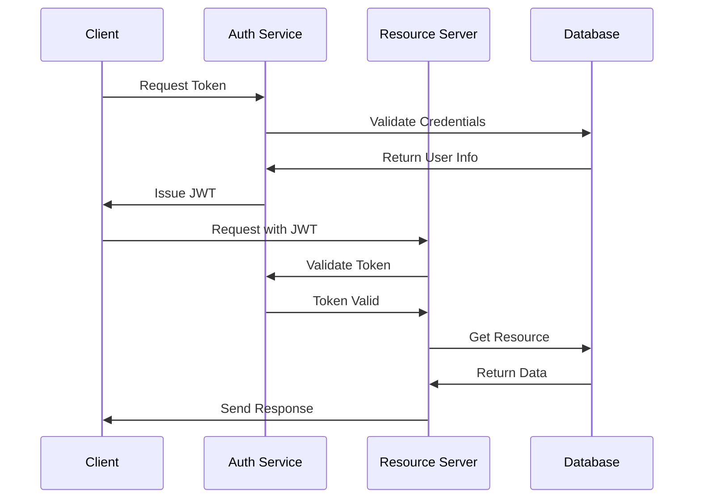
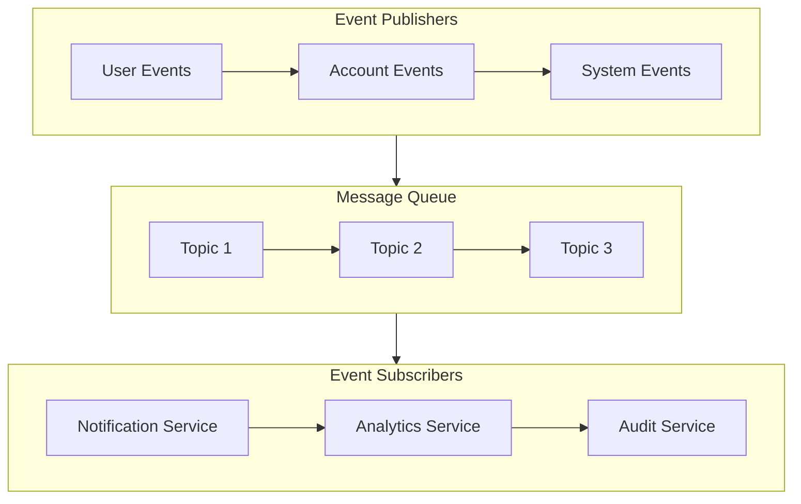
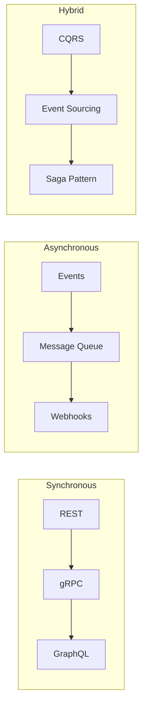
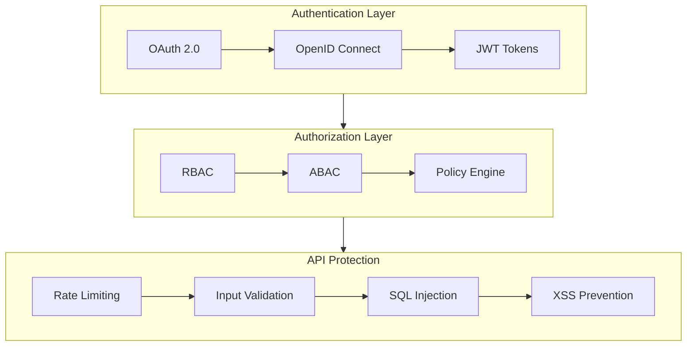
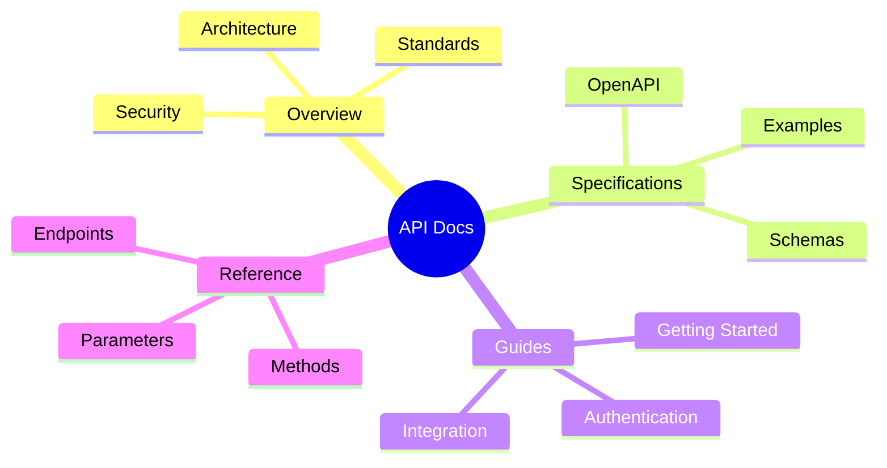
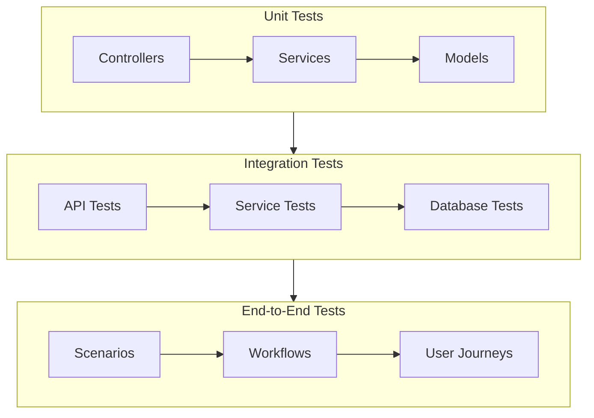

# API Documentation

## API Architecture Overview



## API Standards

### REST API Design


### Authentication Flow


## API Specifications

### Core APIs

#### User Service API
```yaml
openapi: 3.0.0
info:
  title: User Service API
  version: 1.0.0
  description: API for user management and authentication
paths:
  /users:
    get:
      summary: List users
      responses:
        '200':
          description: List of users
    post:
      summary: Create user
      responses:
        '201':
          description: User created
  /users/{id}:
    get:
      summary: Get user
      parameters:
        - name: id
          in: path
          required: true
          schema:
            type: string
      responses:
        '200':
          description: User details
```

#### Account Service API
```yaml
openapi: 3.0.0
info:
  title: Account Service API
  version: 1.0.0
  description: API for account management
paths:
  /accounts:
    get:
      summary: List accounts
      responses:
        '200':
          description: List of accounts
  /accounts/{id}/transactions:
    get:
      summary: Get transactions
      responses:
        '200':
          description: Transaction history
```

## API Integration Patterns

### Event-Driven Architecture


### Microservices Communication


## API Security

### Security Controls


## API Documentation

### Documentation Structure


## API Testing

### Test Framework


## Related Documentation
- [API Design Guidelines](guidelines/api-design.md)
- [Authentication Guide](security/authentication.md)
- [Error Handling](guidelines/error-handling.md)
- [Rate Limiting](security/rate-limiting.md)
- [API Versioning](guidelines/versioning.md)

---

*Last updated: 2024-03-20* 