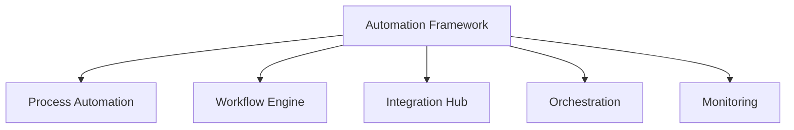

# Automation Framework

## 📋 Overview
This document defines the automation framework for our Operations Knowledge Base, establishing the foundation for automated processes, workflows, and integrations across all systems.

## 🎯 Framework Architecture

### Core Components


### Framework Layers
1. **Automation Layers**
   ```yaml
   automation_layers:
     process:
       - task_automation
       - workflow_automation
       - decision_automation
       - monitoring_automation
     integration:
       - tool_integration
       - service_integration
       - data_integration
       - system_integration
   ```

2. **Control Points**
   - Process validation
   - Workflow control
   - Integration management
   - Performance monitoring

## 🔄 Process Automation

### Task Automation
1. **Task Types**
   ```python
   def automate_tasks():
       handle_routine_tasks()
       manage_scheduled_tasks()
       process_event_driven_tasks()
       coordinate_dependent_tasks()
   ```

2. **Task Management**
   - Task definition
   - Scheduling
   - Execution
   - Monitoring

### Workflow Automation
1. **Workflow Engine**
   ```json
   {
     "workflow_engine": {
       "processes": ["sequential", "parallel", "conditional", "event-driven"],
       "controls": ["gates", "approvals", "notifications", "escalations"],
       "states": ["pending", "running", "completed", "failed"],
       "actions": ["start", "pause", "resume", "terminate"]
     }
   }
   ```

2. **Process Flow**
   - Workflow definition
   - State management
   - Transition rules
   - Error handling

## 🛠 Integration Hub

### Tool Integration
1. **Development Tools**
   - Version control
   - Build systems
   - Testing frameworks
   - Deployment tools

2. **Management Tools**
   - Project management
   - Resource management
   - Documentation systems
   - Monitoring tools

### Service Integration
1. **Internal Services**
   - Authentication
   - Authorization
   - Data services
   - Business services

2. **External Services**
   - Cloud services
   - Third-party APIs
   - External systems
   - Partner services

## 🎯 Orchestration

### Process Orchestration
1. **Flow Control**
   - Process sequencing
   - Parallel execution
   - Conditional branching
   - Error handling

2. **Resource Orchestration**
   - Resource allocation
   - Load balancing
   - Scaling management
   - Failover handling

### Service Orchestration
1. **Service Management**
   - Service discovery
   - Load distribution
   - Health monitoring
   - Failover management

2. **Integration Management**
   - API management
   - Data transformation
   - Protocol handling
   - Security enforcement

## 📊 Monitoring and Analytics

### Performance Monitoring
1. **System Metrics**
   - Resource utilization
   - Process performance
   - Service health
   - Error rates

2. **Business Metrics**
   - Process efficiency
   - Automation coverage
   - Cost savings
   - Time savings

### Analytics Engine
1. **Data Analysis**
   - Performance analysis
   - Trend detection
   - Pattern recognition
   - Anomaly detection

2. **Reporting System**
   - Performance reports
   - Status dashboards
   - Trend analysis
   - Optimization recommendations

## 🤖 Intelligent Automation

### AI Integration
1. **Decision Automation**
   - Rule processing
   - Pattern matching
   - Predictive analysis
   - Adaptive learning

2. **Process Optimization**
   - Performance optimization
   - Resource optimization
   - Workflow optimization
   - Cost optimization

### Machine Learning
1. **Learning Systems**
   - Pattern learning
   - Behavior analysis
   - Performance prediction
   - Anomaly detection

2. **Adaptive Systems**
   - Dynamic optimization
   - Self-tuning
   - Auto-scaling
   - Self-healing

## 🔒 Security Framework

### Security Controls
1. **Access Management**
   - Authentication
   - Authorization
   - Audit logging
   - Secret management

2. **Process Security**
   - Input validation
   - Output sanitization
   - Error handling
   - Security scanning

### Compliance Management
1. **Policy Enforcement**
   - Security policies
   - Compliance rules
   - Industry standards
   - Best practices

2. **Audit System**
   - Activity logging
   - Change tracking
   - Compliance reporting
   - Security monitoring

## 📝 Related Documentation
- [[ci-cd-pipeline]]
- [[workflow-automation]]
- [[integration-framework]]
- [[monitoring-system]]
- [[security-controls]]
- [[ai-framework]]

## 🔄 Change Log
| Date | Change | Author |
|------|--------|--------|
| YYYY-MM-DD | Initial automation framework documentation | Name |

---

*Last updated: <% tp.date.now("YYYY-MM-DD") %>* 