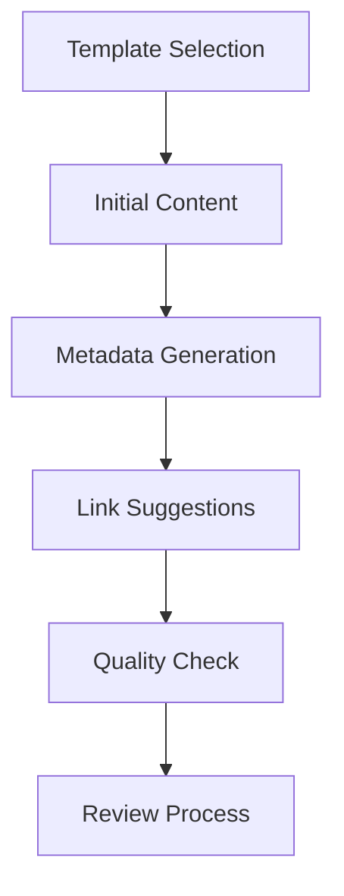
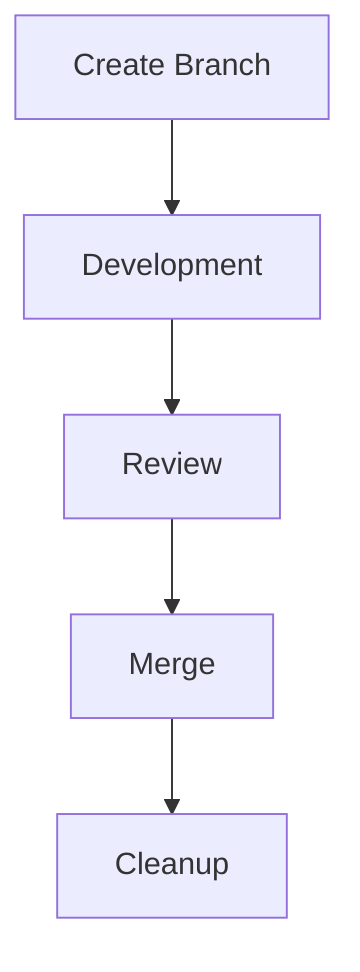
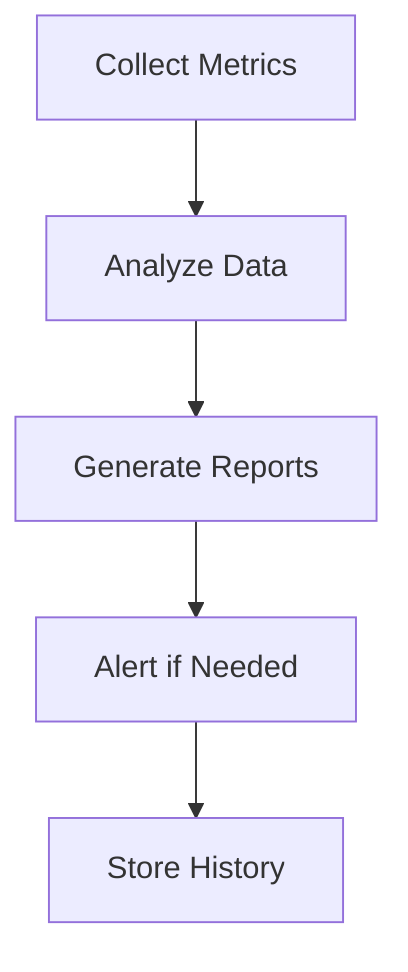
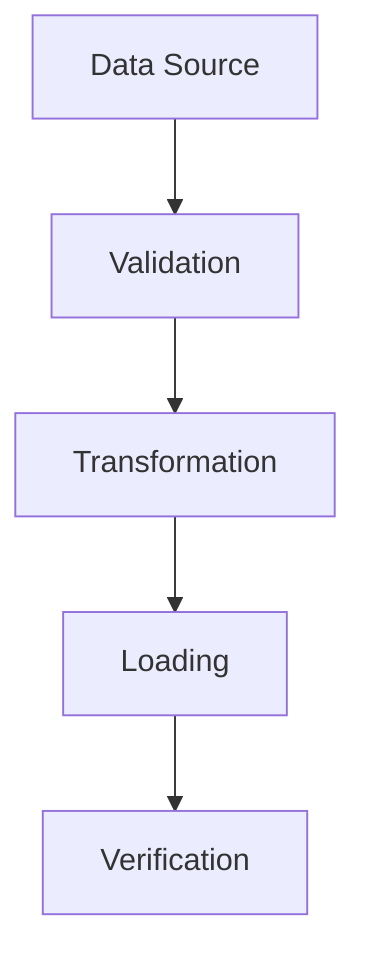

# Automation Workflows

## 📋 Overview
This document details the automated workflows implemented in our Operations Knowledge Base, providing step-by-step processes and integration details.

## 🔄 Documentation Workflows

### Content Creation


#### Implementation
```yaml
# Template trigger
trigger:
  - new_file_created
  - template_selected

actions:
  - apply_template
  - generate_metadata
  - suggest_links
  - run_quality_check
```

### Content Updates
1. **Regular Updates**
   - Schedule: Daily/Weekly
   - Version check
   - Content refresh
   - Link validation

2. **Batch Processing**
   - Bulk updates
   - Mass replacements
   - Tag management
   - Category updates

### Archive Management
- Automatic archiving
- Version retention
- Cleanup procedures
- Recovery options

## 🛠 Git Workflows

### Branch Management


### Commit Processing
1. **Pre-commit**
   - Lint checking
   - Format validation
   - Link verification
   - Security scan

2. **Post-commit**
   - Notification
   - Documentation update
   - Status tracking
   - Integration triggers

### Review Automation
- Reviewer assignment
- Check automation
- Feedback collection
- Approval tracking

## 🤖 Agent Workflows

### Content Enhancement
1. **Quality Improvement**
   ```python
   def enhance_content():
       scan_for_issues()
       suggest_improvements()
       apply_approved_changes()
       verify_results()
   ```

2. **Link Management**
   ```python
   def manage_links():
       validate_existing_links()
       suggest_new_links()
       remove_broken_links()
       update_references()
   ```

### Process Automation
1. **Task Management**
   - Priority assessment
   - Resource allocation
   - Progress tracking
   - Status updates

2. **Decision Support**
   - Data analysis
   - Option evaluation
   - Risk assessment
   - Recommendation generation

## 📊 Monitoring Workflows

### Performance Monitoring


### Quality Assurance
1. **Content Validation**
   - Style compliance
   - Format checking
   - Completeness verification
   - Accuracy assessment

2. **Process Verification**
   - Workflow compliance
   - Step completion
   - Error detection
   - Performance metrics

## 🔒 Security Workflows

### Access Control
```yaml
# Access workflow
workflow:
  name: access_control
  triggers:
    - user_action
    - system_event
  steps:
    - validate_permissions
    - log_access
    - monitor_activity
    - enforce_limits
```

### Safety Checks
1. **Input Validation**
   - Content scanning
   - Format verification
   - Security checking
   - Compliance validation

2. **Process Control**
   - Step validation
   - Resource monitoring
   - Error handling
   - Recovery procedures

## 📈 Integration Workflows

### Tool Integration
1. **Obsidian Integration**
   - Plugin automation
   - Template processing
   - Graph management
   - Search optimization

2. **External Tools**
   - Git synchronization
   - CI/CD pipeline
   - Backup systems
   - Monitoring tools

### Data Exchange


## 🔄 Maintenance Workflows

### Regular Maintenance
1. **Daily Tasks**
   - Link checking
   - Backup verification
   - Log review
   - Status updates

2. **Weekly Tasks**
   - Content review
   - Performance analysis
   - System updates
   - Report generation

### System Health
- Resource monitoring
- Performance tracking
- Error detection
- Health checks

## 📝 Related Documentation
- [[automation-strategy]]
- [[automation-monitoring]]
- [[git-automation]]
- [[agent-workflows]]

## 🔄 Change Log
| Date | Change | Author |
|------|--------|--------|
| YYYY-MM-DD | Initial automation workflows | Name |

---

*Last updated: <% tp.date.now("YYYY-MM-DD") %>* 