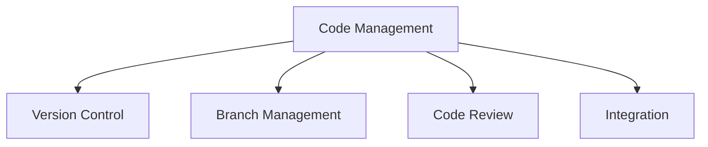

# Code Management

## 📋 Overview
This document defines the code management practices and version control processes for our Operations Knowledge Base, ensuring consistent and efficient code management across all development activities.

## 🎯 Version Control Framework

### Core Components


### Management Layers
1. **Version Control Structure**
   ```yaml
   version_control:
     repositories:
       - main_repository
       - documentation
       - configuration
       - tools
     branches:
       - main
       - develop
       - feature/*
       - release/*
       - hotfix/*
   ```

2. **Control Points**
   - Repository management
   - Branch control
   - Access management
   - Quality gates

## 🌳 Branch Strategy

### Branch Types
1. **Core Branches**
   ```python
   def manage_branches():
       maintain_main_branch()    # Production-ready code
       manage_develop_branch()   # Integration branch
       handle_feature_branches() # Feature development
       manage_release_branches() # Release preparation
   ```

2. **Branch Naming**
   ```json
   {
     "branch_naming": {
       "feature": "feature/{issue-id}-{description}",
       "bugfix": "bugfix/{issue-id}-{description}",
       "hotfix": "hotfix/{issue-id}-{description}",
       "release": "release/{version}"
     }
   }
   ```

### Branch Workflow
1. **Feature Development**
   - Branch from develop
   - Feature implementation
   - Code review
   - Merge to develop

2. **Release Process**
   - Create release branch
   - Stabilization
   - Testing and fixes
   - Merge to main

## 📝 Code Review Process

### Review Standards
1. **Review Requirements**
   - Code quality
   - Test coverage
   - Documentation
   - Performance impact

2. **Review Workflow**
   - Pull request creation
   - Automated checks
   - Manual review
   - Approval process

### Review Guidelines
1. **Code Quality**
   - Style compliance
   - Best practices
   - Performance
   - Security

2. **Documentation**
   - Code comments
   - API documentation
   - Change documentation
   - Usage examples

## 🔄 Integration Process

### Merge Process
1. **Merge Requirements**
   - Clean build
   - Passing tests
   - Review approval
   - Documentation update

2. **Merge Strategy**
   - Rebase workflow
   - Squash commits
   - Linear history
   - Conflict resolution

### Integration Testing
1. **Pre-merge Testing**
   - Unit tests
   - Integration tests
   - Performance tests
   - Security scans

2. **Post-merge Validation**
   - Build verification
   - Deployment testing
   - Regression testing
   - Performance validation

## 🔒 Access Control

### Repository Access
1. **Access Levels**
   - Read access
   - Write access
   - Admin access
   - Integration access

2. **Permission Management**
   - User roles
   - Team access
   - Service accounts
   - External access

### Protection Rules
1. **Branch Protection**
   - Push restrictions
   - Merge requirements
   - Review requirements
   - Status checks

2. **Security Controls**
   - Secret scanning
   - Dependency scanning
   - Code scanning
   - Access monitoring

## 📊 Metrics and Monitoring

### Performance Metrics
1. **Repository Metrics**
   - Commit frequency
   - Branch count
   - Merge success rate
   - Build success rate

2. **Quality Metrics**
   - Code coverage
   - Technical debt
   - Issue resolution
   - Review turnaround

### Monitoring Systems
1. **Activity Monitoring**
   - Repository activity
   - Branch status
   - Build status
   - Integration status

2. **Health Monitoring**
   - Repository size
   - Performance metrics
   - Error rates
   - Access patterns

## 🛠 Tools and Automation

### Development Tools
1. **Version Control Tools**
   - Git clients
   - GUI tools
   - CLI tools
   - IDE integration

2. **Integration Tools**
   - CI/CD tools
   - Code analysis
   - Review tools
   - Documentation tools

### Automation
1. **Automated Processes**
   - Branch creation
   - Code formatting
   - Documentation generation
   - Release tagging

2. **Quality Automation**
   - Linting
   - Testing
   - Security scanning
   - Performance testing

## 📝 Related Documentation
- [[branch-strategy]]
- [[code-review-process]]
- [[integration-workflow]]
- [[release-management]]

## 🔄 Change Log
| Date | Change | Author |
|------|--------|--------|
| YYYY-MM-DD | Initial code management documentation | Name |

---

*Last updated: <% tp.date.now("YYYY-MM-DD") %>* 