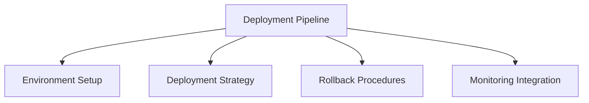

# Deployment Pipeline

## 📋 Overview
This document defines the deployment pipeline and procedures for our Operations Knowledge Base, ensuring reliable and consistent software deployment across all environments.

## 🎯 Pipeline Framework

### Core Components


### Pipeline Layers
1. **Deployment Layers**
   ```yaml
   deployment_layers:
     infrastructure:
       - environment_setup
       - configuration_management
       - resource_provisioning
       - access_control
     application:
       - artifact_deployment
       - service_configuration
       - data_migration
       - health_verification
   ```

2. **Control Points**
   - Environment validation
   - Deployment verification
   - Health checks
   - Performance monitoring

## 🌐 Environment Setup

### Environment Management
1. **Environment Types**
   ```python
   def setup_environment():
       configure_development()
       configure_testing()
       configure_staging()
       configure_production()
   ```

2. **Infrastructure Setup**
   - Server provisioning
   - Network configuration
   - Security setup
   - Monitoring integration

### Configuration Management
1. **Environment Config**
   ```json
   {
     "environment_config": {
       "development": ["local", "dev", "integration"],
       "testing": ["qa", "uat", "performance"],
       "staging": ["pre-prod", "staging"],
       "production": ["prod", "dr"]
     }
   }
   ```

2. **Resource Management**
   - Compute resources
   - Storage allocation
   - Network resources
   - Security resources

## 🚀 Deployment Strategy

### Deployment Methods
1. **Deployment Types**
   - Blue-Green deployment
   - Canary releases
   - Rolling updates
   - Feature flags

2. **Release Process**
   - Release planning
   - Deployment scheduling
   - Change management
   - Communication plan

### Automation Pipeline
1. **Pipeline Stages**
   - Build verification
   - Environment preparation
   - Artifact deployment
   - Service configuration

2. **Integration Points**
   - CI/CD integration
   - Monitoring hooks
   - Notification system
   - Logging integration

## 🔄 Rollback Procedures

### Rollback Strategy
1. **Rollback Types**
   - Full rollback
   - Partial rollback
   - Feature rollback
   - Data rollback

2. **Recovery Process**
   - State preservation
   - Version control
   - Data consistency
   - Service restoration

### Contingency Planning
1. **Failure Scenarios**
   - Deployment failure
   - Service degradation
   - Data corruption
   - Security breach

2. **Response Procedures**
   - Incident detection
   - Impact assessment
   - Recovery execution
   - Post-mortem analysis

## 📊 Monitoring Integration

### Health Monitoring
1. **Health Checks**
   - Service health
   - Resource utilization
   - Performance metrics
   - Error rates

2. **Alert System**
   - Threshold alerts
   - Anomaly detection
   - Incident notification
   - Escalation paths

### Performance Tracking
1. **Metrics Collection**
   - Response times
   - Resource usage
   - Error rates
   - User metrics

2. **Analysis Tools**
   - Performance analysis
   - Trend detection
   - Capacity planning
   - Optimization recommendations

## 🔒 Security Integration

### Security Controls
1. **Access Management**
   - Authentication
   - Authorization
   - Audit logging
   - Secret management

2. **Security Validation**
   - Security scanning
   - Compliance checking
   - Vulnerability assessment
   - Penetration testing

### Compliance Management
1. **Compliance Requirements**
   - Security standards
   - Industry regulations
   - Internal policies
   - Audit requirements

2. **Validation Process**
   - Compliance checking
   - Security validation
   - Audit logging
   - Documentation

## 📝 Documentation

### Deployment Documentation
1. **Process Documentation**
   - Setup guides
   - Configuration guides
   - Deployment procedures
   - Rollback procedures

2. **Environment Documentation**
   - Architecture diagrams
   - Network topology
   - Security architecture
   - Resource allocation

### Maintenance Guides
1. **Operational Procedures**
   - Daily operations
   - Monitoring procedures
   - Incident response
   - Maintenance tasks

2. **Troubleshooting Guides**
   - Common issues
   - Resolution steps
   - Debug procedures
   - Support contacts

## 🛠 Tools and Integration

### Deployment Tools
1. **Infrastructure Tools**
   - Configuration management
   - Container orchestration
   - Service mesh
   - Monitoring tools

2. **Application Tools**
   - Deployment automation
   - Service discovery
   - Load balancing
   - Health checking

## 📝 Related Documentation
- [[code-management]]
- [[build-process]]
- [[environment-setup]]
- [[monitoring-system]]

## 🔄 Change Log
| Date | Change | Author |
|------|--------|--------|
| YYYY-MM-DD | Initial deployment pipeline documentation | Name |

---

*Last updated: <% tp.date.now("YYYY-MM-DD") %>* 