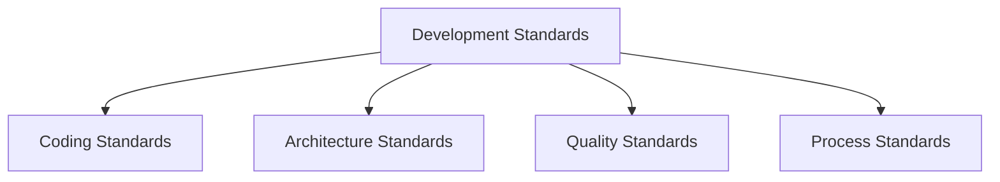

# Development Standards

## 📋 Overview
This document outlines the development standards and practices for our Operations Knowledge Base, providing a comprehensive guide for software development processes and quality.

## 🎯 Standards Framework

### Core Components


### Standards Architecture
1. **Standard Layers**
   ```yaml
   development_standards:
     code_standards:
       - style_guidelines
       - naming_conventions
       - documentation_requirements
       - quality_metrics
     process_standards:
       - development_workflow
       - version_control
       - review_process
       - deployment_guidelines
   ```

2. **Standard Types**
   - Technical Standards
   - Process Standards
   - Quality Standards
   - Documentation Standards

## 💻 Coding Standards

### Code Style
1. **Style Guidelines**
   ```python
   def implement_coding_standards():
       follow_style_guide()
       apply_naming_conventions()
       maintain_code_organization()
       ensure_code_documentation()
   ```

2. **Code Organization**
   - File structure
   - Module organization
   - Class structure
   - Function design

### Naming Conventions
1. **Naming Standards**
   ```json
   {
     "naming_conventions": {
       "variables": ["descriptive", "camelCase", "meaningful", "clear"],
       "functions": ["action_based", "verb_first", "descriptive", "specific"],
       "classes": ["noun_based", "PascalCase", "descriptive", "focused"]
     }
   }
   ```

2. **Identifier Guidelines**
   - Variable names
   - Function names
   - Class names
   - Constant names

## 🏗 Architecture Standards

### Design Patterns
1. **Pattern Usage**
   - Design patterns
   - Architecture patterns
   - Implementation patterns
   - Integration patterns

2. **Pattern Guidelines**
   - Pattern selection
   - Implementation guidelines
   - Pattern documentation
   - Best practices

### Component Design
1. **Component Standards**
   - Module design
   - Service design
   - API design
   - Interface design

2. **Integration Standards**
   - Component integration
   - Service integration
   - API integration
   - System integration

## 📝 Documentation Standards

### Code Documentation
1. **Documentation Requirements**
   - Inline comments
   - Function documentation
   - Class documentation
   - Module documentation

2. **Documentation Style**
   - Comment format
   - Documentation format
   - Example usage
   - Version notes

### Technical Documentation
1. **Documentation Types**
   - API documentation
   - System documentation
   - Architecture documentation
   - Integration documentation

2. **Documentation Management**
   - Version control
   - Documentation updates
   - Review process
   - Distribution

## 🔍 Quality Standards

### Code Quality
1. **Quality Metrics**
   - Code complexity
   - Code coverage
   - Code duplication
   - Code maintainability

2. **Quality Practices**
   - Code review
   - Testing requirements
   - Performance standards
   - Security standards

### Testing Standards
1. **Test Requirements**
   - Unit testing
   - Integration testing
   - System testing
   - Performance testing

2. **Test Quality**
   - Test coverage
   - Test reliability
   - Test maintenance
   - Test documentation

## 🔄 Development Process

### Workflow Standards
1. **Process Requirements**
   - Development workflow
   - Review process
   - Testing process
   - Deployment process

2. **Process Guidelines**
   - Task management
   - Progress tracking
   - Quality gates
   - Release criteria

### Version Control
1. **Version Management**
   - Branch strategy
   - Commit standards
   - Merge process
   - Release management

2. **Repository Standards**
   - Repository organization
   - Branch naming
   - Commit messages
   - Tag conventions

## 🛠 Development Tools

### Tool Standards
1. **Required Tools**
   - Development tools
   - Testing tools
   - Analysis tools
   - Documentation tools

2. **Tool Usage**
   - Tool configuration
   - Usage guidelines
   - Integration setup
   - Best practices

### Environment Standards
1. **Environment Setup**
   - Development environment
   - Testing environment
   - Staging environment
   - Production environment

2. **Configuration Standards**
   - Environment config
   - Tool config
   - Service config
   - Integration config

## 🔒 Security Standards

### Security Requirements
1. **Code Security**
   - Security practices
   - Vulnerability prevention
   - Secure coding
   - Security testing

2. **Data Security**
   - Data handling
   - Authentication
   - Authorization
   - Encryption

### Security Process
1. **Security Review**
   - Code review
   - Security testing
   - Vulnerability scanning
   - Compliance checking

2. **Security Management**
   - Security updates
   - Patch management
   - Security monitoring
   - Incident response

## 📈 Performance Standards

### Performance Requirements
1. **Performance Metrics**
   - Response time
   - Resource usage
   - Scalability
   - Reliability

2. **Optimization Standards**
   - Code optimization
   - Query optimization
   - Resource optimization
   - Cache usage

### Performance Testing
1. **Test Requirements**
   - Load testing
   - Stress testing
   - Endurance testing
   - Spike testing

2. **Performance Monitoring**
   - Metric collection
   - Performance analysis
   - Bottleneck identification
   - Optimization recommendations

## 📝 Related Documentation
- [[code-review-process]]
- [[testing-strategy]]
- [[documentation-standards]]
- [[quality-standards]]

## 🔄 Change Log
| Date | Change | Author |
|------|--------|--------|
| YYYY-MM-DD | Initial development standards documentation | Name |

---

*Last updated: <% tp.date.now("YYYY-MM-DD") %>* 