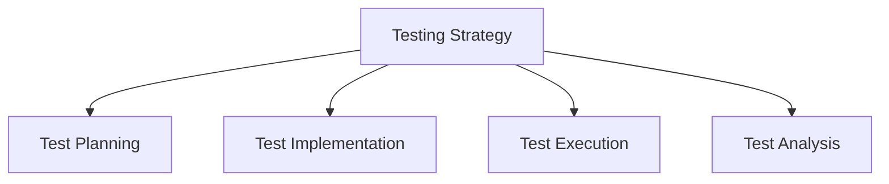

# Testing Strategy

## 📋 Overview
This document outlines the testing strategy and practices for our Operations Knowledge Base, providing a comprehensive approach to software testing and quality assurance.

## 🎯 Testing Framework

### Core Components


### Testing Architecture
1. **Testing Layers**
   ```yaml
   testing_layers:
     unit_testing:
       - component_tests
       - function_tests
       - class_tests
       - module_tests
     integration_testing:
       - component_integration
       - service_integration
       - system_integration
       - end_to_end_tests
   ```

2. **Testing Types**
   - Unit Testing
   - Integration Testing
   - System Testing
   - Acceptance Testing

## 🔍 Test Planning

### Strategy Development
1. **Test Strategy**
   ```python
   def develop_test_strategy():
       define_test_objectives()
       identify_test_scope()
       plan_test_approach()
       allocate_test_resources()
   ```

2. **Planning Components**
   - Test objectives
   - Test scope
   - Test approach
   - Resource planning

### Test Design
1. **Test Architecture**
   ```json
   {
     "test_design": {
       "levels": ["unit", "integration", "system", "acceptance"],
       "types": ["functional", "performance", "security", "usability"],
       "approaches": ["black_box", "white_box", "gray_box"]
     }
   }
   ```

2. **Test Coverage**
   - Code coverage
   - Feature coverage
   - Scenario coverage
   - Requirements coverage

## 🧪 Test Implementation

### Unit Testing
1. **Component Testing**
   - Function testing
   - Class testing
   - Module testing
   - Component isolation

2. **Test Development**
   - Test cases
   - Test fixtures
   - Mock objects
   - Test data

### Integration Testing
1. **Integration Approach**
   - Component integration
   - Service integration
   - System integration
   - Interface testing

2. **Integration Strategy**
   - Bottom-up testing
   - Top-down testing
   - Sandwich testing
   - Risk-based testing

## 🚀 Test Execution

### Test Process
1. **Execution Steps**
   - Test setup
   - Test running
   - Result recording
   - Issue tracking

2. **Test Environment**
   - Environment setup
   - Data preparation
   - Tool configuration
   - Test automation

### Test Management
1. **Process Management**
   - Test scheduling
   - Resource allocation
   - Progress tracking
   - Issue management

2. **Test Control**
   - Quality gates
   - Release criteria
   - Test completion
   - Sign-off process

## 📊 Test Analysis

### Results Analysis
1. **Analysis Methods**
   - Coverage analysis
   - Defect analysis
   - Performance analysis
   - Risk analysis

2. **Quality Metrics**
   - Pass/fail rates
   - Defect density
   - Test effectiveness
   - Coverage metrics

### Reporting
1. **Test Reports**
   - Status reports
   - Progress reports
   - Coverage reports
   - Defect reports

2. **Analysis Reports**
   - Trend analysis
   - Quality metrics
   - Performance metrics
   - Risk assessment

## 🔄 Continuous Testing

### CI/CD Integration
1. **Pipeline Integration**
   - Build integration
   - Test automation
   - Result reporting
   - Feedback loop

2. **Automation Strategy**
   - Test selection
   - Tool selection
   - Framework design
   - Maintenance plan

### Test Automation
1. **Automation Framework**
   - Framework design
   - Tool selection
   - Script development
   - Maintenance process

2. **Automation Scope**
   - Unit tests
   - Integration tests
   - System tests
   - Regression tests

## 🛠 Testing Tools

### Tool Selection
1. **Testing Tools**
   - Unit testing tools
   - Integration testing tools
   - System testing tools
   - Automation tools

2. **Support Tools**
   - Test management
   - Issue tracking
   - Coverage analysis
   - Performance testing

### Tool Management
1. **Tool Administration**
   - Tool setup
   - Configuration
   - Maintenance
   - Updates

2. **Tool Integration**
   - CI/CD integration
   - Repository integration
   - Issue tracking
   - Reporting tools

## 📈 Performance Testing

### Load Testing
1. **Load Tests**
   - Performance tests
   - Stress tests
   - Endurance tests
   - Spike tests

2. **Performance Metrics**
   - Response time
   - Throughput
   - Resource usage
   - Scalability

### Security Testing
1. **Security Tests**
   - Vulnerability testing
   - Penetration testing
   - Security scanning
   - Compliance testing

2. **Security Metrics**
   - Security coverage
   - Vulnerability metrics
   - Risk metrics
   - Compliance metrics

## 📝 Test Documentation

### Documentation Types
1. **Test Documents**
   - Test plans
   - Test cases
   - Test procedures
   - Test reports

2. **Process Documents**
   - Test strategy
   - Test standards
   - Guidelines
   - Templates

### Documentation Management
1. **Document Control**
   - Version control
   - Change management
   - Review process
   - Distribution

2. **Maintenance**
   - Regular updates
   - Review cycles
   - Improvement process
   - Archive management

## 📝 Related Documentation
- [[development-standards]]
- [[code-review-process]]
- [[quality-standards]]
- [[ci-cd-pipeline]]

## 🔄 Change Log
| Date | Change | Author |
|------|--------|--------|
| YYYY-MM-DD | Initial testing strategy documentation | Name |

---

*Last updated: <% tp.date.now("YYYY-MM-DD") %>* 